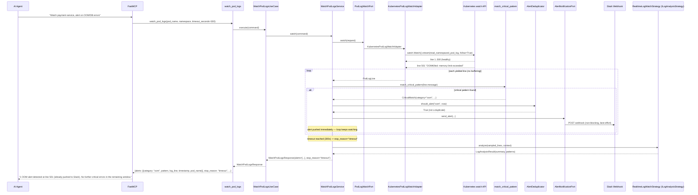
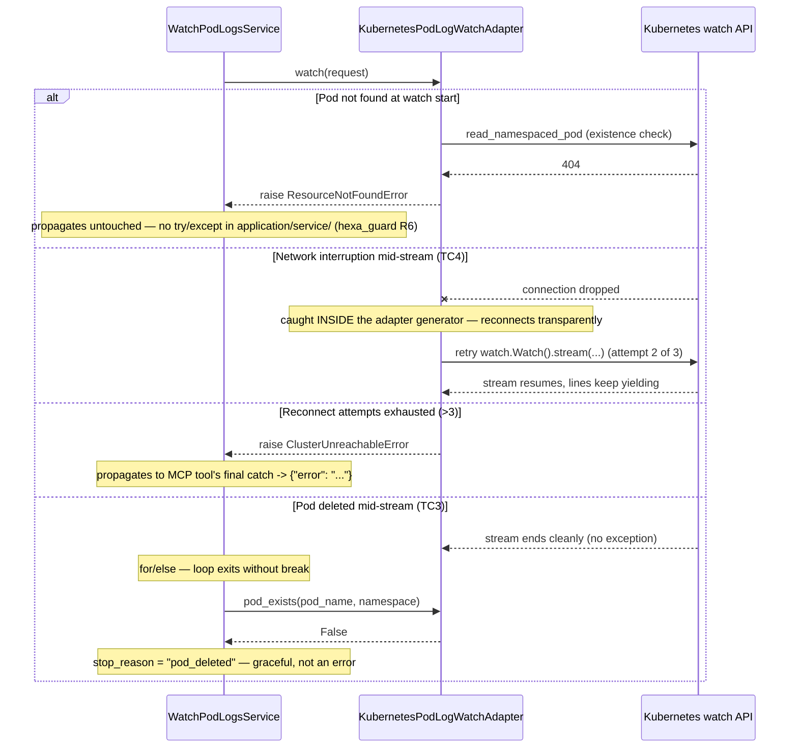
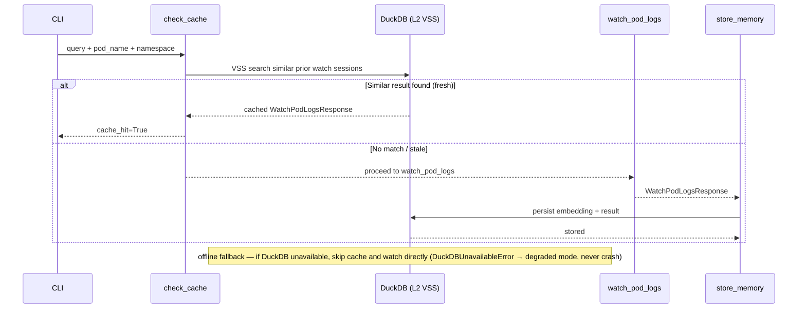

# Use Case 59 — Real-Time Pod Log Watch with Instant Critical Alerting

## Sample Questions

- "Stream and analyze in real-time the logs from the payment-service pod — alert me as soon as an OOM or DB connection error appears."
- "Watch the checkout pod's logs live and let me know immediately if it panics or runs out of memory."
- "Can you tail the worker pod and alert on any database connection failures?"
- "Monitor auth-service for OOM kills over the next 5 minutes."
- "Live-watch the api-gateway pod logs and notify Slack the moment something critical happens."

---

**Naming note**: this is a *new*, distinct capability — `watch_pod_logs` —
not a reuse of the existing `StreamingStrategy`. `StreamingStrategy`
(`docs/use-cases/57-analyze-pod-logs.md`) means *batch-chunked processing
of an already-collected >10000-line volume*; it has no yield, no callback,
no watch. This use case introduces `RealtimeLogWatchStrategy`, a distinct
concrete `LogAnalysisStrategy` (`ILogAnalysisStrategy`, ECA-14) used only
by `watch_pod_logs`, never auto-selected by `StrategySelector` or
`select_strategy_by_volume`.

**Architecture note**: MCP tools in this repo are request/response —
every tool call returns once. `watch_pod_logs` opens a real Kubernetes log
watch (`kubernetes.watch.Watch`, no full buffering) and runs *inside a
single bounded tool call* until a timeout (default 300s), the pod is
deleted, or the connection is unrecoverable — pushing a Slack alert via
the existing `AlertNotificationPort` the instant each new critical pattern
is detected, independent of when the tool call itself returns.

### Flow 1 — Happy Path: Critical Pattern Detected and Pushed



### Flow 2 — Graceful Stop and Reconnect Paths



### Flow 3 — Checker Node: False Positive Prevention

```mermaid
sequenceDiagram
    participant Checker as Checker Node
    participant LLM as LLM Response

    Checker->>LLM: Validate watch_pod_logs alert
    alt LLM claims an alert fired for a non-critical line
        Checker-->>LLM: ❌ FAIL — only OOM/db_connection_error/panic categories are valid
    alt LLM reports 5 alerts for 5 identical OOM lines within 1 second
        Checker-->>LLM: ⚠️ FLAG — AlertDeduplicator should have suppressed repeats within the 5s window
    else All checks pass
        Checker-->>LLM: ✅ PASS
    end
```

### Flow 4 — DuckDB Memory: VSS Check Before, Store After



## Key Points

- **No buffering** — every line is processed and yielded as it arrives via `kubernetes.watch.Watch`; the adapter never accumulates the full log body in memory.
- **Sampling bounds memory, never alerting** — `should_keep_line` only decides what's *retained* for the final summary; every single line is still scanned for critical patterns (10000 lines/sec edge case never causes a missed alert).
- **Dedup prevents flooding** — `AlertDeduplicator` suppresses repeated alerts for the same category within a 5-second window; multiple identical OOM lines in one second produce exactly one Slack push.
- **Reconnection lives in the adapter, not the service** — `hexa_guard` Rule 6 forbids try/except in `application/service/`; the adapter's generator retries transparently (up to 3 attempts) and only raises `ClusterUnreachableError` after exhausting retries.
- **Pod deletion is not an error** — a K8s log-follow stream ending is normal; `for...else` + `PodLogWatchPort.pod_exists()` distinguishes `"pod_deleted"` from `"session_ended"` with pure control flow, no exception handling needed.
- **First production wiring of `AlertNotificationPort`** — previously only reachable via the `hexa slack test` CLI command; `watch_pod_logs` is the first real detection-to-alert integration.

## Test Coverage

| Test | File | Status |
|---|---|---|
| `test_oom_matches` / `test_connection_refused_matches` / `test_panic_matches` | `tests/unit/log_analysis/test_critical_pattern_matcher.py` | ✅ |
| `test_multiple_alerts_in_one_second_deduplicated` | `tests/unit/log_analysis/test_alert_deduplicator.py` | ✅ |
| `test_high_volume_bounds_kept_count` | `tests/unit/log_analysis/test_line_sampler.py` | ✅ |
| `TestRealtimeLogWatchStrategy` (supports/analyze) | `tests/unit/log_analysis/test_strategy.py` | ✅ |
| `test_oom_triggers_alert_with_context` (TC1) | `tests/unit/test_watch_pod_logs_service.py` | ✅ |
| `test_alert_pushed_at_detection_time_not_after_loop` (TC1, "immediately") | `tests/unit/test_watch_pod_logs_service.py` | ✅ |
| `test_timeout_returns_heartbeat` (TC2) | `tests/unit/test_watch_pod_logs_service.py` | ✅ |
| `test_stream_ends_and_pod_no_longer_exists` (TC3) | `tests/unit/test_watch_pod_logs_service.py` | ✅ |
| `test_high_volume_sampling_bounds_memory` | `tests/unit/test_watch_pod_logs_service.py` | ✅ |
| `test_multiple_criticals_within_a_second_are_deduplicated` | `tests/unit/test_watch_pod_logs_service.py` | ✅ |
| `test_reconnects_after_transient_failure` (TC4) | `tests/unit/test_kubernetes_pod_log_watch_adapter.py` | ✅ |
| `test_raises_after_exhausting_reconnect_attempts` (TC4) | `tests/unit/test_kubernetes_pod_log_watch_adapter.py` | ✅ |
| `test_raises_resource_not_found` | `tests/unit/test_kubernetes_pod_log_watch_adapter.py` | ✅ |
| `test_returns_watch_result` / `test_handles_error` | `tests/unit/test_watch_pod_logs_tool.py` | ✅ |

## Related Files

- `src/hexawyn/domain/models/watch_pod_logs.py` — CriticalMatch, WatchPodLogsRequest/Result
- `src/hexawyn/domain/services/log_analysis/critical_pattern_matcher.py` — match_critical_pattern (OOM/DB/panic classifier)
- `src/hexawyn/domain/services/log_analysis/alert_deduplicator.py` — AlertDeduplicator
- `src/hexawyn/domain/services/log_analysis/line_sampler.py` — should_keep_line
- `src/hexawyn/domain/services/log_analysis/strategy.py` — RealtimeLogWatchStrategy (ILogAnalysisStrategy)
- `src/hexawyn/application/ports/driven/pod_log_watch_port.py` — PodLogWatchPort
- `src/hexawyn/application/ports/driven/alert_notification_port.py` — AlertNotificationPort (reused, first production wiring)
- `src/hexawyn/application/service/watch_pod_logs_service.py` — WatchPodLogsService
- `src/hexawyn/application/use_case/watch_pod_logs/watch_pod_logs_use_case.py` — WatchPodLogsUseCase
- `src/hexawyn/adapters/secondary/gitops/kubernetes_pod_log_watch_adapter.py` — KubernetesPodLogWatchAdapter
- `src/hexawyn/adapters/secondary/slack/slack_alert_adapter.py` — SlackAlertAdapter (reused)
- `src/hexawyn/mcp/tools/watch_pod_logs.py` — MCP tool
