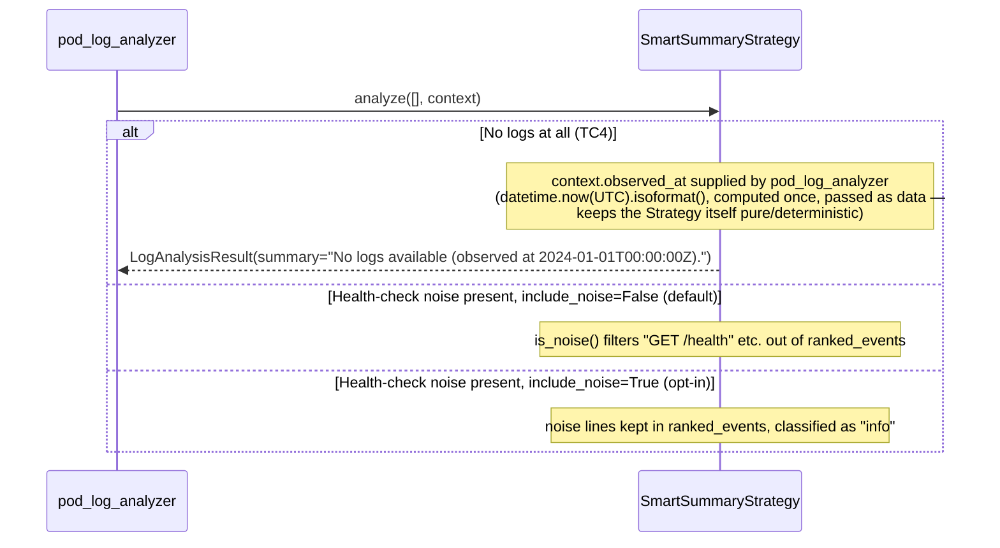

# Use Case 60 — SMART Log Summary (Dedup, Noise Filter, Severity Rank)

## Sample Questions

- "Give me a smart summary of the last 2000 log lines from the order-service pod — keep only unique meaningful events and reduce noise."
- "Deduplicate the checkout pod logs and show me what actually happened, not 1000 repeated health checks."
- "What are the unique, meaningful events in the auth-service logs, ranked by severity?"
- "Strip out the health-check noise from payment-service logs and show me the real events."
- "Summarize worker-pod's logs without the repeated readiness probe spam."

---

Concrete SMART implementation of `LogAnalysisStrategy` (`ILogAnalysisStrategy`,
ECA-14), replacing the previous error-rate-percentage branching in
`SmartSummaryStrategy` with a deterministic dedup → noise-filter → severity-rank
pipeline. Used by `analyze_pod_logs`'s <1000-line volume tier
(`select_strategy_by_volume`).

### Flow 1 — Happy Path: Dedup, Filter Noise, Rank by Severity

```mermaid
sequenceDiagram
    participant AI as AI Agent
    participant MCP as FastMCP
    participant Tool as analyze_pod_logs
    participant Service as AnalyzePodLogsService
    participant Domain as pod_log_analyzer
    participant Smart as SmartSummaryStrategy (ILogAnalysisStrategy)
    participant Dedup as deduplicate_lines
    participant Noise as is_noise
    participant Severity as classify_event_severity
    participant Processor as AdaptiveLogProcessor

    AI->>MCP: "Smart summary of order-service, last 2000 lines"
    MCP->>Tool: analyze_pod_logs(pod_name="order-service", ...)
    Tool->>Service: analyze(command)
    Service->>Domain: analyze_pod_logs(request, log_lines)
    Note over Domain: 2000 lines, volume < 1000? no — but SMART also<br/>reached directly for illustration; line count in SMART tier
    Domain->>Smart: analyze(messages, context)

    Smart->>Dedup: deduplicate_lines(logs)
    Dedup-->>Smart: 1800x "GET /health HTTP/1.1 200" + 20 unique DeduplicatedLine

    Smart->>Noise: is_noise(line) for each deduplicated line
    Noise-->>Smart: health-check line filtered; 20 meaningful lines remain

    loop each visible DeduplicatedLine
        Smart->>Severity: classify_event_severity(line)
        Severity-->>Smart: "critical" | "high" | "medium" | "info"
    end
    Note over Smart: ranked_events sorted descending by severity

    Smart->>Processor: estimate_tokens_from_lines(raw vs. ranked lines)
    Processor-->>Smart: token_reduction_percentage ≈ 96%

    Smart-->>Domain: LogAnalysisResult(ranked_events, patterns, token_reduction_percentage)
    Domain-->>Service: AnalyzePodLogsResult
    Service-->>Tool: AnalyzePodLogsResponse
    Tool-->>MCP: {ranked_events: [{line, count, severity}, ...], token_reduction_percentage: 96.2, ...}
    MCP-->>AI: "Reduced 2000 lines to 20 unique meaningful events (96% token savings). Top: 5x high-severity errors."
```

### Flow 2 — Empty Logs and Opt-In Noise



### Flow 3 — Checker Node: False Positive Prevention

```mermaid
sequenceDiagram
    participant Checker as Checker Node
    participant LLM as LLM Response

    Checker->>LLM: Validate SMART summary
    alt LLM claims a health-check line was a meaningful event
        Checker-->>LLM: ❌ FAIL — health-check/probe lines are noise-filtered by default
    alt LLM reports token reduction below 90% as meeting the target
        Checker-->>LLM: ⚠️ FLAG — AC requires at least 90% reduction vs raw input
    else All checks pass
        Checker-->>LLM: ✅ PASS
    end
```

## Key Points

- **Dedup always keeps the count** — `deduplicate_lines` collapses identical lines (a line repeated 10000 times shows once with `count=10000`), never silently drops occurrence information.
- **Noise filtered by default, opt-in via `context.include_noise`** — health-check/readiness/liveness probe lines are excluded from `ranked_events` unless explicitly requested.
- **Severity ranking is deterministic and reusable** — `classify_event_severity` and `SEVERITY_ORDER` are the same building blocks a future ticket could reuse (e.g. for cross-strategy consistency).
- **`AdaptiveLogProcessor` (already in `domain/services/log_analysis/analyzer.py` since ECA-14/15) powers the ≥90% token-reduction target** — no migration from `utils.py` was needed, it was already the right place.
- **Algorithm replacement, not an addition** — the previous error-rate-percentage branching ("High error rate" / "Moderate activity") is gone; `HybridStrategy` (ECA-15) and `RealtimeLogWatchStrategy` (ECA-16) don't call `SmartSummaryStrategy` and are unaffected.

## Test Coverage

| Test | File | Status |
|---|---|---|
| `test_line_repeated_10000_times_shows_once_with_count` | `tests/unit/log_analysis/test_log_deduplicator.py` | ✅ |
| `test_health_endpoint_is_noise` / `test_error_line_is_not_noise` | `tests/unit/log_analysis/test_noise_filter.py` | ✅ |
| `test_panic_is_critical` / `test_error_is_high` / `test_default_is_info` | `tests/unit/log_analysis/test_event_severity.py` | ✅ |
| `test_tc1_dedup_and_noise_filter_reduces_health_check_noise` (TC1) | `tests/unit/log_analysis/test_strategy.py` | ✅ |
| `test_tc2_all_unique_lines_returns_all_severity_sorted` (TC2) | `tests/unit/log_analysis/test_strategy.py` | ✅ |
| `test_tc3_mixed_json_derived_and_plain_text_messages` (TC3) | `tests/unit/log_analysis/test_strategy.py` | ✅ |
| `test_tc4_empty_logs_returns_no_logs_available_with_timestamp` (TC4) | `tests/unit/log_analysis/test_strategy.py` | ✅ |
| `test_edge_case_line_repeated_10000_times_shown_once_with_count` | `tests/unit/log_analysis/test_strategy.py` | ✅ |
| `test_edge_case_health_check_shown_when_include_noise_true` | `tests/unit/log_analysis/test_strategy.py` | ✅ |
| `test_smart_strategy_propagates_ranked_events` | `tests/unit/log_analysis/test_pod_log_analyzer.py` | ✅ |
| `test_analyze_returns_response_from_domain_computation` | `tests/unit/test_analyze_pod_logs_service.py` | ✅ |
| `test_returns_analysis` | `tests/unit/test_analyze_pod_logs_tool.py` | ✅ |

## Related Files

- `src/hexawyn/domain/models/log.py` — DeduplicatedLine, RankedEvent, LogAnalysisContext (+ observed_at, include_noise), LogAnalysisResult (+ ranked_events)
- `src/hexawyn/domain/services/log_analysis/log_deduplicator.py` — deduplicate_lines
- `src/hexawyn/domain/services/log_analysis/noise_filter.py` — is_noise
- `src/hexawyn/domain/services/log_analysis/event_severity.py` — classify_event_severity, SEVERITY_ORDER
- `src/hexawyn/domain/services/log_analysis/strategy.py` — SmartSummaryStrategy (ILogAnalysisStrategy)
- `src/hexawyn/domain/services/log_analysis/analyzer.py` — AdaptiveLogProcessor (token-reduction calculation)
- `src/hexawyn/domain/services/log_analysis/pod_log_analyzer.py` — analyze_pod_logs (generates observed_at, plumbs ranked_events)
- `src/hexawyn/domain/models/analyze_pod_logs.py` — AnalyzePodLogsResult (+ ranked_events)
- `src/hexawyn/application/ports/driving/analyze_pod_logs/analyze_pod_logs_response.py` — AnalyzePodLogsResponse (+ RankedEventDict)
- `src/hexawyn/application/service/analyze_pod_logs_service.py` — AnalyzePodLogsService
- `src/hexawyn/mcp/tools/analyze_pod_logs.py` — MCP tool (unchanged tool name; SMART is an internal strategy tier)
