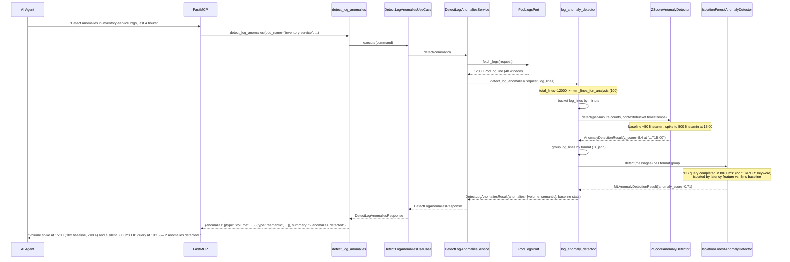
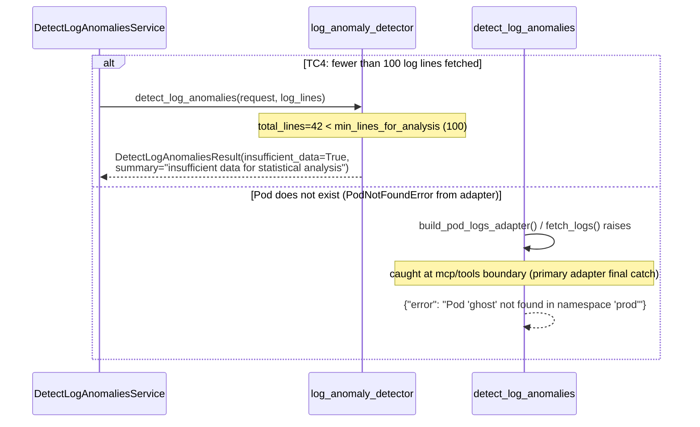
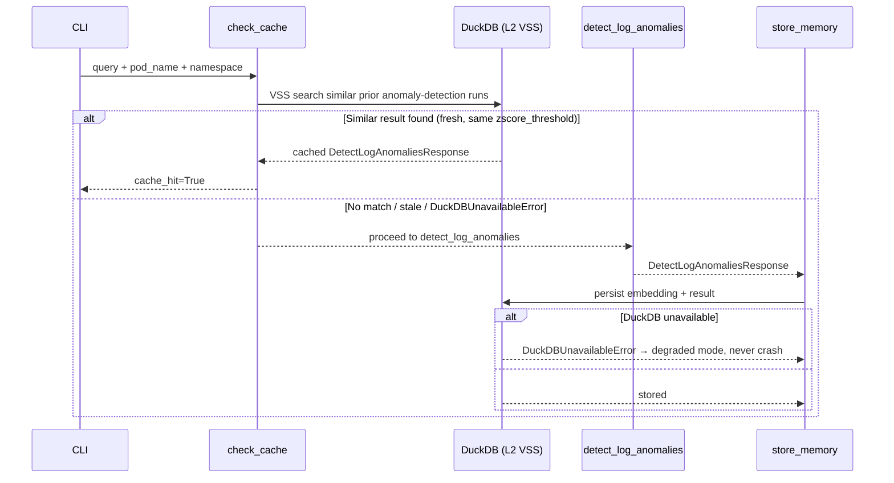

# Use Case 61 — Detect Log Anomalies (Z-Score Volume + Isolation Forest Semantic)

## Sample Questions

- "Detect anomalies in the logs of the inventory-service pod over the last 4 hours — are there unusual spikes, silent errors, or statistical outliers?"
- "Is there anything statistically abnormal in the checkout-service logs today?"
- "Show me any silent failures in payment-service logs that don't have an ERROR keyword but look wrong."
- "Are there any log volume spikes in the order-service pod I should worry about?"
- "Find outlier log lines in worker-pod's last 2 hours using anomaly detection."

---

As an SRE, I want to detect statistical anomalies in pod logs so I can catch silent
failures, unusual spikes, and edge cases that don't produce explicit error messages.
Combines a `ZScoreAnomalyDetector` (volume spikes, reused from
`domain/services/anomaly_detection/statistical.py`) with a new
`IsolationForestAnomalyDetector` (semantic outliers, scikit-learn — ECA-14
`ILogAnalysisStrategy` port dependency, zero K8s dependency).

### Flow 1 — Happy Path: Volume Spike + Silent Semantic Outlier



### Flow 2 — Error Flows: Insufficient Data and Pod Not Found



### Flow 3 — Checker Node: False Positive / Confidence Guard

```mermaid
sequenceDiagram
    participant Checker as Checker Node
    participant LLM as LLM Response

    Checker->>LLM: Validate detect_log_anomalies findings
    alt LLM reports an anomaly detected in the first 10 log lines as high-confidence
        Checker-->>LLM: ⚠️ FLAG — anomaly.low_confidence=True (insufficient surrounding baseline)
    alt LLM claims a Z-score anomaly below the configured threshold (default 3.0)
        Checker-->>LLM: ❌ FAIL — z-score must exceed request.zscore_threshold
    alt LLM merges volume and semantic anomalies into one type
        Checker-->>LLM: ❌ FAIL — AC requires an explicit type: "volume" | "semantic" per anomaly
    else All checks pass
        Checker-->>LLM: ✅ PASS
    end
```

### Flow 4 — DuckDB Memory: VSS Check Before, Store After



## Key Points

- **Two independent, composable detectors** — `ZScoreAnomalyDetector` (already shipped for event correlation, reused as-is with `zscore_threshold` now defaulting to 3.0 for logs) flags volume spikes; the new `IsolationForestAnomalyDetector` flags semantic outliers. Neither depends on the other.
- **Silent failures are the whole point** — `IsolationForestAnomalyDetector` operates on numeric features (`log_features.extract_log_features`: length, digit count, parsed latency in ms, word count), not keyword matching, so a slow DB query with no "ERROR" string is still caught by its latency feature diverging from baseline.
- **Fixed-contamination false positives are filtered out** — scikit-learn's `IsolationForest` with a fixed `contamination` always flags ~5% of any batch; `_select_true_outliers` additionally requires the point's anomaly score to deviate from the batch's own score distribution by `isolation_forest_min_score_deviation` (1.5σ), which is what makes TC3 (uniform logs) correctly return zero anomalies.
- **Log format changes mid-window are analyzed separately** — log lines are grouped by `PodLogLine.is_json` before running Isolation Forest per group, so a JSON→plain-text format change never contaminates one feature space with the other's.
- **Early anomalies are flagged, not dropped** — an anomaly whose original line index falls within the first `low_confidence_line_window` (10) lines is still returned, with `low_confidence=True`, since there isn't enough surrounding context yet to be fully confident.
- **Zero K8s dependency in the domain** — `log_anomaly_detector.py`, `statistical.py`, and `ml.py` all operate on plain `PodLogLine` values already fetched through the existing `PodLogsPort` (reused from `analyze_pod_logs`); no new driven port was needed.

## Test Coverage

| Test | File | Status |
|---|---|---|
| `test_short_normal_line_has_low_latency_feature` / `test_slow_query_in_seconds_converted_to_milliseconds` | `tests/unit/anomaly_detection/test_log_features.py` | ✅ |
| `test_silent_slow_query_detected_without_error_keyword` (TC2) | `tests/unit/anomaly_detection/test_ml.py` | ✅ |
| `test_completely_normal_logs_returns_no_anomalies` (TC3) | `tests/unit/anomaly_detection/test_ml.py` | ✅ |
| `test_mild_score_deviation_below_threshold_is_not_flagged` | `tests/unit/anomaly_detection/test_ml.py` | ✅ |
| `test_spike_minute_flagged_as_volume_anomaly` (TC1) | `tests/unit/log_analysis/test_log_anomaly_detector.py` | ✅ |
| `test_silent_slow_query_detected_without_error_keyword` (TC2) | `tests/unit/log_analysis/test_log_anomaly_detector.py` | ✅ |
| `test_normal_logs_return_no_anomalies_with_baseline` (TC3) | `tests/unit/log_analysis/test_log_anomaly_detector.py` | ✅ |
| `test_fewer_than_100_lines_returns_insufficient_data_warning` (TC4) | `tests/unit/log_analysis/test_log_anomaly_detector.py` | ✅ |
| `test_format_change_mid_window_analyzed_separately` (edge case) | `tests/unit/log_analysis/test_log_anomaly_detector.py` | ✅ |
| `test_anomaly_in_first_10_lines_flagged_low_confidence` (edge case) | `tests/unit/log_analysis/test_log_anomaly_detector.py` | ✅ |
| `test_detect_returns_response_from_domain_computation` | `tests/unit/test_detect_log_anomalies_service.py` | ✅ |
| `test_response_anomaly_dict_shape_for_volume_spike` | `tests/unit/test_detect_log_anomalies_service.py` | ✅ |
| `test_execute_delegates_to_service` | `tests/unit/test_detect_log_anomalies_use_case.py` | ✅ |
| `test_returns_no_anomalies_for_normal_logs` / `test_returns_insufficient_data_warning` / `test_handles_error` | `tests/unit/test_detect_log_anomalies_tool.py` | ✅ |

## Related Files

- `src/hexawyn/domain/models/constants.py` — `LogAnomalyDetectionConstants` (zscore_threshold=3.0, min_lines_for_analysis=100, low_confidence_line_window=10, isolation_forest_*)
- `src/hexawyn/domain/models/log_anomaly.py` — `LogAnomaly`, `DetectLogAnomaliesRequest`, `DetectLogAnomaliesResult`
- `src/hexawyn/domain/services/anomaly_detection/statistical.py` — `ZScoreAnomalyDetector` (reused, unmodified)
- `src/hexawyn/domain/services/anomaly_detection/log_features.py` — `extract_log_features` (length, digit count, latency-ms, word count)
- `src/hexawyn/domain/services/anomaly_detection/ml.py` — `IsolationForestAnomalyDetector` (ECA-14 concrete strategy)
- `src/hexawyn/domain/services/log_analysis/log_anomaly_detector.py` — `detect_log_anomalies` orchestrator (bucketing, format grouping, low-confidence flagging)
- `src/hexawyn/application/ports/driving/detect_log_anomalies/` — command, response, service_port
- `src/hexawyn/application/service/detect_log_anomalies_service.py` — `DetectLogAnomaliesService`
- `src/hexawyn/application/use_case/detect_log_anomalies/detect_log_anomalies_use_case.py` — `DetectLogAnomaliesUseCase`
- `src/hexawyn/mcp/tools/detect_log_anomalies.py` — MCP tool (auto-registered by `mcp/server.py::register_tools`)
