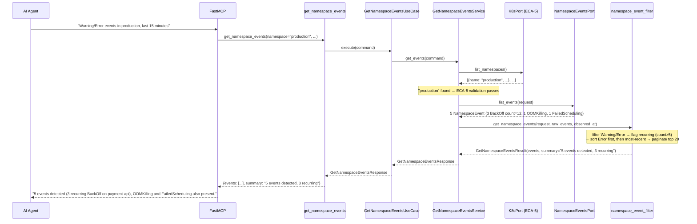
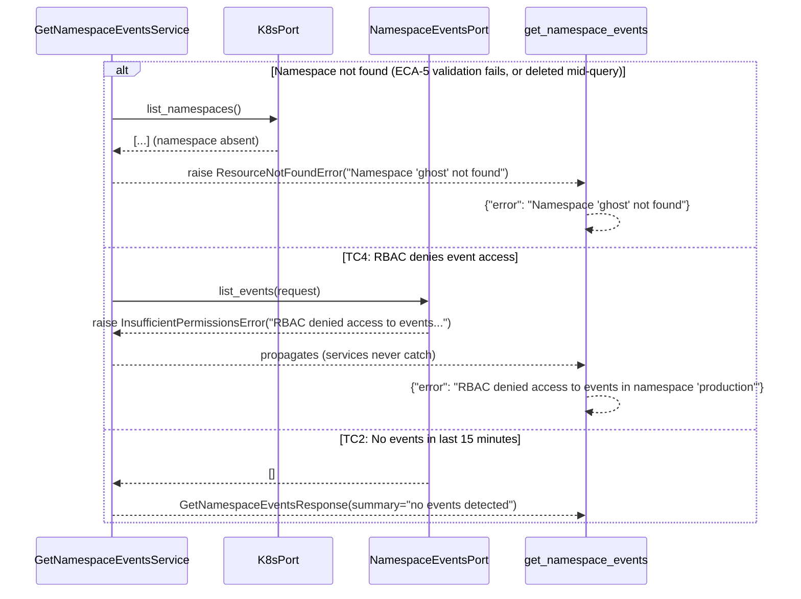

# Use Case 62 — Namespace Warning/Error Events Triage

## Sample Questions

- "Show me all Warning and Error events in the production namespace from the last 15 minutes — which pods are involved?"
- "What's going wrong in the checkout namespace right now?"
- "Are there any recurring BackOff or OOMKilled events in payment-namespace?"
- "List the critical events for the staging namespace in the last quarter hour."
- "Which objects in production are throwing repeated warnings I should look at first?"

---

As an SRE, I want to get all Warning and Error events from a namespace in the last
15 minutes so I can quickly identify which pods are causing issues without
scrolling through thousands of events. Namespace existence is validated via
`list_namespaces` (ECA-5) before events are fetched through the new
`core_v1.list_namespaced_event`-backed adapter.

### Flow 1 — Happy Path: Filtered, Sorted, Flagged Events



### Flow 2 — Error Flows: Namespace Not Found, RBAC Denied, No Events



### Flow 3 — Checker Node: Progressive Disclosure Guard

```mermaid
sequenceDiagram
    participant Checker as Checker Node
    participant LLM as LLM Response

    Checker->>LLM: Validate get_namespace_events findings
    alt TC3: 500+ events but LLM claims to have listed them all
        Checker-->>LLM: ❌ FAIL — only top_n (20) are ever returned; has_more/remaining_count must be surfaced
    alt LLM reports a count=1 event from 30s ago as low priority
        Checker-->>LLM: ⚠️ FLAG — urgency="high" for very recent single occurrences, not to be downplayed
    alt LLM omits the "object no longer exists" note for a deleted pod's event
        Checker-->>LLM: ❌ FAIL — object_exists=False events must carry the note
    else All checks pass
        Checker-->>LLM: ✅ PASS
    end
```

## Key Points

- **ECA-5 is an explicit dependency, not an afterthought** — `GetNamespaceEventsService` calls `K8sPort.list_namespaces()` before ever touching `NamespaceEventsPort`, so a typo'd or deleted namespace fails fast with a clear `ResourceNotFoundError` instead of a confusing empty-events response.
- **Sort is severity-first, then recency** — `_sort_key` ranks `Error` (0) before `Warning` (1), and within the same severity orders by `last_seen` descending, so the freshest problems surface first without a separate grouping pass.
- **Recurring is per-event, not cross-event aggregation** — `recurring = count > 5` uses each `NamespaceEvent`'s own `.count` (Kubernetes already aggregates repeated identical events server-side); events for the same object naturally end up adjacent once sorted.
- **Progressive disclosure caps the response, never the truth** — `top_n` (default 20) limits what's returned, but `total_events`, `has_more`, and `remaining_count` are always accurate so the agent can ask for more instead of assuming completeness.
- **Silent single occurrences aren't silently dropped** — a `count=1` event less than `urgency_recent_window_seconds` (60s) old is flagged `urgency="high"`, since a single very-recent Warning is often the first sign of an emerging incident.
- **Deleted objects are surfaced, not hidden** — the adapter's best-effort `read_namespaced_pod` lookup sets `object_exists=False`, and the domain service appends "(object no longer exists)" to the message so a stale event for a since-deleted pod is never mistaken for an active one.

## Test Coverage

| Test | File | Status |
|---|---|---|
| `test_events_over_threshold_flagged_recurring_and_adjacent` (TC1) | `tests/unit/event_analysis/test_namespace_event_filter.py` | ✅ |
| `test_empty_events_returns_clean_message` (TC2) | `tests/unit/event_analysis/test_namespace_event_filter.py` | ✅ |
| `test_more_than_top_n_events_paginated` (TC3) | `tests/unit/event_analysis/test_namespace_event_filter.py` | ✅ |
| `test_error_events_sorted_before_warning_regardless_of_timestamp` / `test_same_severity_sorted_by_most_recent_first` | `tests/unit/event_analysis/test_namespace_event_filter.py` | ✅ |
| `test_normal_type_events_are_filtered_out` | `tests/unit/event_analysis/test_namespace_event_filter.py` | ✅ |
| `test_single_recent_event_flagged_high_urgency` / `test_old_single_event_is_normal_urgency` (edge case) | `tests/unit/event_analysis/test_namespace_event_filter.py` | ✅ |
| `test_deleted_object_shown_with_note` (edge case) | `tests/unit/event_analysis/test_namespace_event_filter.py` | ✅ |
| `test_get_events_raises_when_namespace_missing` (ECA-5) | `tests/unit/test_get_namespace_events_service.py` | ✅ |
| `test_forbidden_raises_insufficient_permissions` (TC4) | `tests/unit/test_kubernetes_namespace_events_adapter.py` | ✅ |
| `test_namespace_not_found_raises_resource_not_found` (edge case: namespace deleted mid-query) | `tests/unit/test_kubernetes_namespace_events_adapter.py` | ✅ |
| `test_list_events_deleted_pod_marked_object_missing` (edge case) | `tests/unit/test_kubernetes_namespace_events_adapter.py` | ✅ |
| `test_returns_events` / `test_handles_error` | `tests/unit/test_get_namespace_events_tool.py` | ✅ |

## Related Files

- `src/hexawyn/domain/models/constants.py` — `NamespaceEventsConstants` (recurring_count_threshold=5, top_n_default=20, urgency_recent_window_seconds=60)
- `src/hexawyn/domain/models/namespace_event.py` — `NamespaceEvent`, `GetNamespaceEventsRequest`, `GetNamespaceEventsResult`
- `src/hexawyn/domain/services/event_analysis/namespace_event_filter.py` — `get_namespace_events` (filter, flag, sort, paginate)
- `src/hexawyn/application/ports/driven/namespace_events_port.py` — `NamespaceEventsPort`
- `src/hexawyn/application/ports/driving/get_namespace_events/` — command, response, service_port
- `src/hexawyn/application/service/get_namespace_events_service.py` — `GetNamespaceEventsService` (ECA-5 validation + orchestration)
- `src/hexawyn/application/use_case/get_namespace_events/get_namespace_events_use_case.py` — `GetNamespaceEventsUseCase`
- `src/hexawyn/adapters/secondary/gitops/kubernetes_namespace_events_adapter.py` — `KubernetesNamespaceEventsAdapter` (`core_v1.list_namespaced_event`)
- `src/hexawyn/mcp/tools/get_namespace_events.py` — MCP tool (auto-registered by `mcp/server.py::register_tools`)
- `src/hexawyn/mcp/server.py` — `build_namespace_events_adapter` (new), reuses existing `build_k8s_adapter` for ECA-5
