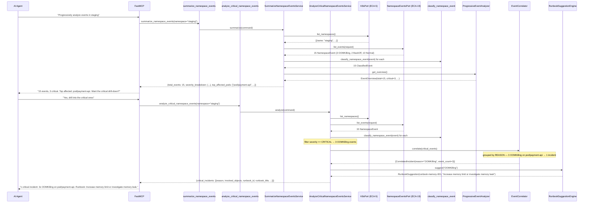
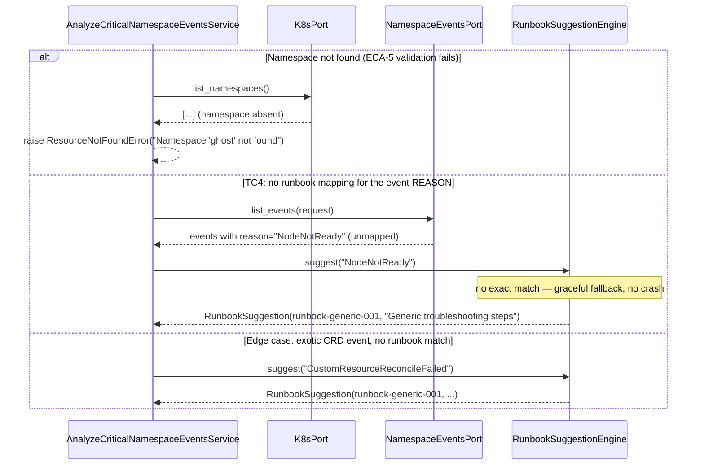
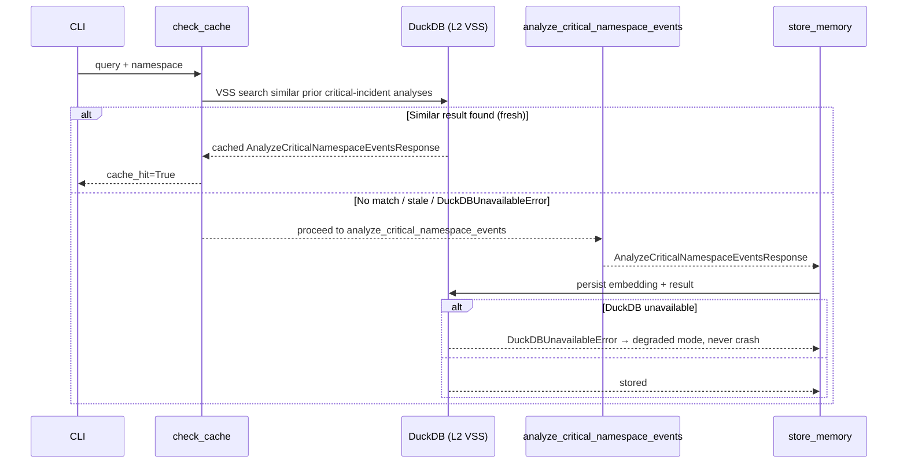

# Use Case 63 — Progressive Namespace Event Analysis with Runbook Correlation

## Sample Questions

- "Progressively analyze events in the staging namespace — start with a summary, then drill down into critical events with correlated runbook suggestions."
- "Give me a quick overview of what's happening in staging, then show me the critical stuff with fixes."
- "What are the top affected pods in production right now, and what runbooks apply to the critical ones?"
- "Summarize namespace events for checkout, then correlate the critical incidents for me."
- "Is there a recurring OOMKilling incident in staging, and what's the recommended runbook?"

---

As an SRE, I want to progressively analyze namespace events starting with a
high-level summary, then automatically drilling into the most critical ones
with runbook suggestions, so I can triage faster during an incident.
Reuses `NamespaceEventsPort` (ECA-19, unfiltered — Normal events count toward
the Phase 1 total) and the existing `ProgressiveEventAnalyzer` for the
severity breakdown; adds two new pure domain services, `RunbookSuggestionEngine`
and `EventCorrelator`.

### Flow 1 — Happy Path: Phase 1 Summary, Then Phase 2 Drill-Down



### Flow 2 — Error Flows and TC4 Fallback



### Flow 3 — Checker Node: Correlation and Runbook Guard

```mermaid
sequenceDiagram
    participant Checker as Checker Node
    participant LLM as LLM Response

    Checker->>LLM: Validate progressive namespace analysis findings
    alt LLM reports 10 separate incidents for the same REASON across 10 pods
        Checker-->>LLM: ❌ FAIL — EventCorrelator groups by REASON, not by pod; must be 1 incident
    alt LLM invents a runbook not in the RunbookSuggestionEngine mapping
        Checker-->>LLM: ❌ FAIL — runbook_id must come from RunbookSuggestionEngine.suggest(), never fabricated
    alt LLM skips Phase 1 and jumps straight to a critical-events claim
        Checker-->>LLM: ⚠️ FLAG — progressive disclosure requires the Phase 1 summary before Phase 2 detail
    else All checks pass
        Checker-->>LLM: ✅ PASS
    end
```

### Flow 4 — DuckDB Memory: VSS Check Before, Store After



## Key Points

- **Two tools, two phases, one data source** — `summarize_namespace_events` (Phase 1) and `analyze_critical_namespace_events` (Phase 2) both fetch through the same `NamespaceEventsPort` (ECA-19), unfiltered — Normal events count toward `total_events`, unlike the Warning/Error-only filter built for the prior `get_namespace_events` ticket.
- **`ProgressiveEventAnalyzer` is reused, not reimplemented** — Phase 1's severity breakdown comes straight from its existing `get_overview()`; only "top 3 affected pods" (ranked by event count) is new, since that metric didn't exist before.
- **Correlation groups by REASON, never by object** — `EventCorrelator` treats "3 OOMKilling events on one pod" and "1 OOMKilling event each on 10 different pods" the same way: one incident per reason, because a reason recurring cluster-wide is exactly the kind of shared root cause an SRE needs surfaced as one thing, not ten.
- **RunbookSuggestionEngine never raises** — an unmapped or exotic REASON always resolves to the generic fallback (`runbook-generic-001`) rather than an exception, so a single unrecognized CRD event can't take down the whole analysis.
- **Phase 2 is critical-only by design** — only `EventSeverity.CRITICAL` events reach `EventCorrelator`; BackOff (HIGH) and Normal (LOW) events are visible in the Phase 1 breakdown but never appear in `critical_incidents`, keeping the drill-down focused.
- **ECA-5 validation is shared with the prior ticket's pattern** — both new services call `K8sPort.list_namespaces()` before touching events, exactly like `GetNamespaceEventsService`, so a deleted/mistyped namespace fails fast and consistently across all three namespace-event use cases.

## Test Coverage

| Test | File | Status |
|---|---|---|
| `test_oomkilling_is_critical_resource` / `test_backoff_is_high` / `test_normal_type_is_low_severity` | `tests/unit/event_analysis/test_namespace_event_classifier.py` | ✅ |
| `test_oomkilling_suggests_memory_runbook` (TC2) | `tests/unit/event_analysis/test_runbook.py` | ✅ |
| `test_unknown_reason_returns_generic_fallback` (TC4) | `tests/unit/event_analysis/test_runbook.py` | ✅ |
| `test_exotic_crd_event_no_match_does_not_crash` (edge case) | `tests/unit/event_analysis/test_runbook.py` | ✅ |
| `test_same_pod_events_within_minutes_correlated_as_one_incident` (TC3) | `tests/unit/event_analysis/test_correlator.py` | ✅ |
| `test_same_reason_across_ten_pods_grouped_by_reason` (edge case) | `tests/unit/event_analysis/test_correlator.py` | ✅ |
| `test_total_events_and_severity_breakdown` / `test_top_affected_pods_ranks_by_event_count` (TC1 Phase 1) | `tests/unit/event_analysis/test_progressive_namespace_analysis.py` | ✅ |
| `test_critical_incident_correlated_with_runbook` (TC1 Phase 2) | `tests/unit/event_analysis/test_progressive_namespace_analysis.py` | ✅ |
| `test_unmapped_critical_reason_falls_back_to_generic_runbook` (TC4) | `tests/unit/event_analysis/test_progressive_namespace_analysis.py` | ✅ |
| `test_summarize_validates_namespace_then_fetches_events` | `tests/unit/test_summarize_namespace_events_service.py` | ✅ |
| `test_analyze_validates_namespace_then_returns_critical_incidents` | `tests/unit/test_analyze_critical_namespace_events_service.py` | ✅ |
| `test_returns_summary` / `test_handles_error` | `tests/unit/test_summarize_namespace_events_tool.py` | ✅ |
| `test_returns_critical_incidents_with_runbooks` / `test_handles_error` | `tests/unit/test_analyze_critical_namespace_events_tool.py` | ✅ |

## Related Files

- `src/hexawyn/domain/services/event_analysis/namespace_event_classifier.py` — `classify_namespace_event` (raw NamespaceEvent → ClassifiedEvent)
- `src/hexawyn/domain/services/event_analysis/runbook.py` — `RunbookSuggestionEngine`, `RunbookSuggestion`
- `src/hexawyn/domain/services/event_analysis/correlator.py` — `EventCorrelator`, `CorrelatedIncident`
- `src/hexawyn/domain/services/event_analysis/classifier.py` — `ProgressiveEventAnalyzer` (reused, unmodified)
- `src/hexawyn/domain/services/event_analysis/progressive_namespace_analysis.py` — `summarize_namespace_events` (Phase 1), `analyze_critical_events` (Phase 2)
- `src/hexawyn/application/ports/driving/summarize_namespace_events/` — command, response, service_port
- `src/hexawyn/application/ports/driving/analyze_critical_namespace_events/` — command, response, service_port
- `src/hexawyn/application/service/summarize_namespace_events_service.py` / `analyze_critical_namespace_events_service.py`
- `src/hexawyn/application/use_case/summarize_namespace_events/` / `analyze_critical_namespace_events/`
- `src/hexawyn/mcp/tools/summarize_namespace_events.py` / `analyze_critical_namespace_events.py`
