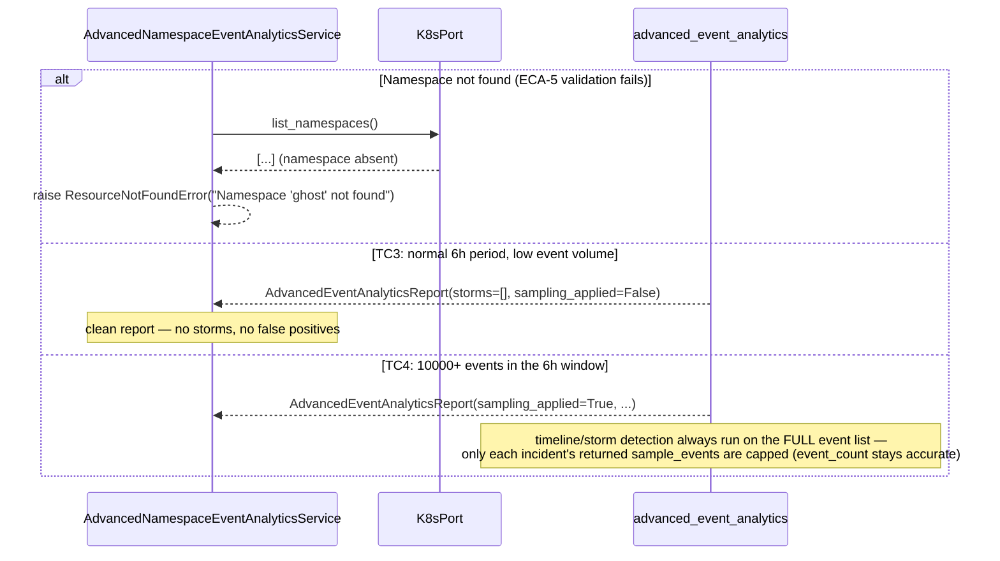

# Use Case 64 — Advanced Namespace Event Analytics (6h Storm Detection + Correlation)

## Sample Questions

- "Give me an advanced analytics report of all events in the data-pipeline namespace over the past 6 hours — categorize by severity and highlight correlated incidents."
- "Were there any event storms in the checkout namespace today?"
- "What are the top recurring event reasons in production over the last 6 hours?"
- "Show me the event volume timeline for staging and flag any spikes."
- "Are there correlated incidents across multiple pods in data-pipeline right now?"

---

As an SRE, I want an advanced analytics report of namespace events over a
6-hour window so I can detect event storms, correlated incidents, and
systemic patterns beyond simple log scanning. Reuses `NamespaceEventsPort`
(ECA-19) and `EventCorrelator` (ECA-20, unmodified, reused from the
progressive-analysis ticket) — the only new domain pieces are
`EventStormDetector` and the timeline/top-reasons aggregation.

### Flow 1 — Happy Path: Timeline, Storm, Top Reasons, Correlated Incidents

```mermaid
sequenceDiagram
    participant AI as AI Agent
    participant MCP as FastMCP
    participant Tool as advanced_namespace_event_analytics
    participant UseCase as AdvancedNamespaceEventAnalyticsUseCase
    participant Service as AdvancedNamespaceEventAnalyticsService
    participant K8sPort as K8sPort (ECA-5)
    participant EventsPort as NamespaceEventsPort (ECA-19)
    participant Domain as advanced_event_analytics
    participant Storm as EventStormDetector
    participant Classifier as classify_namespace_event
    participant Correlator as EventCorrelator (ECA-20)

    AI->>MCP: "Advanced analytics report for data-pipeline, last 6h"
    MCP->>Tool: advanced_namespace_event_analytics(namespace="data-pipeline")
    Tool->>UseCase: execute(command)
    UseCase->>Service: analyze(command)
    Service->>K8sPort: list_namespaces()
    K8sPort-->>Service: [{name: "data-pipeline", ...}]
    Service->>EventsPort: list_events(request)
    EventsPort-->>Service: ~450 NamespaceEvent (6h window)

    Service->>Domain: generate_advanced_event_analytics(namespace, events)
    Note over Domain: sort by timestamp (out-of-order edge case handled)
    Domain->>Storm: detect(sorted_events)
    Note over Storm: sliding window — 85 events within 90s at 14:32
    Storm-->>Domain: [EventStorm(start=14:32:00, end=14:33:30, count=85)]
    Note over Domain: per-minute timeline built; buckets inside the storm window flagged is_spike=True

    Domain->>Domain: filter non-Normal events → top 5 reasons (BackOff x340, OOMKilling x12, ...)
    Domain->>Classifier: classify_namespace_event(event) for each non-Normal event
    Domain->>Correlator: correlate(classified)
    Note over Correlator: grouped by REASON — 5 pods with BackOff → 1 incident
    Correlator-->>Domain: [CorrelatedIncident(reason="BackOff", involved_objects=[5 pods]), ...]

    Domain-->>Service: AdvancedEventAnalyticsReport(timeline, storms, top_reasons, correlated_incidents)
    Service-->>UseCase: AdvancedNamespaceEventAnalyticsResponse
    UseCase-->>Tool: AdvancedNamespaceEventAnalyticsResponse
    Tool-->>MCP: {timeline: [...], storms: [{start_time, end_time, event_count: 85}], top_reasons: [...], correlated_incidents: [...]}
    MCP-->>AI: "1 storm at 14:32 (85 events/90s). Top reason: BackOff (340x). 1 correlated incident across 5 pods — likely a downstream failure."
```

### Flow 2 — Error Flows and TC3/TC4



### Flow 3 — Checker Node: Storm Accuracy and Correlation Guard

```mermaid
sequenceDiagram
    participant Checker as Checker Node
    participant LLM as LLM Response

    Checker->>LLM: Validate advanced analytics findings
    alt LLM claims sampling reduced storm event_count below the true value
        Checker-->>LLM: ❌ FAIL — storm/timeline counts are always computed on the unsampled full event list
    alt LLM reports the rolling-restart storm as a confirmed incident, not a spike to interpret
        Checker-->>LLM: ⚠️ FLAG — the tool cannot distinguish an expected rolling-restart storm from a real one; flag for user judgment, don't assert root cause
    alt LLM groups the same REASON separately per pod instead of one correlated incident
        Checker-->>LLM: ❌ FAIL — EventCorrelator (ECA-20) groups by REASON, not by pod
    else All checks pass
        Checker-->>LLM: ✅ PASS
    end
```

## Key Points

- **Timeline and storm detection see every event, correlation and top-reasons don't** — a rolling restart floods a namespace with Normal events (Killing, Created, Started), which is exactly the kind of volume spike this report must surface; but only non-Normal (Warning/Error) events are meaningful for "top recurring reasons" and root-cause correlation, so those two are filtered.
- **`EventStormDetector` is a single O(n) forward sliding window** — sorts timestamps once, then a two-pointer scan (`right` never resets backward) finds every contiguous run of `>storm_min_events` (50) within `storm_window_seconds` (120), merging each run into one `EventStorm` rather than reporting overlapping duplicates.
- **`EventCorrelator` (ECA-20) is reused completely unmodified** — the same REASON-based grouping built for the progressive-analysis ticket means "5 pods all showing BackOff" collapses into one correlated incident here too, with no new correlation logic to maintain.
- **Sampling never touches the numbers that matter** — `sampling_applied` only caps how many individual sample events are returned per incident (`sample_events_per_incident` = 50); `total_events`, every `EventStorm.event_count`, and every incident's own `event_count` are always computed from the complete, unsampled event list.
- **Out-of-order timestamps are a non-issue by construction** — the very first step in `generate_advanced_event_analytics` sorts all events by parsed timestamp, so a K8s API returning events in an arbitrary order never affects storm or timeline accuracy.
- **The tool reports, it doesn't interpret** — an event storm during an expected rolling restart is flagged exactly like any other storm; the domain has no way to know deployment intent, so that judgment call is left to the SRE reading the report (documented, not coded around).

## Test Coverage

| Test | File | Status |
|---|---|---|
| `test_storm_detected_when_burst_exceeds_threshold` (TC1) | `tests/unit/event_analysis/test_event_storm_detector.py` | ✅ |
| `test_out_of_order_timestamps_still_detected` (edge case) | `tests/unit/event_analysis/test_event_storm_detector.py` | ✅ |
| `test_no_storm_for_normal_low_volume_period` (TC3) | `tests/unit/event_analysis/test_event_storm_detector.py` | ✅ |
| `test_storm_flagged_with_timeline_spike` (TC1) | `tests/unit/event_analysis/test_advanced_event_analytics.py` | ✅ |
| `test_same_reason_across_pods_correlated_as_one_incident` (TC2) | `tests/unit/event_analysis/test_advanced_event_analytics.py` | ✅ |
| `test_low_volume_period_has_no_storms` (TC3) | `tests/unit/event_analysis/test_advanced_event_analytics.py` | ✅ |
| `test_large_volume_applies_sampling_but_keeps_accurate_counts` (TC4) | `tests/unit/event_analysis/test_advanced_event_analytics.py` | ✅ |
| `test_top_reasons_ranked_by_count` | `tests/unit/event_analysis/test_advanced_event_analytics.py` | ✅ |
| `test_out_of_order_timestamps_sorted_before_analysis` (edge case) | `tests/unit/event_analysis/test_advanced_event_analytics.py` | ✅ |
| `test_analyze_validates_namespace_then_returns_report` | `tests/unit/test_advanced_namespace_event_analytics_service.py` | ✅ |
| `test_returns_report` / `test_handles_error` | `tests/unit/test_advanced_namespace_event_analytics_tool.py` | ✅ |

## Related Files

- `src/hexawyn/domain/models/constants.py` — `AdvancedEventAnalyticsConstants` (storm_min_events=50, storm_window_seconds=120, top_reasons_limit=5, sampling_threshold=5000, sample_events_per_incident=50)
- `src/hexawyn/domain/services/event_analysis/event_storm_detector.py` — `EventStormDetector`, `EventStorm`
- `src/hexawyn/domain/services/event_analysis/advanced_event_analytics.py` — `generate_advanced_event_analytics` (timeline, storms, top reasons, sampled incidents)
- `src/hexawyn/domain/services/event_analysis/correlator.py` — `EventCorrelator` (ECA-20, reused unmodified)
- `src/hexawyn/domain/services/event_analysis/namespace_event_classifier.py` — `classify_namespace_event` (reused)
- `src/hexawyn/application/ports/driving/advanced_namespace_event_analytics/` — command, response, service_port
- `src/hexawyn/application/service/advanced_namespace_event_analytics_service.py` — `AdvancedNamespaceEventAnalyticsService`
- `src/hexawyn/application/use_case/advanced_namespace_event_analytics/advanced_namespace_event_analytics_use_case.py`
- `src/hexawyn/mcp/tools/advanced_namespace_event_analytics.py` — MCP tool (auto-registered)
