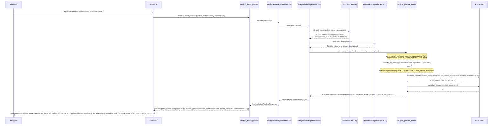
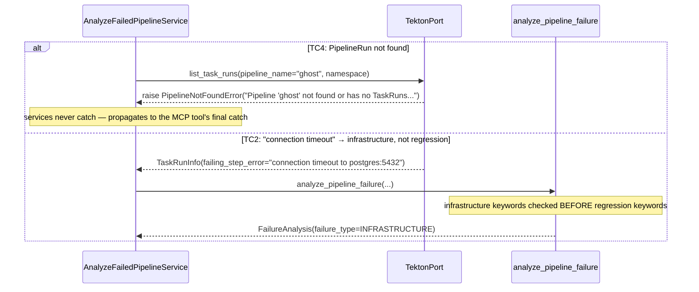

# Use Case 65 — Automated Pipeline Failure Root Cause Analysis

## Sample Questions

- "The pipeline deploy-payment-v3 failed — what is the root cause? Which task failed, what were the error logs, and was it a flaky test or a real regression?"
- "Why did the checkout-service pipeline fail — is this a flaky test or a real bug?"
- "Give me a root cause analysis for the failed order-api pipeline with a remediation recommendation."
- "Is the payment-gateway pipeline failure infrastructure-related or a code regression?"
- "What's the confidence and impact score for the latest deploy-payment-v3 failure?"

---

As an SRE, I want to automatically analyze a failed pipeline so I can identify
the root cause, distinguish flaky tests from real regressions, and get a
remediation recommendation without reading raw logs. Reuses the pre-built
`RcaScorer`/`RcaScoringConfig` (confidence 0-1, impact 1-10) with a scoring
config specific to this feature, `TektonPort.list_task_runs` (ECA-8) for
failed-task identification *and* historical flakiness detection from the same
call, and `PipelineRunLogsPort.fetch_step_logs` (ECA-11) to enrich generic
exit-code errors with the actual log line.

### Flow 1 — Happy Path: Regression Classified with Confidence and Remediation



### Flow 2 — Error Flows: Pipeline Not Found and Infrastructure Classification



### Flow 3 — Checker Node: Flaky vs. Regression and Ordering Guard

```mermaid
sequenceDiagram
    participant Checker as Checker Node
    participant LLM as LLM Response

    Checker->>LLM: Validate pipeline failure RCA findings
    alt TC3: same test failed 3 of last 5 runs, but LLM classifies by error keyword instead
        Checker-->>LLM: ❌ FAIL — intermittent failure pattern (flaky_test_min_failures ≤ N < window) overrides keyword classification
    alt LLM reports a persistent failure (all 5 of last 5 runs) as flaky
        Checker-->>LLM: ❌ FAIL — failing every recent run is a real regression, not flakiness
    alt Multiple tasks failed but LLM only reports one
        Checker-->>LLM: ⚠️ FLAG — each failing task must be analyzed separately (edge case: multiple failures aggregated)
    alt An earlier-executing task (e.g. clone-repo) also failed but LLM shows the later task first
        Checker-->>LLM: ❌ FAIL — failures must be ordered by start_time; the init/earlier task surfaces first
    else All checks pass
        Checker-->>LLM: ✅ PASS
    end
```

## Key Points

- **Flakiness is a historical pattern, checked before message classification** — for each failing task, the last `flaky_test_window_runs` (5) entries for that same `task_ref` are inspected; `flaky_test_min_failures` (3) ≤ failures-in-window < window size means intermittent (flaky), overriding whatever the current error message says. A test that fails every single recent run is NOT flaky — that's a persistent regression.
- **Confidence reuses the pre-built `RcaScorer`, just with feature-specific weights** — `RcaScoringConfig(base=0.5, logs_analyzed=0.2, root_cause_found=0.1, timeline_available=0.05)` sums to exactly 0.85 when all three evidence factors are present, matching TC1 precisely; the generic `RcaScorer`/`RcaConfidenceScore`/`FailureImpactScore` classes are unmodified and reusable by other RCA features with their own weight configs.
- **Infrastructure keywords are checked before regression keywords** — "connection timeout" contains no assertion language, but even if it did, `_classify_by_message` checks infrastructure/dependency/config first, so TC2 never gets misclassified as a code regression.
- **ECA-11 step logs enrich, they don't replace** — `failing_step_error` from Tekton is used directly when descriptive; `PipelineRunLogsPort` output is only substituted in when the Tekton-level message is a bare `"exit code N"`, giving richer signal without a redundant primary data path.
- **Multiple failures are analyzed independently, then aggregated** — each distinct `task_ref` whose most-recent run failed gets its own `FailureAnalysis` (own classification, confidence, impact, remediation); `aggregated_root_cause` summarizes all of them together for a single top-line answer.
- **Failures surface in execution order, not discovery order** — sorting by `start_time` ascending means an early init-phase task's failure is always shown before a later main-task failure, with no separate "is this an init container" detection needed.

## Test Coverage

| Test | File | Status |
|---|---|---|
| `test_assertion_error_classified_as_regression` (TC1) | `tests/unit/failure_analysis/test_rca.py` | ✅ |
| `test_connection_timeout_classified_as_infrastructure` (TC2) | `tests/unit/failure_analysis/test_rca.py` | ✅ |
| `test_module_not_found_classified_as_dependency` | `tests/unit/failure_analysis/test_rca.py` | ✅ |
| `test_missing_env_var_classified_as_config_error` | `tests/unit/failure_analysis/test_rca.py` | ✅ |
| `test_intermittent_failures_classified_as_flaky` (TC3) | `tests/unit/failure_analysis/test_rca.py` | ✅ |
| `test_all_runs_failing_is_not_flaky` | `tests/unit/failure_analysis/test_rca.py` | ✅ |
| `test_two_failing_tasks_both_analyzed` (edge case) | `tests/unit/failure_analysis/test_rca.py` | ✅ |
| `test_earlier_task_failure_appears_first` (edge case) | `tests/unit/failure_analysis/test_rca.py` | ✅ |
| `test_generic_exit_code_error_enriched_by_step_logs` | `tests/unit/failure_analysis/test_rca.py` | ✅ |
| `test_analyze_propagates_pipeline_not_found` (TC4) | `tests/unit/test_analyze_failed_pipeline_service.py` | ✅ |
| `test_returns_analysis` / `test_handles_pipeline_not_found` | `tests/unit/test_analyze_failed_pipeline_tool.py` | ✅ |

## Related Files

- `src/hexawyn/domain/models/constants.py` — `PipelineFailureAnalysisConstants` (flaky_test_min_failures=3, flaky_test_window_runs=5)
- `src/hexawyn/domain/models/pipeline_failure_analysis.py` — `FailureType`, `FailureAnalysis`, `AnalyzeFailedPipelineRequest`, `AnalyzeFailedPipelineResult`
- `src/hexawyn/domain/services/failure_analysis/rca.py` — `analyze_pipeline_failure` (classification, flaky detection, aggregation)
- `src/hexawyn/domain/services/failure_analysis/scorer.py` — `RcaScorer` (reused, unmodified)
- `src/hexawyn/domain/models/scoring.py` — `RcaScoringConfig`, `RcaConfidenceScore`, `FailureImpactScore` (reused, unmodified)
- `src/hexawyn/application/ports/driving/analyze_failed_pipeline/` — command, response, service_port
- `src/hexawyn/application/service/analyze_failed_pipeline_service.py` — `AnalyzeFailedPipelineService`
- `src/hexawyn/application/use_case/analyze_failed_pipeline/analyze_failed_pipeline_use_case.py`
- `src/hexawyn/mcp/tools/analyze_failed_pipeline.py` — MCP tool (auto-registered)
