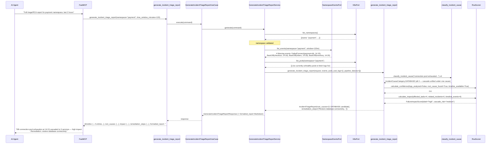
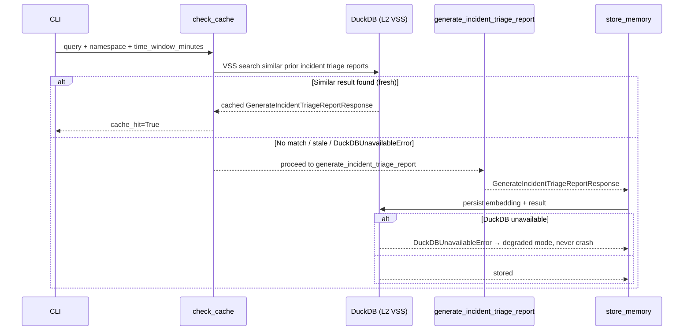

# Use Case 66 — Automated Incident Triage & RCA Report

## Sample Questions

- "Generate a full automated triage and RCA report for the incident on the payment namespace in the last 2 hours — include timeline, impact, root cause, and remediation steps."
- "What caused the outage in checkout-service over the last hour, and how long did it take to recover?"
- "Give me a post-mortem-ready report for the payment namespace I can paste into Confluence."
- "Is this a single root cause or multiple concurrent failures — and which is most likely?"
- "Did the payment-namespace incident spread to any other namespaces?"

---

As an SRE, I want an automated triage and RCA report for a namespace incident so I
can hand off a complete post-mortem document without spending hours writing it
manually. This is a **composition use case** — no new cluster access is added.
It orchestrates four already-shipped driven ports (`NamespaceEventsPort` for
events, `PodLogsPort` for logs, `K8sPort.list_pods` for pod status, `TektonPort`
+ `PipelineRunLogsPort` for pipeline failures) and reuses `analyze_pipeline_failure`
and `RcaScorer` from the pipeline-failure-RCA feature (`domain/services/failure_analysis/`).
Root-cause candidates are grouped by a keyword-classified `IncidentCauseCategory`
(not raw K8s event `reason`), so a cascade of different-looking events sharing
one underlying trigger (e.g. a DB outage causing `BackOff` on three unrelated
services) is reported as **one** root cause instead of three.

**Known data-model gap**: `K8sPort.list_pods` only exposes a cumulative restart
count, not per-restart timestamps — no port in this repo returns "pod restarted
at time T". Pod-restart timeline entries are therefore sourced from the
Kubernetes **events** K8s already emits with real timestamps (`BackOff`,
`Killing`, `Unhealthy`, `Started`, `OOMKilling`); `list_pods` is used for
*current* impact assessment (which pods are unhealthy right now), not historical
placement.

### Flow 1 — Happy Path: Clear Root Cause with Cascade and Remediation (TC1)



### Flow 2 — Error Flows: Insufficient Data and Resolved Incident (TC4, TC3)

```mermaid
sequenceDiagram
    participant Service as GenerateIncidentTriageReportService
    participant EventsPort as NamespaceEventsPort
    participant K8sPort as K8sPort
    participant Domain as generate_incident_triage_report

    alt TC4: no events, pods, logs, or pipeline runs found in the window
        Service->>EventsPort: list_events(namespace="idle-ns", window=120m)
        EventsPort-->>Service: []
        Service->>K8sPort: list_pods(namespace="idle-ns")
        K8sPort-->>Service: []
        Service->>Domain: generate_incident_triage_report(request, [], [], {}, [])
        Domain-->>Service: IncidentTriageReport(insufficient_data=True,<br/>data_checked=["namespace events (120m window)", "pod status", "pod logs", "pipeline runs"])
    else TC3: incident already resolved before report generation
        EventsPort-->>Service: 4 Warning events (14:15-14:20) + 1 Normal "Started" event (15:42)
        Service->>Domain: generate_incident_triage_report(...)
        Note over Domain: last Warning/Error at 14:20; first Normal event after<br/>that is 15:42 → resolved=True
        Domain-->>Service: IncidentTriageReport(resolved=True, resolution_time="...15:42:00Z",<br/>mttr_minutes=87)
    end
```

### Flow 3 — Checker Node: Ambiguous Ranking, Cross-Namespace, and Clock Drift (TC2, edge cases)

```mermaid
sequenceDiagram
    participant Checker as Checker Node
    participant LLM as LLM Response

    Checker->>LLM: Validate incident triage/RCA findings
    alt TC2: two concurrent, unrelated failures (DB timeout + auth-service connection refused)
        Checker-->>LLM: ❌ FAIL — both DATABASE and NETWORK candidates must be reported,<br/>ranked by confidence; LLM must not silently pick one as "the" cause
    alt Incident spans multiple namespaces (payment DB outage also hits billing-db)
        Checker-->>LLM: ⚠️ FLAG — related_namespaces events matching the top candidate's<br/>category must appear in cross_namespace_correlation, not be dropped
    alt A pod's log line predates the K8s event referencing it by more than the drift threshold
        Checker-->>LLM: ❌ FAIL — ntp_drift_detected must be surfaced with a note,<br/>not silently reordered into a false causal chain
    alt LLM reports a report as "clear root cause" despite two comparable-confidence candidates
        Checker-->>LLM: ❌ FAIL — ambiguity must be preserved in the output, not collapsed
    else All checks pass
        Checker-->>LLM: ✅ PASS
    end
```

### Flow 4 — DuckDB Memory: VSS Check Before, Store After



## Key Points

- **Root cause is grouped by classified category, not raw K8s event `reason`** — `_build_root_causes` runs `classify_incident_cause` (keyword match: database/resource-exhaustion/network/image-or-config/deployment) on every Warning/Error timeline entry's `reason + message`, then groups by the resulting `IncidentCauseCategory`. A DB outage that trips `FailedConnect` on the database pod and `BackOff` on three dependent services all classify as `DATABASE` and merge into **one** candidate — exactly the "clear root cause with cascade" shape TC1 expects, which raw per-reason correlation (as used by the namespace-events feature) would have split into two separate incidents.
- **Confidence and impact reuse `RcaScorer` unmodified** — same `calculate_confidence`/`calculate_impact` used by pipeline-failure RCA, scored per candidate from `logs_analyzed` (any log-sourced evidence), `root_cause_found` (category != UNKNOWN), and `timeline_available` (>1 supporting entry); candidates are sorted by confidence descending, which is what makes TC2's ambiguous case "just work" — two comparable-confidence candidates both surface, ranked.
- **Pipeline failures fold in as their own candidates** — each `FailureAnalysis` from the existing `analyze_pipeline_failure` domain function (reused as-is, called per Failed `PipelineRun` found within the incident window) is mapped through `_FAILURE_TYPE_TO_CAUSE_CATEGORY` into a `RootCauseCandidate`, keeping its own already-computed confidence rather than recomputing it.
- **Resolution detection looks for a Normal event after the last failure, not per-object** — `_detect_resolution` finds the earliest Normal/recovery-type timeline entry timestamped after the *last* Warning/Error entry (across all objects); `mttr_minutes` is the delta from the *first* failure to that recovery point, matching the ticket's own fixture exactly (14:15 → 15:42 = 87 minutes).
- **Clock-drift detection is a scoped heuristic, not real NTP querying** — `_detect_ntp_drift` compares, per object, the earliest event-sourced timestamp against any log-sourced timestamp for the same object; a log claiming to predate the corresponding K8s event by more than `ntp_drift_threshold_seconds` (30s) flags a note rather than silently reordering the timeline.
- **Cross-namespace correlation requires an explicit `related_namespaces` list** — there is no automatic service-dependency-graph lookup wired into this feature; the driving command accepts `related_namespaces: list[str]`, the service fetches events for each via the same `NamespaceEventsPort`, and the domain function keeps only those matching the primary namespace's top root-cause category.
- **The report is a plain Markdown string, not a Confluence/Notion API call** — `format_report_as_markdown` produces a pasteable `# Incident Report` document (Timeline table, Impact Assessment, Root Cause, Remediation Steps); no external export integration was required or added.

## Test Coverage

| Test | File | Status |
|---|---|---|
| `test_cascade_unified_under_single_database_root_cause` / `test_timeline_shows_full_cascade_in_order` / `test_remediation_mentions_restoring_the_database` / `test_impact_assessment_lists_all_affected_services` (TC1) | `tests/unit/incident_triage/test_report_builder.py` | ✅ |
| `test_two_unrelated_concurrent_failures_both_ranked` (TC2) | `tests/unit/incident_triage/test_report_builder.py` | ✅ |
| `test_resolution_time_and_mttr_computed` / `test_unresolved_incident_reports_ongoing` (TC3) | `tests/unit/incident_triage/test_report_builder.py` | ✅ |
| `test_empty_sources_return_insufficient_data` (TC4) | `tests/unit/incident_triage/test_report_builder.py` | ✅ |
| `test_pipeline_failure_folded_in_as_root_cause_candidate` | `tests/unit/incident_triage/test_report_builder.py` | ✅ |
| `test_related_namespace_events_matching_top_category_are_correlated` (edge case: cross-namespace) | `tests/unit/incident_triage/test_report_builder.py` | ✅ |
| `test_log_timestamp_far_before_event_flags_drift` / `test_consistent_timestamps_do_not_flag_drift` (edge case: NTP drift) | `tests/unit/incident_triage/test_report_builder.py` | ✅ |
| `test_connection_pool_exhausted_classified_as_database` + 6 other category tests | `tests/unit/incident_triage/test_root_cause_classifier.py` | ✅ |
| `TestIncidentCauseCategory` / `TestTimelineEntry` / `TestRootCauseCandidate` / `TestImpactAssessment` / `TestIncidentTriageRequest` / `TestIncidentTriageReport` | `tests/unit/test_incident_triage.py` | ✅ |
| `test_includes_required_sections` / `test_timeline_rendered_as_table` / `test_includes_mttr_and_resolution_time_when_resolved` / `test_empty_report_does_not_crash` | `tests/unit/incident_triage/test_markdown_formatter.py` | ✅ |
| `test_defaults` / `test_explicit_value` | `tests/unit/test_generate_incident_triage_report_command.py` | ✅ |
| `test_defaults` / `test_error_field` | `tests/unit/test_generate_incident_triage_report_response.py` | ✅ |
| `test_is_abstract` / `test_cannot_instantiate` | `tests/unit/test_generate_incident_triage_report_service_port.py` | ✅ |
| `test_raises_when_namespace_missing` / `test_generate_returns_report_with_formatted_markdown` / `test_only_unhealthy_pods_get_logs_fetched_and_capped` / `test_pod_log_fetch_failure_does_not_abort_report` / `test_only_failed_runs_within_window_are_analyzed` / `test_related_namespaces_trigger_additional_event_fetches` | `tests/unit/test_generate_incident_triage_report_service.py` | ✅ |
| `test_execute_delegates_to_service` | `tests/unit/test_generate_incident_triage_report_use_case.py` | ✅ |
| `test_returns_report` / `test_handles_error` / `test_has_register` | `tests/unit/test_generate_incident_triage_report_tool.py` | ✅ |

## Related Files

- `src/hexawyn/domain/models/constants.py` — `IncidentTriageConstants` (default_time_window_minutes=120, ntp_drift_threshold_seconds=30, max_pods_logs_fetched=5)
- `src/hexawyn/domain/models/incident_triage.py` — `IncidentCauseCategory`, `TimelineEntry`, `RootCauseCandidate`, `ImpactAssessment`, `IncidentTriageRequest`, `IncidentTriageReport`
- `src/hexawyn/domain/services/incident_triage/root_cause_classifier.py` — `classify_incident_cause`, `remediation_for`
- `src/hexawyn/domain/services/incident_triage/report_builder.py` — `generate_incident_triage_report` (timeline, root-cause grouping, resolution/MTTR, NTP drift, cross-namespace correlation)
- `src/hexawyn/domain/services/incident_triage/markdown_formatter.py` — `format_report_as_markdown`
- `src/hexawyn/domain/services/failure_analysis/rca.py` — `analyze_pipeline_failure` (reused, unmodified)
- `src/hexawyn/domain/services/failure_analysis/scorer.py` — `RcaScorer` (reused, unmodified)
- `src/hexawyn/application/ports/driving/generate_incident_triage_report/` — command, response, service_port
- `src/hexawyn/application/service/generate_incident_triage_report_service.py` — `GenerateIncidentTriageReportService` (5 driven ports: events, k8s, pod logs, tekton, pipeline run logs)
- `src/hexawyn/application/use_case/generate_incident_triage_report/generate_incident_triage_report_use_case.py`
- `src/hexawyn/mcp/tools/generate_incident_triage_report.py` — MCP tool (auto-registered)
