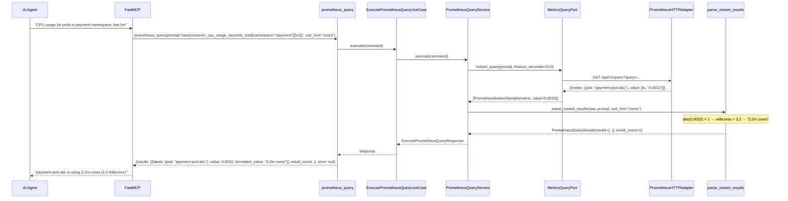
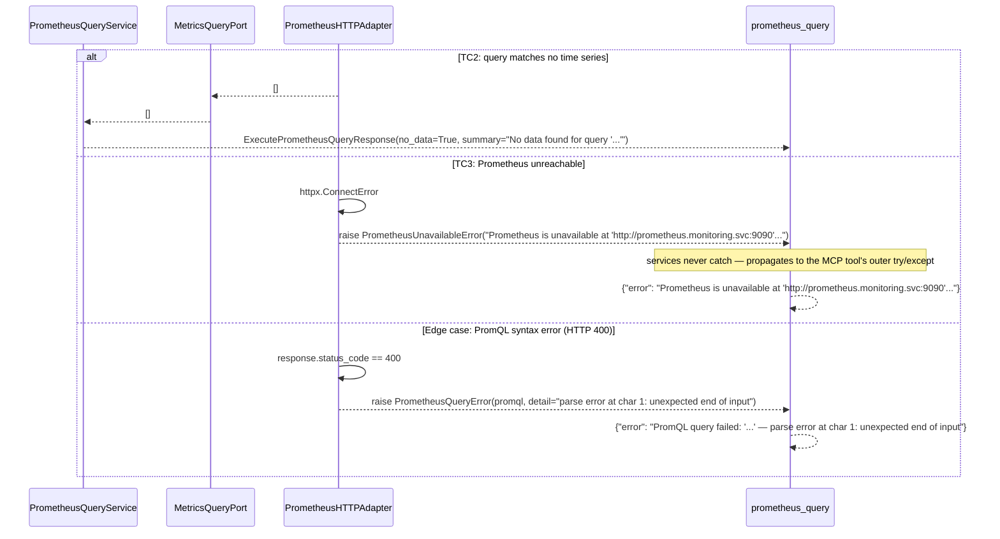
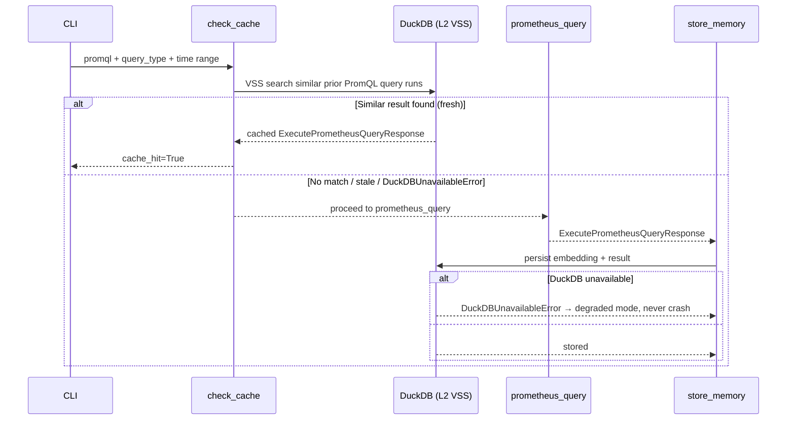

# Use Case 68 — Execute PromQL Queries Against Prometheus

## Sample Questions

- "What is the current CPU usage rate for all pods in the payment namespace over the last 5 minutes? Query Prometheus for container_cpu_usage_seconds_total."
- "Run `up` against Prometheus and tell me which targets are down."
- "Give me the memory usage series for the checkout-service pod over the last hour."
- "Is Prometheus even reachable right now?"
- "What's `rate(http_requests_total{status=~\"5..\"}[5m])` currently showing for the auth-service?"

---

As an SRE, I want hexawyn to execute PromQL queries against the cluster Prometheus so I
can retrieve live metrics for any workload without opening the Prometheus UI or Grafana
dashboard. Supports both instant queries (`/api/v1/query`) and range queries
(`/api/v1/query_range`), with results formatted into human-readable units (cores, bytes,
percent) via a caller-supplied `unit_hint` — PromQL results carry no unit metadata, so
guessing from the query string would be fragile.

This closes a real gap: no prior feature in this codebase executed real PromQL — the
existing `MemorySaturationPort`/`MetricCorrelationPort`/`LatencyPercentilePort` adapters
were all stubs, and `mcp/tools/prometheus_query.py` was a 0-byte placeholder. The one
already-working reference (`vanilla_adapter.py::_fetch_prometheus_usage`) is the pattern
this feature's `PrometheusHTTPAdapter` builds on, tightened to raise distinct domain
errors per failure mode instead of silently swallowing them.

### Flow 1 — Happy Path: Instant Query with Unit Formatting (TC1, TC5)



### Flow 2 — Error Flows: No Data, Unreachable, Syntax Error (TC2, TC3, edge case)



### Flow 3 — Checker Node: Range Query, Truncation, Auth, Timeout (TC4, edge cases)

```mermaid
sequenceDiagram
    participant Checker as Checker Node
    participant LLM as LLM Response

    Checker->>LLM: Validate prometheus_query findings
    alt TC4: range query over a 5-minute window
        Checker-->>LLM: ❌ FAIL — each result must carry `values: [(timestamp, value), ...]`, not a single scalar
    alt More than 10,000 time series returned
        Checker-->>LLM: ⚠️ FLAG — `truncated=True` and the cap note must be surfaced, not silently dropped
    alt PROMETHEUS_TOKEN is configured
        Checker-->>LLM: ❌ FAIL — the Bearer header must be sent on every request; an unauthenticated call must not be reported as a genuine "no data" result
    alt Query exceeds the configured timeout
        Checker-->>LLM: ❌ FAIL — must surface as a timeout-specific error (AdapterTimeoutError), not conflated with "Prometheus unavailable"
    else All checks pass
        Checker-->>LLM: ✅ PASS
    end
```

### Flow 4 — DuckDB Memory: VSS Check Before, Store After



## Key Points

- **Unit is caller-supplied, not inferred** — `unit_hint: Literal["cores","bytes","percent","raw"]` is an explicit param on the command; PromQL results carry no unit metadata, and guessing from the query string (e.g. spotting `"cpu"`) is a fragile heuristic that was deliberately rejected in favor of the SRE/agent stating what they queried.
- **PromQL param construction lives in the adapter, not domain** — an earlier draft put `_instant_query_params`/`_range_query_params` in `domain/services/metrics_query/`, but `hexa_guard.py`'s hexagonal-boundary check correctly rejected it: building an HTTP query-string dict is adapter-layer transport shaping, not domain business logic. They're private functions in `prometheus_http_adapter.py`, unit-tested directly by importing them from the adapter module (tests may import adapters; adapters may not import domain services).
- **`0.003` and `0.0032` cores both format from one formula** — for `abs(value) < 1`, `_format_cores` computes millicores and renders with `%g`-style trimming, so `3.0` → `"3m cores"` and `3.2` → `"3.2m cores"` without two separate code paths.
- **400 is distinct from "unavailable"** — a syntax error means Prometheus *responded*, just rejected the query; the adapter checks `status_code == 400` **before** calling `raise_for_status()` and raises the new `PrometheusQueryError(promql, detail)` instead of `PrometheusUnavailableError`, parsing Prometheus's own `{"error": "..."}` body for the detail message.
- **Timeout is checked before the generic HTTP-error branch** — `httpx.TimeoutException` is a subtype of `httpx.HTTPError` in httpx's exception hierarchy, so the timeout `except` clause must come first or it would never fire; this mirrors the exact ordering mistake avoided in the pipeline-failure-RCA feature's keyword classification.
- **Truncation caps output, not the underlying result count claim** — `parse_instant_results`/`parse_range_results` slice to `MetricsQueryConstants.max_results` (10,000) and set `truncated=True` with a note in `summary`, following the same "cap the response, never hide the truth" principle used by the namespace-events-triage feature's `top_n` pagination.
- **Bearer auth is additive, not required** — `PROMETHEUS_TOKEN` is optional; when unset, the client sends no `Authorization` header at all (today's unauthenticated behavior is unchanged), matching the existing `PROMETHEUS_URL`-only convention used by every other Prometheus-backed port in this repo.

## Tests

Unit test stubs for the three pure domain-logic concerns the ticket calls out — PromQL
construction, result parsing, unit formatting — plus the full port/service/use-case/tool
stack:

| Test | File | Status |
|---|---|---|
| `test_instant_query_params_wraps_promql` / `test_range_query_params_includes_start_end_step` (PromQL construction) | `tests/unit/test_prometheus_http_adapter.py` | ✅ |
| `test_valid_results_returned_with_labels_and_values` (TC1) / `test_empty_result_returns_clear_no_data_message` (TC2) / `test_more_than_max_results_is_truncated` (edge case) (result parsing) | `tests/unit/metrics_query/test_result_parser.py` | ✅ |
| `test_range_series_includes_timestamps` (TC4) / `test_empty_range_result_returns_no_data` (result parsing) | `tests/unit/metrics_query/test_result_parser.py` | ✅ |
| `test_0_003_cores_formatted_as_3m_cores` / `test_0_0032_cores_formatted_as_3_2m_cores` (TC5) + bytes/percent/raw cases (unit formatting) | `tests/unit/metrics_query/test_unit_formatter.py` | ✅ |
| `TestPrometheusMetricResult` / `TestPrometheusQueryRequest` / `TestPrometheusQueryResult` | `tests/unit/test_metrics_query.py` | ✅ |
| `test_is_abstract` / `test_cannot_instantiate` | `tests/unit/test_metrics_query_port.py` | ✅ |
| `test_defaults` / `test_range_query_values` | `tests/unit/test_execute_prometheus_query_command.py` | ✅ |
| `test_defaults` / `test_error_field` | `tests/unit/test_execute_prometheus_query_response.py` | ✅ |
| `test_is_abstract` / `test_cannot_instantiate` | `tests/unit/test_execute_prometheus_query_service_port.py` | ✅ |
| `test_valid_query_returns_labeled_results` (TC1) / `test_empty_result_returns_no_data` (TC2) / `test_range_query_returns_series_with_timestamps` (TC4) | `tests/unit/test_prometheus_query_service.py` | ✅ |
| `test_execute_delegates_to_service` | `tests/unit/test_execute_prometheus_query_use_case.py` | ✅ |
| `test_valid_query_returns_metric_and_value` / `test_range_query_returns_series_with_iso_timestamps` (TC1, TC4) | `tests/unit/test_prometheus_http_adapter.py` | ✅ |
| `test_connection_refused_raises_unavailable_with_endpoint` (TC3) | `tests/unit/test_prometheus_http_adapter.py` | ✅ |
| `test_timeout_raises_adapter_timeout_error` / `test_non_400_http_error_raises_unavailable` (edge cases) | `tests/unit/test_prometheus_http_adapter.py` | ✅ |
| `test_400_response_raises_prometheus_query_error` (edge case: syntax error) | `tests/unit/test_prometheus_http_adapter.py` | ✅ |
| `test_bearer_token_added_to_client_headers` / `test_no_token_means_no_auth_header` (edge case: auth) | `tests/unit/test_prometheus_http_adapter.py` | ✅ |
| `TestPrometheusQueryError` (message + context) | `tests/unit/test_errors.py` | ✅ |
| `test_returns_query_results` / `test_handles_error` / `test_has_register` | `tests/unit/test_prometheus_query_tool.py` | ✅ |

## Related Files

- `src/hexawyn/domain/errors.py` — `PrometheusQueryError` (new, alongside the existing `PrometheusUnavailableError`)
- `src/hexawyn/domain/models/constants.py` — `MetricsQueryConstants` (`max_results=10000`, `default_step="15s"`, `default_timeout_seconds=15.0`)
- `src/hexawyn/domain/models/metrics_query.py` — `PrometheusMetricResult`, `PrometheusQueryRequest`, `PrometheusQueryResult`
- `src/hexawyn/domain/services/metrics_query/unit_formatter.py` — `format_metric_value`
- `src/hexawyn/domain/services/metrics_query/result_parser.py` — `parse_instant_results`, `parse_range_results`
- `src/hexawyn/application/ports/driven/metrics_query_port.py` — `MetricsQueryPort`, `PrometheusInstantSample`, `PrometheusRangeSample`
- `src/hexawyn/application/ports/driving/execute_prometheus_query/` — command, response, service_port
- `src/hexawyn/application/service/prometheus_query_service.py` — `PrometheusQueryService`
- `src/hexawyn/application/use_case/execute_prometheus_query/execute_prometheus_query_use_case.py`
- `src/hexawyn/adapters/secondary/gitops/prometheus_http_adapter.py` — `PrometheusHTTPAdapter` (real `httpx` calls; owns PromQL param construction as a hexagonal-boundary-correct adapter concern)
- `src/hexawyn/mcp/tools/prometheus_query.py` — MCP tool (replaces the former 0-byte stub; auto-registered)
- `src/hexawyn/mcp/server.py` — `build_metrics_query_adapter` (new; reads `PROMETHEUS_URL`/`PROMETHEUS_TOKEN`)
