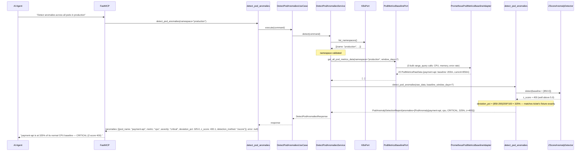
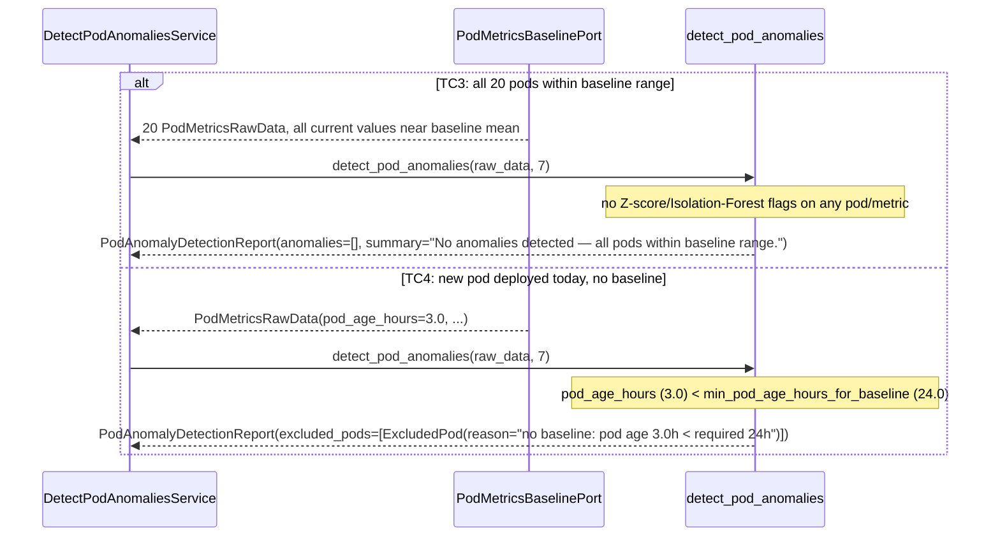

# Use Case 69 — Pod Metrics Anomaly Detection (vs 7-Day Baseline)

## Sample Questions

- "Detect anomalies across all pods in production — which ones show unusual CPU spikes, memory patterns, or error rate deviations vs baseline?"
- "Is payment-api using more CPU than usual right now?"
- "Any pods in production drifting toward a memory leak over the last few hours?"
- "Give me a ranked list of anomalous pods in the checkout namespace, worst first."
- "Which pods don't have enough history yet to even compare against a baseline?"

---

As an SRE, I want to detect anomalies across all pods in production comparing to their
historical baseline so I can proactively catch issues before they become incidents.
Compares current CPU, memory, and error rates against a 7-day baseline **per pod**,
using dual Z-score + Isolation Forest detection, ranked by severity with deviation
percentage.

This is a direct beneficiary of the `prometheus_query`/`MetricsQueryPort` feature built
immediately before it — the driven port's adapter (`PrometheusPodMetricsBaselineAdapter`)
runs **3 real bulk range queries** against Prometheus (CPU, memory, error rate — one
query each, `by (pod)` grouped, covering the whole namespace) rather than being a stub.
Two fields it honestly cannot populate from this repo's current ports —
`hours_since_last_restart` and `is_scheduled_batch_job` — are documented gaps, not faked
signals; the domain logic fully implements both edge cases and is tested directly at
that layer, ready the moment a richer signal exists.

### Flow 1 — Happy Path: Clear CPU Spike (TC1)



### Flow 2 — Exclusion and Clean Report (TC3, TC4)



### Flow 3 — Checker Node: Gradual Drift and Both Edge Cases (TC2, edge cases)

```mermaid
sequenceDiagram
    participant Checker as Checker Node
    participant LLM as LLM Response

    Checker->>LLM: Validate pod anomaly detection findings
    alt TC2: memory drifts from 700 to 950 over the last 6 hourly points
        Checker-->>LLM: ❌ FAIL — must be reported via detection_method="isolation_forest" (or "both"),<br/>not silently missed because the final point's solo Z-score isn't extreme
    alt Scheduled batch/cron job pod shows the same magnitude spike as TC1
        Checker-->>LLM: ⚠️ FLAG — severity must be capped at LOW with a note,<br/>not reported as CRITICAL like an unplanned spike
    alt Pod was restarted 10h ago (168h baseline window requested)
        Checker-->>LLM: ❌ FAIL — only the last 10h of baseline data may be used;<br/>the note must state the shortened window, not silently use 7 days of pre-restart data
    alt LLM reports total_pods correctly but omits excluded_pods from the response
        Checker-->>LLM: ❌ FAIL — every excluded pod must carry an explanatory reason, not be silently dropped
    else All checks pass
        Checker-->>LLM: ✅ PASS
    end
```

## Key Points

- **`IsolationForestAnomalyDetector` gained one additive method, nothing removed** — `detect_series(values: list[float])` shares the exact same `_select_true_outliers` deviation-filter as the existing text-based `detect(log_lines)`, generalized to a `item_key` parameter (`"line"` vs `"value"`). The pre-existing `detect()` public contract and its 7 tests are untouched; 5 new tests were added alongside.
- **A drifting tail is caught by Isolation Forest without any special "trend" code** — feeding the full baseline+recent series (not just the delta) means a monotonically climbing tail cluster is numerically distant from the stable bulk of historical points, so it isolates in fewer random splits — the same mechanism that catches a sharp spike also catches gradual drift, just via a different point in the series.
- **Severity comes from Z-score magnitude, not a separate scoring pass** — `>=5.0` → CRITICAL (matches TC1's "Z-score > 5" requirement exactly), `>=4.0` → HIGH, `>=3.0` (the base anomaly threshold) → MEDIUM; an Isolation-Forest-only hit (no Z-score flag) defaults to MEDIUM since it represents a real but less acute deviation.
- **False-positive rate <5% is inherited, not reinvented** — the same `_select_true_outliers` deviation-threshold filter already proven on uniform log data (rejecting IsolationForest's fixed-contamination false positives) is reused verbatim; TC3's clean-report test is the direct proof this holds for numeric pod-metric series too.
- **The real adapter is honest about two fields it can't populate** — `hours_since_last_restart` and `is_scheduled_batch_job` always come back `None`/`False` from `PrometheusPodMetricsBaselineAdapter`, because no port in this repo exposes per-restart timestamps or pod owner references. Both edge cases are fully implemented and tested at the domain layer via direct fixtures (`tests/unit/pod_anomaly_detection/test_detector.py`) — the logic is correct and ready, the wiring is transparently partial.
- **Bulk fetch, not per-pod looping** — `PodMetricsBaselinePort.get_all_pod_metrics_data` is called exactly once per `detect()` call; the adapter itself issues exactly 3 Prometheus queries (one per metric, `by (pod)` grouped) regardless of how many pods exist in the namespace — mirrors `NamespaceWasteAnalysisPort.get_all_namespace_waste_data` exactly.
- **PromQL param construction stayed out of domain/, on purpose** — same hexagonal-boundary lesson from the `prometheus_query` feature: the adapter builds its own PromQL strings and range-query params locally; nothing in `domain/` imports adapter-layer or transport concerns.

## Test Coverage

| Test | File | Status |
|---|---|---|
| `test_single_spike_detected` / `test_gradual_drift_tail_detected` / `test_uniform_data_returns_no_anomalies` (FP-rate proof) | `tests/unit/anomaly_detection/test_ml.py` | ✅ |
| `test_payment_api_cpu_spike_is_critical` (TC1) | `tests/unit/pod_anomaly_detection/test_detector.py` | ✅ |
| `test_gradual_drift_flagged_as_trend_anomaly` (TC2) | `tests/unit/pod_anomaly_detection/test_detector.py` | ✅ |
| `test_all_pods_healthy_returns_clean_report` (TC3) | `tests/unit/pod_anomaly_detection/test_detector.py` | ✅ |
| `test_young_pod_excluded_from_comparison` (TC4) | `tests/unit/pod_anomaly_detection/test_detector.py` | ✅ |
| `test_batch_job_spike_capped_at_low_severity` (edge case) | `tests/unit/pod_anomaly_detection/test_detector.py` | ✅ |
| `test_baseline_limited_to_time_since_restart` (edge case) | `tests/unit/pod_anomaly_detection/test_detector.py` | ✅ |
| `TestPodAnomaly` / `TestExcludedPod` / `TestPodAnomalyDetectionRequest` / `TestPodAnomalyDetectionReport` | `tests/unit/test_pod_anomaly.py` | ✅ |
| `test_is_abstract` / `test_cannot_instantiate` | `tests/unit/test_pod_metrics_baseline_port.py` | ✅ |
| `test_defaults` / `test_explicit_value` | `tests/unit/test_detect_pod_anomalies_command.py` | ✅ |
| `test_defaults` / `test_error_field` | `tests/unit/test_detect_pod_anomalies_response.py` | ✅ |
| `test_is_abstract` / `test_cannot_instantiate` | `tests/unit/test_detect_pod_anomalies_service_port.py` | ✅ |
| `test_raises_when_namespace_missing` / `test_calls_port_once_in_bulk` / `test_clean_report_maps_to_empty_anomalies` | `tests/unit/test_detect_pod_anomalies_service.py` | ✅ |
| `test_execute_delegates_to_service` | `tests/unit/test_detect_pod_anomalies_use_case.py` | ✅ |
| `test_runs_exactly_three_range_queries_scoped_to_namespace` / `test_last_point_is_current_rest_is_baseline` / `test_pod_with_no_matching_series_gets_empty_baseline` | `tests/unit/test_prometheus_pod_metrics_baseline_adapter.py` | ✅ |
| `test_hours_parsed_directly` / `test_days_converted_to_hours` / `test_minutes_converted_to_hours` (pod age parsing) | `tests/unit/test_prometheus_pod_metrics_baseline_adapter.py` | ✅ |
| `test_hours_since_last_restart_is_none` / `test_is_scheduled_batch_job_is_false` (honest gaps) | `tests/unit/test_prometheus_pod_metrics_baseline_adapter.py` | ✅ |
| `test_returns_report` / `test_handles_error` / `test_has_register` | `tests/unit/test_detect_pod_anomalies_tool.py` | ✅ |

## Related Files

- `src/hexawyn/domain/models/constants.py` — `PodAnomalyDetectionConstants` (zscore thresholds, isolation-forest params, `min_pod_age_hours_for_baseline=24.0`, `recent_window_hours=6.0`)
- `src/hexawyn/domain/models/pod_anomaly.py` — `PodAnomaly`, `ExcludedPod`, `PodAnomalyDetectionReport`, `PodAnomalyDetectionRequest`
- `src/hexawyn/domain/services/anomaly_detection/ml.py` — `IsolationForestAnomalyDetector.detect_series` (new, additive)
- `src/hexawyn/domain/services/anomaly_detection/statistical.py` — `ZScoreAnomalyDetector` (reused, unmodified)
- `src/hexawyn/domain/services/pod_anomaly_detection/detector.py` — `detect_pod_anomalies` (partition, dual-detect, severity, ranking, batch-job cap, restart-window cap)
- `src/hexawyn/application/ports/driven/pod_metrics_baseline_port.py` — `PodMetricsBaselinePort`, `PodMetricsRawData`
- `src/hexawyn/application/ports/driving/detect_pod_anomalies/` — command, response, service_port
- `src/hexawyn/application/service/detect_pod_anomalies_service.py` — `DetectPodAnomaliesService`
- `src/hexawyn/application/use_case/detect_pod_anomalies/detect_pod_anomalies_use_case.py`
- `src/hexawyn/adapters/secondary/gitops/prometheus_pod_metrics_baseline_adapter.py` — `PrometheusPodMetricsBaselineAdapter` (real Prometheus wiring via `MetricsQueryPort`)
- `src/hexawyn/mcp/tools/detect_pod_anomalies.py` — MCP tool (auto-registered)
- `src/hexawyn/mcp/server.py` — `build_pod_metrics_baseline_adapter` (new; composes `build_metrics_query_adapter` + `build_k8s_adapter`)
