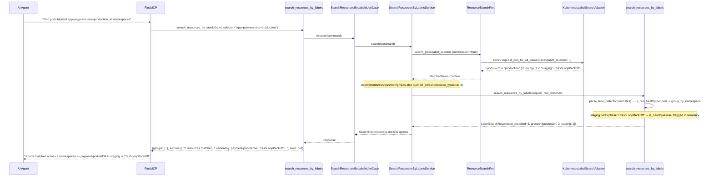
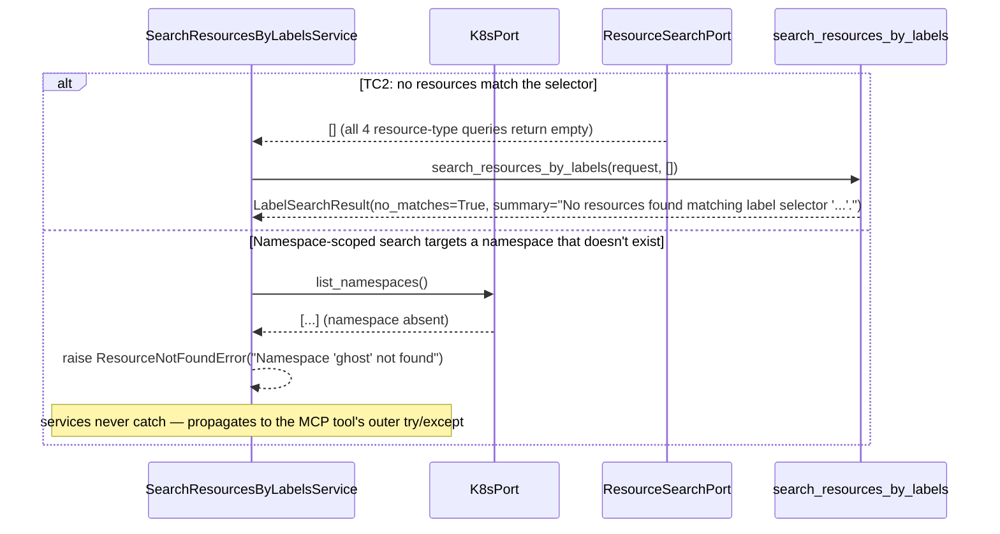
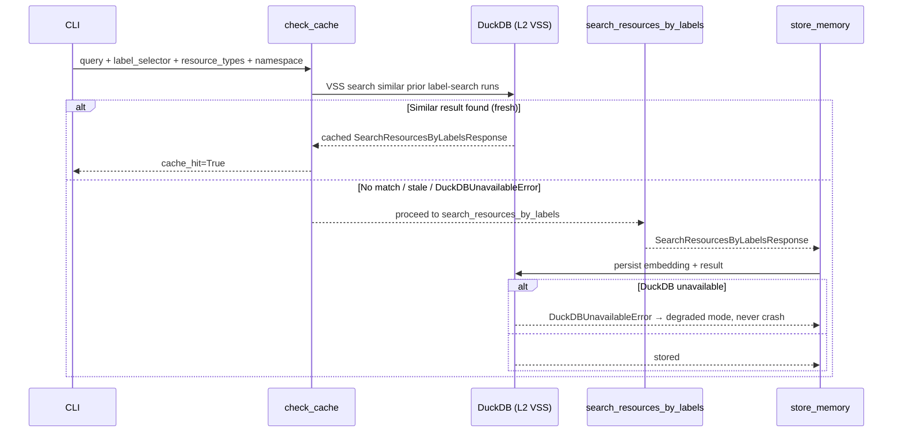

# Use Case 70 — Search Kubernetes Resources by Label Selector

## Sample Questions

- "Find all pods labeled app=payment and env=production across all namespaces — what is their current status?"
- "Which services and pods match app=checkout in the production namespace?"
- "Is anything labeled app.kubernetes.io/name=payment unhealthy right now?"
- "Show me every resource with version=1.2.3 across the cluster."
- "Are there any configmaps or deployments labeled team=platform anywhere?"

---

As a platform engineer, I want hexawyn to search Kubernetes resources by label
selectors so I can instantly locate all pods or services matching specific labels
across any namespace without running multiple `kubectl` commands. Searches
pods/deployments/services/configmaps by one or more `key=value` label pairs, across
all namespaces by default (or scoped to one), grouped by namespace, with pod
name/namespace/node/phase/ready surfaced for every pod match.

**The scaffolding already existed but was completely empty** — `application/use_case/search_resources_by_labels/`
and `mcp/tools/search_resources_by_labels.py` were 0-byte placeholders with no port,
domain layer, adapter, or tests. This is the from-scratch build behind that name.
`label_selector` as a live K8s API parameter is a first for this codebase — it was only
ever used for Tekton CRD lookups before; pod/deployment/service/configmap *listing*
never used it. Pod "ready" (container-ready-count) is also new — no existing code
computes it anywhere (only *node* readiness existed, which is unrelated).

### Flow 1 — Happy Path: Multi-Namespace Match with Unhealthy Pod Flagged (TC1, TC5)



### Flow 2 — Error Flows: No Matches and Invalid Namespace (TC2, namespace validation)



### Flow 3 — Checker Node: Mixed Kinds, Truncation, and Selector Edge Cases (TC3, edge cases)

```mermaid
sequenceDiagram
    participant Checker as Checker Node
    participant LLM as LLM Response

    Checker->>LLM: Validate search_resources_by_labels findings
    alt TC3: single label matches both pods and services
        Checker-->>LLM: ❌ FAIL — both kinds must appear in the grouped results, not just the first kind queried
    alt More than 500 matching resources
        Checker-->>LLM: ⚠️ FLAG — has_more=True and remaining_count must be surfaced, results capped not silently dropped
    alt Label key uses a domain prefix (app.kubernetes.io/name=payment)
        Checker-->>LLM: ❌ FAIL — must be parsed as one key "app.kubernetes.io/name", not split again on the internal '.' or '/'
    alt A matched deployment/service/configmap has no status.phase
        Checker-->>LLM: ❌ FAIL — must report phase=null/ready=null, never falsely flagged as unhealthy (is_healthy=None, not False)
    alt Namespace-scoped search combined with the same cluster-wide label
        Checker-->>LLM: ⚠️ FLAG — only resources in the requested namespace should appear; the namespaced K8s API call must have been used, not the all-namespaces one
    else All checks pass
        Checker-->>LLM: ✅ PASS
    end
```

### Flow 4 — DuckDB Memory: VSS Check Before, Store After



## Key Points

- **One port method per K8s API group, service composes** — `ResourceSearchPort` has
  `search_pods`/`search_deployments`/`search_services`/`search_configmaps` because these
  are genuinely different `kubernetes` client calls (`CoreV1Api` vs `AppsV1Api`); the
  application service calls whichever `resource_types` were requested (default all four)
  and aggregates — same "service composes multiple port calls, domain does the pure
  aggregation" shape as the incident-triage and pod-anomaly features.
- **A new, narrow adapter — not an addition to `VanillaAdapter`/`K8sPort`** — Interface
  Segregation, matching every other purpose-built K8s adapter in this repo. `AppsV1Api`
  was already used elsewhere for other purposes but never for listing; Services/ConfigMaps
  had no adapter code at all before this feature.
- **`is_healthy=None` means "no health concept", not "unknown/unhealthy"** — pods get a
  real `True`/`False` from `is_pod_healthy(phase)`; deployments/services/configmaps get
  `None` because they have no `status.phase` at all. `summarize_health` only ever counts
  `is_healthy is False` as unhealthy, so non-pod kinds never pollute the health count.
- **Label selector parsing splits on the *first* `=` only** — Kubernetes label values
  never contain `=`, and keys may contain exactly one `/` (domain-prefixed keys like
  `app.kubernetes.io/name`) — `parse_label_selector` handles both the
  `version=1.2.3`-style value and the domain-prefixed-key edge case from one simple rule,
  raising the new `LabelSelectorError` only on a genuinely malformed pair.
- **Pod "ready" is computed fresh — nothing to reuse existed** — `all(status.ready for
  status in container_statuses)`, `False` when there are no container statuses at all
  (matches K8s semantics: a pod with no reported containers isn't ready).
- **Truncation follows the `has_more`/`remaining_count` pairing**, not a boolean-only
  `truncated` flag — this is a filtered-list-for-display feature like namespace-events
  triage, not a raw-series feature like a metrics query, so it reuses that convention
  instead.

## Tests

Unit test stubs for the domain logic the ticket calls out — label parsing, resource
grouping, status formatting — plus the full port/service/use-case/tool/adapter stack:

| Test | File | Status |
|---|---|---|
| `test_multiple_pairs` / `test_special_characters_in_value` (edge case) / `test_kubernetes_io_domain_prefixed_key` (edge case) / `test_missing_equals_sign_raises` (label parsing) | `tests/unit/label_search/test_label_parser.py` | ✅ |
| `test_groups_resources_by_namespace` / `test_groups_sorted_by_namespace_name` / `test_resources_within_group_sorted_by_kind_then_name` (resource grouping) | `tests/unit/label_search/test_resource_grouping.py` | ✅ |
| `test_crashloopbackoff_is_unhealthy` (TC5) / `test_no_phase_returns_none` (edge case) / `test_all_healthy_pods` (TC4) (status formatting) | `tests/unit/label_search/test_status_formatter.py` | ✅ |
| `test_grouped_by_namespace` (TC1) / `test_empty_result_with_message` (TC2) / `test_pods_and_services_both_present` (TC3) / `test_crashloopbackoff_pod_flagged` (TC5) / `test_more_than_max_results_is_truncated` (edge case) | `tests/unit/label_search/test_search.py` | ✅ |
| `TestMatchedResourceResult` / `TestNamespaceGroup` / `TestLabelSearchRequest` / `TestLabelSearchResult` | `tests/unit/test_label_search.py` | ✅ |
| `test_is_abstract` / `test_cannot_instantiate` | `tests/unit/test_resource_search_port.py` | ✅ |
| `test_defaults` / `test_explicit_values` | `tests/unit/test_search_resources_by_labels_command.py` | ✅ |
| `test_defaults` / `test_error_field` | `tests/unit/test_search_resources_by_labels_response.py` | ✅ |
| `test_is_abstract` / `test_cannot_instantiate` | `tests/unit/test_search_resources_by_labels_service_port.py` | ✅ |
| `test_raises_when_namespace_missing` / `test_calls_only_requested_resource_type_methods` / `test_mixed_kinds_aggregated_into_one_response` (TC3) / `test_namespace_passed_through_to_port` (edge case) | `tests/unit/test_search_resources_by_labels_service.py` | ✅ |
| `test_execute_delegates_to_service` | `tests/unit/test_search_resources_by_labels_use_case.py` | ✅ |
| `test_all_namespaces_call_when_namespace_none` / `test_namespaced_call_when_namespace_given` (edge case) / `test_ready_false_when_any_container_not_ready` / `test_returns_deployment_kind_with_no_pod_fields` | `tests/unit/test_kubernetes_label_search_adapter.py` | ✅ |
| `test_returns_grouped_results` / `test_handles_error` / `test_has_register` | `tests/unit/test_search_resources_by_labels_tool.py` | ✅ |
| `TestLabelSelectorError` (message + context) | `tests/unit/test_errors.py` | ✅ |

## Related Files

- `src/hexawyn/domain/errors.py` — `LabelSelectorError`
- `src/hexawyn/domain/models/constants.py` — `LabelSearchConstants` (`max_results=500`)
- `src/hexawyn/domain/models/label_search.py` — `ResourceType`, `MatchedResourceResult`, `NamespaceGroup`, `LabelSearchRequest`, `LabelSearchResult`
- `src/hexawyn/domain/services/label_search/label_parser.py` — `parse_label_selector`
- `src/hexawyn/domain/services/label_search/resource_grouping.py` — `group_by_namespace`
- `src/hexawyn/domain/services/label_search/status_formatter.py` — `is_pod_healthy`, `summarize_health`
- `src/hexawyn/domain/services/label_search/search.py` — `search_resources_by_labels`
- `src/hexawyn/application/ports/driven/resource_search_port.py` — `ResourceSearchPort`, `MatchedResourceRaw`
- `src/hexawyn/application/ports/driving/search_resources_by_labels/` — command, response, service_port
- `src/hexawyn/application/service/search_resources_by_labels_service.py` — `SearchResourcesByLabelsService`
- `src/hexawyn/application/use_case/search_resources_by_labels/search_resources_by_labels_use_case.py`
- `src/hexawyn/adapters/secondary/gitops/kubernetes_label_search_adapter.py` — `KubernetesLabelSearchAdapter`
- `src/hexawyn/mcp/tools/search_resources_by_labels.py` — MCP tool (auto-registered)
- `src/hexawyn/mcp/server.py` — `build_resource_search_adapter` (new)
