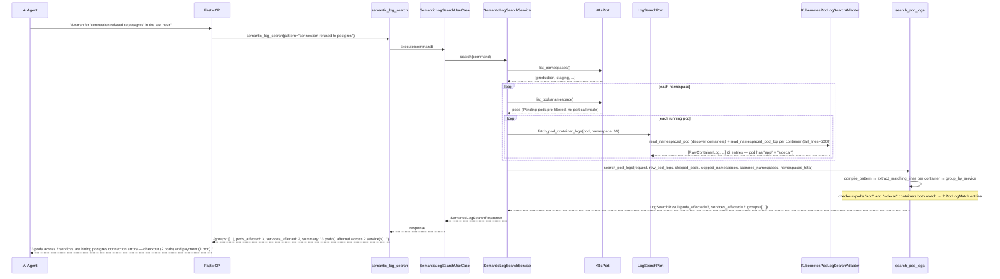
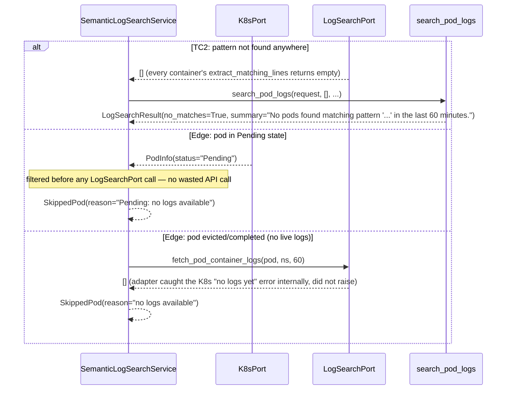

# Use Case 71 — Search Pod Logs by Pattern Across All Namespaces

## Sample Questions

- "Search across all pod logs for the pattern 'connection refused to postgres' in the last hour — which services are affected?"
- "Grep every pod in the checkout namespace for 'OOMKilled' in the last 15 minutes."
- "Is any service logging 'context deadline exceeded' right now?"
- "Find pods matching the regex `timeout.*retry` across all namespaces."
- "Which pods and services show connection errors to redis in the last 6 hours?"

---

As an SRE, I want hexawyn to search pod logs for a pattern across all namespaces so I
can identify which services are affected by a specific error pattern without manually
grepping through individual pods. Supports substring (default) and regex matching,
scans every pod in every namespace (or one) within a time window (default 1h), returns
up to 5 matching lines per pod grouped by service/deployment, with an "N pods affected
across M services" summary.

**"Semantic" naming vs. actual requirements**: the ticket names the service
`SemanticLogSearchService` and lists DuckDB VSS as a dependency, but every Acceptance
Criterion and Test Scenario is literal substring/regex matching. This repo's only
existing DuckDB VSS usage is cosine similarity over pre-computed embeddings for the
unrelated incident-memory feature — there is no log-embedding infrastructure, and
building one (LLM embedding calls per log line, cluster-wide, synchronously, inside an
MCP tool call) is well outside this ticket's reasonable scope. Exact/regex matching is
the fully-implemented primary path. "Semantic" match is a small, honest, stdlib-only
fallback (`difflib.SequenceMatcher`) surfaced only when a pod has zero exact matches,
tagged `match_type="semantic"` — not a vector embedding, and documented as such.

**No bulk "search all pod logs" K8s endpoint exists** — unlike most features in this
series, the driven port is called once per pod (the adapter also makes one extra call
per pod to discover container names, since `read_namespaced_pod_log` requires an
explicit `container` kwarg for multi-container pods). Per-pod/per-namespace failures
(RBAC, pod gone) are isolated in the application service so one bad pod or namespace
never aborts the whole scan.

**The 7 "Checker Node Edge Cases" in the ticket are not implemented here** — that
validation is a LangGraph/semantic-layer concern in the private `hexa-control-plane`
repo. What's in scope: shaping the response so a downstream checker *could* verify all
seven (see Flow 3 below and Key Points).

### Flow 1 — Happy Path: Multi-Deployment, Multi-Container Match (TC1, TC4)



### Flow 2 — Error Flows: No Matches, Pending Pod, Evicted Pod (TC2, edge cases)



### Flow 3 — Checker Node: All 7 Listed Edge Cases (illustrative — validated in hexa-control-plane)

```mermaid
sequenceDiagram
    participant Checker as Checker Node
    participant LLM as LLM Response

    Checker->>LLM: Validate semantic_log_search findings
    alt Namespace mismatch: question says production, tool scanned staging
        Checker-->>LLM: ❌ FAIL — compare requested namespace against `scanned_namespaces`
    alt Generic answer citing no real pod
        Checker-->>LLM: ❌ FAIL — every pod named in the answer must appear in `groups[].pods[].pod_name`
    alt Incomplete coverage reported as total (3/8 namespaces skipped via RBAC)
        Checker-->>LLM: ⚠️ LOW CONFIDENCE — coverage = len(scanned_namespaces) / namespaces_total; low coverage must lower confidence, not be hidden
    alt Pod hallucination: LLM cites a pod not in the tool's results
        Checker-->>LLM: ❌ FAIL — cross-check every named pod against the ground-truth `groups` list
    alt Time window ignored: LLM cites "this morning" instead of the requested window
        Checker-->>LLM: ⚠️ FLAG — compare against echoed `time_window_minutes`
    alt Exact vs. semantic match conflated
        Checker-->>LLM: ⚠️ FLAG — the answer must state whether a cited line is `match_type="exact"` or `"semantic"`, never presented as equivalent
    alt Aggregation mismatch: 5 pods / 2 services, LLM says "3 services"
        Checker-->>LLM: ❌ FAIL — compare stated counts against `pods_affected`/`services_affected`
    else All checks pass
        Checker-->>LLM: ✅ PASS
    end
```

## Key Points

- **Exact matching is real and complete; "semantic" is an honest, bounded fallback** —
  `extract_matching_lines` always tries exact matches first (capped at 5 per container);
  only when a container has *zero* exact matches does the single best-scoring line above
  `semantic_similarity_threshold` (0.5, via stdlib `difflib`) surface, tagged
  `match_type="semantic"` — directly satisfies Checker Edge Case #6's "distinguish exact
  vs. semantic" requirement without inventing an embedding pipeline.
- **No bulk fetch — this feature is architecturally different from its predecessors** —
  the K8s log API has no server-side grep; `LogSearchPort` is called once per pod (plus
  one container-discovery call), and per-pod/per-namespace failures are isolated in
  `SemanticLogSearchService` (not swallowed silently, not left to abort the whole scan) —
  same justified multi-item try/except pattern as `GenerateIncidentTriageReportService`.
- **`tail_lines=5000` bounds cost server-side, not client-side** — the existing
  single-pod `analyze_pod_logs` adapter never uses this kwarg (only `since_seconds`);
  this feature needs it because it's scanning every pod in the cluster, so avoiding a
  50MB client-side fetch just to truncate afterward is a real, motivated improvement.
- **Service/deployment derivation has one clean home now** — `derive_service_name`
  (rsplit-based, `{workload}-{rs-hash}-{pod-hash}` → `{workload}`) replaces what was
  privately duplicated twice in `vanilla_adapter.py`; this is the architecturally
  correct layer for pure string logic that happened to live in the wrong place.
- **Pending pods are filtered before any log-fetch call** — `PodInfo["status"] in
  {"Pending", "Unknown"}` is checked against data already available from `K8sPort.list_pods`,
  so no wasted API call is made for pods that can't have logs yet.
- **The response is shaped for a downstream checker even though the checker isn't
  implemented here** — `scanned_namespaces` (not just a count), `skipped_pods`/
  `skipped_namespaces` with reasons, ground-truth `groups`, echoed `time_window_minutes`,
  per-line `match_type`, and ground-truth `pods_affected`/`services_affected` together
  cover every one of the 7 listed checker edge cases' data needs.

## Tests

Unit test stubs for the domain logic the ticket calls out — pattern matching, log line
extraction, service grouping — plus the full port/service/use-case/tool/adapter stack:

| Test | File | Status |
|---|---|---|
| `test_special_characters_escaped` (edge case) / `test_regex_mode_compiles_as_is` / `test_invalid_regex_raises` (pattern matching) | `tests/unit/log_search/test_pattern_matcher.py` | ✅ |
| `test_matches_capped_at_max_lines` / `test_semantic_fallback_when_no_exact_match` / `test_exact_match_takes_priority_over_semantic` (log line extraction) | `tests/unit/log_search/test_log_line_extraction.py` | ✅ |
| `test_deployment_style_pod_name` / `test_groups_multiple_pods_into_two_services` (TC1) (service grouping) | `tests/unit/log_search/test_service_grouping.py` | ✅ |
| `test_grouped_by_service_with_correct_counts` (TC1) / `test_empty_result_with_message` (TC2) / `test_each_container_produces_its_own_match` (TC4) / `test_skipped_pods_and_namespaces_passed_through` | `tests/unit/log_search/test_pod_log_search.py` | ✅ |
| `TestMatchedLogLine` / `TestPodLogMatch` / `TestServiceGroup` / `TestSkippedPod` / `TestSkippedNamespace` / `TestLogSearchRequest` / `TestLogSearchResult` | `tests/unit/test_log_search.py` | ✅ |
| `test_is_abstract` / `test_cannot_instantiate` | `tests/unit/test_log_search_port.py` | ✅ |
| `test_defaults` / `test_explicit_values` | `tests/unit/test_semantic_log_search_command.py` | ✅ |
| `test_defaults` / `test_error_field` | `tests/unit/test_semantic_log_search_response.py` | ✅ |
| `test_is_abstract` / `test_cannot_instantiate` | `tests/unit/test_semantic_log_search_service_port.py` | ✅ |
| `test_raises_when_namespace_missing` / `test_pending_pod_skipped_without_port_call` (edge case) / `test_namespace_skipped_others_still_scanned` (edge case) / `test_pod_fetch_error_skips_pod_not_whole_scan` | `tests/unit/test_semantic_log_search_service.py` | ✅ |
| `test_execute_delegates_to_service` | `tests/unit/test_semantic_log_search_use_case.py` | ✅ |
| `test_returns_grouped_results` / `test_handles_error` / `test_has_register` | `tests/unit/test_semantic_log_search_tool.py` | ✅ |
| `test_each_container_fetched_separately` (TC4) / `test_tail_lines_passed_through` (TC3) / `test_undecodable_bytes_replaced_not_raised` (edge case) / `test_container_log_fetch_failure_returns_empty_not_raise` (edge case) | `tests/unit/test_kubernetes_pod_log_search_adapter.py` | ✅ |
| `TestLogPatternError` (message + context) | `tests/unit/test_errors.py` | ✅ |

## Related Files

- `src/hexawyn/domain/errors.py` — `LogPatternError`
- `src/hexawyn/domain/models/constants.py` — `LogSearchConstants` (`max_lines_per_pod=5`, `max_tail_lines=5000`, `semantic_similarity_threshold=0.5`, `default_time_window_minutes=60`)
- `src/hexawyn/domain/models/log_search.py` — `MatchType`, `MatchedLogLine`, `PodLogMatch`, `ServiceGroup`, `SkippedPod`, `SkippedNamespace`, `LogSearchRequest`, `LogSearchResult`
- `src/hexawyn/domain/services/log_search/pattern_matcher.py` — `compile_pattern`, `similarity_score`
- `src/hexawyn/domain/services/log_search/log_line_extraction.py` — `extract_matching_lines`
- `src/hexawyn/domain/services/log_search/service_grouping.py` — `derive_service_name`, `group_by_service`
- `src/hexawyn/domain/services/log_search/pod_log_search.py` — `search_pod_logs`
- `src/hexawyn/application/ports/driven/log_search_port.py` — `LogSearchPort`, `RawContainerLog`, `RawPodLogData`
- `src/hexawyn/application/ports/driving/semantic_log_search/` — command, response, service_port
- `src/hexawyn/application/service/semantic_log_search_service.py` — `SemanticLogSearchService`
- `src/hexawyn/application/use_case/semantic_log_search/semantic_log_search_use_case.py`
- `src/hexawyn/adapters/secondary/gitops/kubernetes_pod_log_search_adapter.py` — `KubernetesPodLogSearchAdapter`
- `src/hexawyn/mcp/tools/semantic_log_search.py` — MCP tool (auto-registered)
- `src/hexawyn/mcp/server.py` — `build_log_search_adapter` (new)
