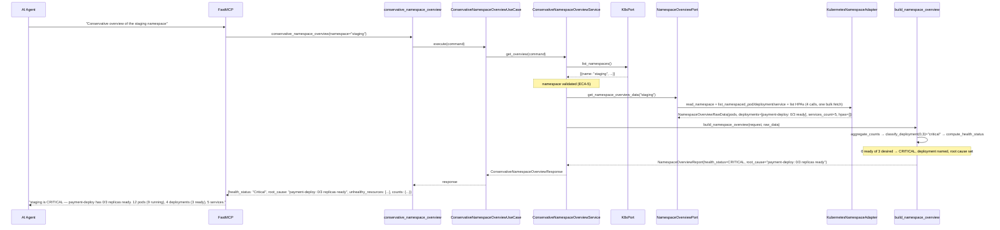
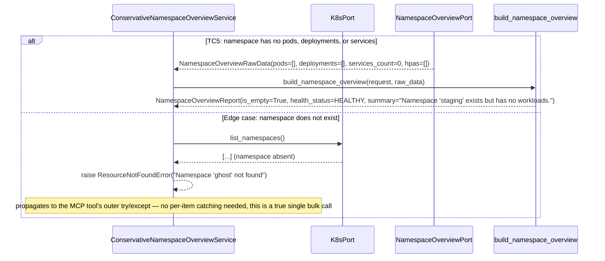

# Use Case 72 — Conservative Namespace Overview

## Sample Questions

- "Give me a conservative overview of the staging namespace — total pods, services, deployments, and any obvious health issues, without flooding the context with raw data."
- "Is the payment namespace healthy right now?"
- "What's broken in production, in one line?"
- "Give me a quick health check on checkout, capped to 500 tokens."
- "Does staging exist, and if so, is anything degraded?"

---

As a platform engineer, I want hexawyn to provide a conservative namespace overview so
I can quickly assess the health of any namespace without flooding the AI context with
raw resource dumps. Returns aggregate counts (pods total/running/failed, deployments
ready/not-ready, services), lists only unhealthy resources by name, stays under a
configurable token budget (default 2000), and returns a single Healthy/Degraded/Critical
score plus a one-line root cause.

**Health score is rule-based, not weighted** — the ticket's test scenarios are crisp
categorical rules (10/10 Running → Healthy; 3 CrashLoopBackOff → Degraded; 0/3 replicas
ready → Critical), not a points-off-100 formula like the existing `fleet_health_score_service.py`
pattern. A deployment at 0 ready (of >0 desired) → CRITICAL; any unhealthy pod or
partially-ready deployment → DEGRADED; otherwise HEALTHY — deterministic and testable
against every literal example without calibration.

**Namespace phase and health score are deliberately separate fields** — a Terminating
namespace surfaces its K8s phase transparently (`namespace_status`) without being
conflated into the Healthy/Degraded/Critical score, which is reserved for workload
health.

### Flow 1 — Happy Path: Healthy Namespace and Critical Deployment (TC1, TC3)



### Flow 2 — Error Flows: Empty Namespace and Namespace Not Found (TC5, edge case)



### Flow 3 — Checker Node: Token Budget, Terminating, HPA Warning, Multi-Type Failure (TC4, edge cases)

```mermaid
sequenceDiagram
    participant Checker as Checker Node
    participant LLM as LLM Response

    Checker->>LLM: Validate conservative_namespace_overview findings
    alt TC4: 200 unhealthy pods but the answer lists all of them verbatim
        Checker-->>LLM: ❌ FAIL — response must respect `estimated_tokens <= max_tokens`; `has_more_unhealthy`/`remaining_unhealthy_count` must be surfaced, not a raw dump
    alt Namespace is Terminating but the answer folds it into "Critical"
        Checker-->>LLM: ❌ FAIL — `namespace_status="Terminating"` is separate from `health_status`; the two must not be conflated
    alt HPA at max replicas reported as a health-degrading issue
        Checker-->>LLM: ⚠️ FLAG — HPA-at-max is a soft warning (`warnings`), it must never appear in `unhealthy_resources` or move the health score off Healthy
    alt Both a pod and a deployment are failing, but the answer only mentions one
        Checker-->>LLM: ❌ FAIL — every entry in `unhealthy_resources` (both kinds) must be acknowledged, and `health_status` must reflect the worst of the two
    else All checks pass
        Checker-->>LLM: ✅ PASS
    end
```

## Key Points

- **Rule-based health score, not a weighted formula** — `classify_deployment`/`compute_health_status`
  encode the ticket's own examples directly (0 ready of >0 desired → CRITICAL; any
  unhealthy pod or partial deployment → DEGRADED) rather than a points-off-100 score
  like `fleet_health_score_service.py`'s (a different feature, cluster-wide, already
  calibrated for its own signals) — deterministic and exactly matches every literal
  test case with zero tuning.
- **Token budget is enforced by measuring, not guessing** — `enforce_token_budget`
  formats the actual summary text and calls `estimate_tokens` (the same chars÷4.0
  heuristic as `AdaptiveLogProcessor.estimate_tokens_from_lines`), trimming the
  worst-severity-first-sorted `unhealthy_resources` list until it fits — `has_more_unhealthy`/
  `remaining_unhealthy_count` mirror the `get_namespace_events` `top_n`/`has_more`
  convention, so truncation is visible, never silent.
- **Deployment issues are sorted and reported before pod issues** — both in the
  truncation order and in `build_root_cause`'s primary-cause selection, since a
  deployment at 0 ready is more systemic than one crashing pod.
- **`namespace_status` (K8s phase) and `health_status` (workload health) are two
  different fields on purpose** — a Terminating namespace is reported as such
  transparently, without forcing an artificial Critical/Degraded health verdict onto a
  namespace that's simply being torn down.
- **HPA-at-max is a `warnings` entry, never an `unhealthy_resources` entry** — "soft
  warning" per the ticket means it's surfaced but never escalates `health_status` off
  Healthy, unlike a genuinely unhealthy pod or deployment.
- **Namespace-not-found vs. legitimately-empty are different states, both required** —
  `list_namespaced_pod` on a nonexistent namespace returns an empty list (200 OK), not a
  404, so the explicit `K8sPort.list_namespaces()` check (ECA-5, reused from four prior
  features this session) is what actually distinguishes TC5 (empty) from the
  namespace-not-found edge case — not just a style choice.
- **True single bulk call, no per-item try/except needed** — unlike `semantic_log_search`
  (forced into a per-pod loop by the K8s log API's shape), pods/deployments/services/HPAs
  all have namespace-scoped bulk list endpoints, so `NamespaceOverviewPort` is called
  exactly once — back to the standard "one port call" precedent used by most features
  this session.

## Tests

Unit test stubs for the domain logic the ticket calls out — count aggregation, health
scoring, token budget enforcement — plus the full port/service/use-case/tool/adapter
stack:

| Test | File | Status |
|---|---|---|
| `test_ticket_fixture_counts` / `test_all_pods_running_no_failures` (TC1) (count aggregation) | `tests/unit/namespace_overview/test_count_aggregation.py` | ✅ |
| `test_zero_ready_of_nonzero_desired_is_critical` (TC3) / `test_critical_wins_over_degraded` (edge case) / `test_deployment_issue_prioritized_over_pod_issue` (health scoring) | `tests/unit/namespace_overview/test_health_scoring.py` | ✅ |
| `test_small_list_fits_without_truncation` / `test_large_list_truncated_under_tight_budget` (TC4) (token budget) | `tests/unit/namespace_overview/test_token_budget.py` | ✅ |
| `test_healthy_no_issues` (TC1) / `test_only_failing_pods_named` (TC2) / `test_deployment_named_and_critical` (TC3) / `test_empty_namespace_message` (TC5) / `test_terminating_status_surfaced_separately` (edge case) / `test_hpa_at_max_is_warning_not_unhealthy` (edge case) / `test_critical_wins_and_both_kinds_listed` (edge case) / `test_truncation_reflected_in_report` (TC4) | `tests/unit/namespace_overview/test_overview.py` | ✅ |
| `TestNamespaceHealthStatus` / `TestNamespaceCounts` / `TestUnhealthyResource` / `TestNamespaceOverviewRequest` / `TestNamespaceOverviewReport` | `tests/unit/test_namespace_overview.py` | ✅ |
| `test_is_abstract` / `test_cannot_instantiate` | `tests/unit/test_namespace_overview_port.py` | ✅ |
| `test_defaults` / `test_custom_max_tokens` | `tests/unit/test_conservative_namespace_overview_command.py` | ✅ |
| `test_defaults` / `test_error_field` | `tests/unit/test_conservative_namespace_overview_response.py` | ✅ |
| `test_is_abstract` / `test_cannot_instantiate` | `tests/unit/test_conservative_namespace_overview_service_port.py` | ✅ |
| `test_raises_when_namespace_missing` (edge case) / `test_calls_port_once_in_bulk` / `test_max_tokens_passed_through_to_domain` (TC4) | `tests/unit/test_conservative_namespace_overview_service.py` | ✅ |
| `test_execute_delegates_to_service` | `tests/unit/test_conservative_namespace_overview_use_case.py` | ✅ |
| `test_returns_overview` / `test_handles_error` / `test_has_register` | `tests/unit/test_conservative_namespace_overview_tool.py` | ✅ |
| `test_waiting_reason_takes_priority_over_phase` / `test_terminating_status_returned` (edge case) / `test_deployment_ready_and_desired_extracted` (TC3) / `test_hpa_current_and_max_extracted` (edge case) | `tests/unit/test_kubernetes_namespace_adapter.py` | ✅ |

## Related Files

- `src/hexawyn/domain/models/constants.py` — `NamespaceOverviewConstants` (`default_max_tokens=2000`, `chars_per_token_divisor=4.0`)
- `src/hexawyn/domain/models/namespace_overview.py` — `NamespaceHealthStatus`, `NamespaceCounts`, `UnhealthyResource`, `NamespaceOverviewRequest`, `NamespaceOverviewReport`
- `src/hexawyn/domain/services/namespace_overview/count_aggregation.py` — `aggregate_counts`
- `src/hexawyn/domain/services/namespace_overview/health_scoring.py` — `is_pod_unhealthy`, `classify_deployment`, `compute_health_status`, `build_root_cause`
- `src/hexawyn/domain/services/namespace_overview/token_budget.py` — `estimate_tokens`, `format_overview_summary`, `enforce_token_budget`
- `src/hexawyn/domain/services/namespace_overview/overview.py` — `build_namespace_overview`
- `src/hexawyn/application/ports/driven/namespace_overview_port.py` — `NamespaceOverviewPort`, `PodStatusRaw`, `DeploymentStatusRaw`, `HpaStatusRaw`, `NamespaceOverviewRawData`
- `src/hexawyn/application/ports/driving/conservative_namespace_overview/` — command, response, service_port
- `src/hexawyn/application/service/conservative_namespace_overview_service.py` — `ConservativeNamespaceOverviewService`
- `src/hexawyn/application/use_case/conservative_namespace_overview/conservative_namespace_overview_use_case.py`
- `src/hexawyn/adapters/secondary/gitops/kubernetes_namespace_adapter.py` — `KubernetesNamespaceAdapter`
- `src/hexawyn/mcp/tools/conservative_namespace_overview.py` — MCP tool (auto-registered)
- `src/hexawyn/mcp/server.py` — `build_namespace_overview_adapter` (new)
