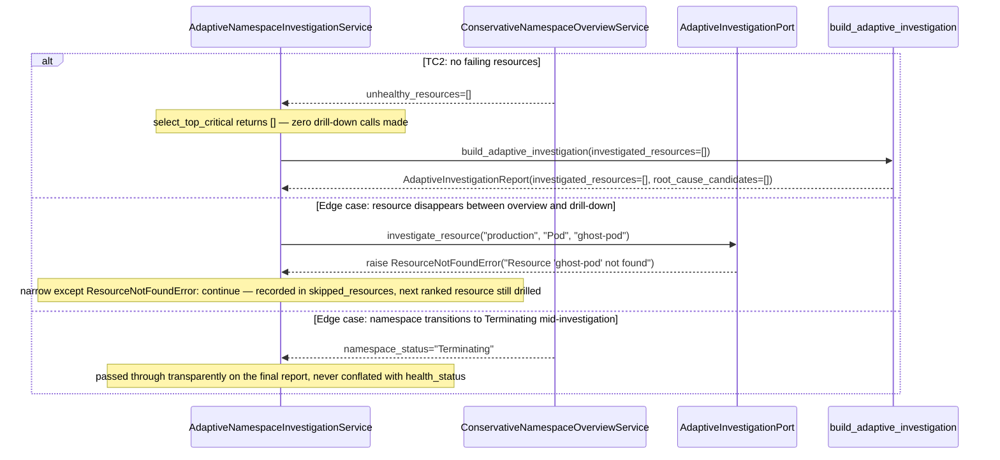

# Use Case 73 — Adaptive Namespace Investigation

## Sample Questions

- "The production namespace is having issues — adaptively investigate it: start with a health summary, then automatically drill into the most critical failing resources."
- "Something's wrong in checkout — figure out what, without me telling you which pod to look at."
- "Give me a triage pass on staging: overview, top offenders, and what I should do about it."
- "Investigate payment with depth=1 — just tell me the single worst thing."
- "Why is auth degraded, and is it OOM, a bad deploy, or something else?"

---

As an SRE, I want hexawyn to adaptively investigate a namespace by starting with a
health summary and automatically drilling into the most critical failing resources, so
I can triage incidents without manually specifying each investigation step. Reuses the
Conservative Namespace Overview (ECA-32) as its first step, ranks failing resources by
restart count (worst-first, Deployments before Pods), drills into the top N (default 3)
via events/logs/restart-and-termination info, and returns overview → root-cause
candidates → recommended actions.

**Pending pods are structurally excluded from drill-down**, not just ranked low — a
Pending pod has no concrete failure to investigate the same way a CrashLoop or OOMKilled
pod does. If every unhealthy resource turns out to be Pending, the report surfaces a
`node_pressure_context` note instead of drilling into nothing.

**OOMKilled detection is a drill-down capability, not an overview one** — none of the
existing shallower adapters read `container_status.last_state.terminated.reason`; this
feature's adapter is the first to read it, specifically to catch OOM causes that the
overview's `waiting.reason`-based status (usually just `CrashLoopBackOff`) can't see.

**Root-cause candidates and recommended actions reuse `incident_triage`'s primitives**
(`classify_incident_cause`, `remediation_for`, `RootCauseCandidate`) rather than
reinventing keyword classification — this feature adds its own lightweight confidence
heuristic (0.85 resolved / 0.3 unknown) instead of pulling in the heavier `RcaScorer`.

### Flow 1 — Happy Path: CrashLoop Drill-Down and OOM Flagged (TC1, TC4)

```mermaid
sequenceDiagram
    participant AI as AI Agent
    participant MCP as FastMCP
    participant Tool as adaptive_namespace_investigation
    participant UseCase as AdaptiveNamespaceInvestigationUseCase
    participant Service as AdaptiveNamespaceInvestigationService
    participant Overview as ConservativeNamespaceOverviewService
    participant K8sPort as K8sPort
    participant Ranking as select_top_critical
    participant Port as AdaptiveInvestigationPort
    participant Adapter as KubernetesAdaptiveInvestigationAdapter
    participant Domain as build_adaptive_investigation

    AI->>MCP: "Investigate the production namespace"
    MCP->>Tool: adaptive_namespace_investigation(namespace="production")
    Tool->>UseCase: execute(command)
    UseCase->>Service: investigate(command)

    Service->>Overview: get_overview(namespace="production")
    Note over Overview: ECA-32 reused as-is
    Overview-->>Service: unhealthy_resources=[payment-pod-abc: CrashLoopBackOff, auth-pod-xyz: OOMKilled, pod-c: Pending]

    Service->>K8sPort: list_pods(namespace="production")
    K8sPort-->>Service: restart_counts={payment-pod-abc: 45, auth-pod-xyz: 12, pod-c: 0}

    Service->>Ranking: select_top_critical(unhealthy, restart_counts, depth=3)
    Note over Ranking: Pending excluded; sort by (kind, -restart_count) → payment-pod-abc (45) first
    Ranking-->>Service: [payment-pod-abc, auth-pod-xyz]

    loop for each ranked resource
        Service->>Port: investigate_resource("production", "Pod", name)
        Port->>Adapter: read_namespaced_pod + list_namespaced_event + read_namespaced_pod_log
        Adapter-->>Port: events, logs, restart_count, last_termination_reason
    end
    Note over Port: auth-pod-xyz's last_state.terminated.reason == "OOMKilled"

    Service->>Domain: build_adaptive_investigation(request, overview, investigated, ...)
    Domain->>Domain: classify_incident_cause per resource → RESOURCE_EXHAUSTION for OOM, DEPLOYMENT for CrashLoop
    Domain-->>Service: AdaptiveInvestigationReport(root_cause_candidates=[...], recommended_actions=[...])

    Service-->>UseCase: AdaptiveNamespaceInvestigationResponse
    UseCase-->>Tool: response
    Tool-->>MCP: {health_status: "Critical", investigated_resources: [...], root_cause_candidates: [...], recommended_actions: [...]}
    MCP-->>AI: "production is CRITICAL. Top offender: payment-pod-abc (CrashLoopBackOff, 45 restarts) — panic: runtime error. auth-pod-xyz was OOMKilled (12 restarts). Recommend: review the recent deploy; increase memory limits on auth-pod-xyz."
```

### Flow 2 — Error Flows: No Failing Resources, Resource Disappeared, Terminating Namespace (TC2, edge cases)



### Flow 3 — Checker Node: 7 Verification Cases

```mermaid
sequenceDiagram
    participant Checker as Checker Node
    participant LLM as LLM Response

    Checker->>LLM: Validate adaptive_namespace_investigation findings
    alt Root cause invented despite empty events
        Checker-->>LLM: ❌ FAIL — every asserted root cause must be anchored in `events`/`logs` actually returned by the tool
    alt Criticality ranking presented out of order (OOM/12 before CrashLoop/45)
        Checker-->>LLM: ❌ FAIL — ranking must be consistent with the stated criterion (`restart_count`); CrashLoop/45 must lead
    alt Drill-down mentions a resource no longer in the overview
        Checker-->>LLM: ⚠️ FLAG — cross-check the overview's resource list against drill-down results; divergence means the resource disappeared mid-investigation
    alt Causal claim between two resources ("A crashes BECAUSE B is OOM") with no supporting evidence
        Checker-->>LLM: ⚠️ FLAG — any causal relationship must be backed by explicit data (calls, errors, timeouts), not inferred
    alt Namespace health formula violated (3/10 pods failing reported as "Healthy")
        Checker-->>LLM: ❌ FAIL — failing_pods > 0 must be at least Degraded
    alt Destructive recommendation without justification ("delete the namespace")
        Checker-->>LLM: ❌ FAIL + escalate — destructive verbs (delete/purge/wipe) require data-backed justification
    else All checks pass
        Checker-->>LLM: ✅ PASS
    end
```

## Key Points

- **ECA-32 reuse is literal composition, not re-derivation** — `AdaptiveNamespaceInvestigationService`
  takes `ConservativeNamespaceOverviewServicePort` as a constructor dependency and calls
  `.get_overview(...)` directly, rather than re-orchestrating `NamespaceOverviewPort` a
  second time.
- **Ranking is worst-first by `(kind priority, -restart_count, name)`** — Deployments
  before Pods (mirrors ECA-32's own `_KIND_SEVERITY_ORDER`), then by restart count
  descending within Pods. `restart_count` comes from `K8sPort.list_pods()`
  (`PodInfo.restarts`), matched by name — ECA-32's `UnhealthyResource` never carried this
  field, so it's threaded in separately rather than modifying ECA-32's domain model.
- **Pending/Terminating/Unknown pods are structurally non-drillable**, a narrower
  exclusion than ECA-32's own broader "unhealthy" set (which does count Pending toward
  the health score) — different purpose, not a change to ECA-32.
- **The drill-down adapter is the first in this codebase to read
  `container_status.last_state.terminated.reason`** — the only way to see `OOMKilled`
  once a container has cycled into `CrashLoopBackOff`; none of the shallower overview,
  events, or logs adapters read this field.
- **Per-item error handling mirrors `semantic_log_search_service.py`'s narrow idiom** —
  catches `ResourceNotFoundError` specifically (never a bare `Exception`), records the
  disappeared resource in `skipped_resources`, continues to the next ranked resource.
- **Root-cause classification and remediation are reused, not reinvented** —
  `classify_incident_cause`/`remediation_for`/`RootCauseCandidate` come directly from
  `domain.services.incident_triage.root_cause_classifier` and
  `domain.models.incident_triage` (pure, dependency-free domain functions); this feature
  layers its own minimal confidence heuristic on top rather than pulling in the heavier
  `RcaScorer`.
- **All-pending is a node-pressure signal, not a dead end** — if ranking selects zero
  drillable resources but some were excluded as Pending, `node_pressure_context` is set
  instead of returning an empty, unexplained investigation. No new Node API port was
  added for this — it stays a plain string note.

## Tests

Unit test stubs for the domain logic the ticket calls out — criticality ranking,
drill-down orchestration, recommendation generation — plus the full
port/service/use-case/tool/adapter stack:

| Test | File | Status |
|---|---|---|
| `test_skips_pending_even_with_depth_to_spare` (TC1) / `test_no_failing_resources_returns_empty` (TC2) / `test_depth_one_limits_to_top_resource` (TC3) / `test_ranks_by_restart_count_descending` (checker edge case) / `test_deployment_ranked_before_pod` / `test_fifty_failing_pods_capped_to_depth_default` (TC5) / `test_terminating_and_unknown_pods_excluded` / `test_all_pending_flags_node_pressure` (edge case) (criticality ranking) | `tests/unit/adaptive_namespace_investigation/test_criticality_ranking.py` | ✅ |
| `test_healthy_summary_no_drilldown` (TC2) / `test_oom_flagged_in_root_cause_candidates` (TC4) / `test_investigation_continues_with_available_data` (edge case) / `test_skipped_resources_passed_through` (edge case) / `test_node_pressure_context_passed_through` / `test_candidates_sorted_by_confidence_descending_and_actions_deduped` / `test_has_more_failing_passthrough` (TC5) (investigation composition + root-cause classification reuse) | `tests/unit/adaptive_namespace_investigation/test_investigation_builder.py` | ✅ |
| `TestUnhealthyResourceRef` / `TestRankedFailingResource` / `TestResourceInvestigation` / `TestAdaptiveInvestigationRequest` / `TestAdaptiveInvestigationReport` | `tests/unit/test_adaptive_namespace_investigation.py` | ✅ |
| `test_is_abstract` / `test_cannot_instantiate` | `tests/unit/test_adaptive_investigation_port.py` | ✅ |
| `test_defaults` / `test_custom_depth` | `tests/unit/test_adaptive_namespace_investigation_command.py` | ✅ |
| `test_defaults` / `test_error_field` | `tests/unit/test_adaptive_namespace_investigation_response.py` | ✅ |
| `test_is_abstract` / `test_cannot_instantiate` | `tests/unit/test_adaptive_namespace_investigation_service_port.py` | ✅ |
| `test_calls_overview_service_with_namespace` (ECA-32 reuse) / `test_no_failing_resources_makes_zero_drilldown_calls` (TC2) / `test_matches_pod_restart_counts_for_ranking` (checker edge case) / `test_depth_one_limits_drilldown_calls` (TC3) / `test_disappeared_resource_recorded_and_skipped` (edge case) / `test_all_pending_sets_node_pressure_context_no_drilldown` (edge case) | `tests/unit/test_adaptive_namespace_investigation_service.py` | ✅ |
| `test_execute_delegates_to_service` | `tests/unit/test_adaptive_namespace_investigation_use_case.py` | ✅ |
| `test_returns_investigation` / `test_handles_error` / `test_has_register` | `tests/unit/test_adaptive_namespace_investigation_tool.py` | ✅ |
| `test_returns_events_logs_restart_count` / `test_oomkilled_termination_reason_surfaced` (TC4) / `test_empty_events_investigation_continues` (edge case) / `test_pod_not_found_raises_resource_not_found_error` (edge case) / `test_cluster_unreachable_translates_other_errors` / `test_forbidden_translates_to_insufficient_permissions` / `test_events_fetch_failure_propagates` / `test_logs_fetch_failure_returns_empty_logs` / `test_deployment_kind_skips_logs_and_termination_reason` / `test_deployment_not_found_raises_resource_not_found_error` | `tests/unit/test_kubernetes_adaptive_investigation_adapter.py` | ✅ |

## Related Files

- `src/hexawyn/domain/models/constants.py` — `AdaptiveInvestigationConstants` (`default_depth=3`, `max_events_per_resource=5`, `max_log_lines_per_resource=20`)
- `src/hexawyn/domain/models/adaptive_namespace_investigation.py` — `OverviewSnapshot`, `UnhealthyResourceRef`, `RankedFailingResource`, `ResourceInvestigation`, `AdaptiveInvestigationRequest`, `AdaptiveInvestigationReport`
- `src/hexawyn/domain/services/adaptive_namespace_investigation/criticality_ranking.py` — `select_top_critical`, `detect_node_pressure_context`
- `src/hexawyn/domain/services/adaptive_namespace_investigation/investigation_builder.py` — `build_adaptive_investigation` (reuses `domain.services.incident_triage.root_cause_classifier`)
- `src/hexawyn/application/ports/driven/adaptive_investigation_port.py` — `AdaptiveInvestigationPort`, `ResourceInvestigationRawData`
- `src/hexawyn/application/ports/driving/adaptive_namespace_investigation/` — command, response, service_port
- `src/hexawyn/application/service/adaptive_namespace_investigation_service.py` — `AdaptiveNamespaceInvestigationService`
- `src/hexawyn/application/use_case/adaptive_namespace_investigation/adaptive_namespace_investigation_use_case.py`
- `src/hexawyn/adapters/secondary/gitops/kubernetes_adaptive_investigation_adapter.py` — `KubernetesAdaptiveInvestigationAdapter`
- `src/hexawyn/mcp/tools/adaptive_namespace_investigation.py` — MCP tool (auto-registered)
- `src/hexawyn/mcp/server.py` — `build_adaptive_investigation_adapter` (new)
