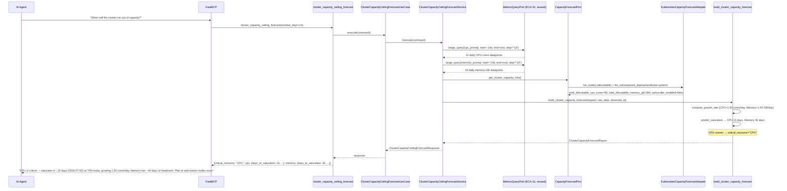
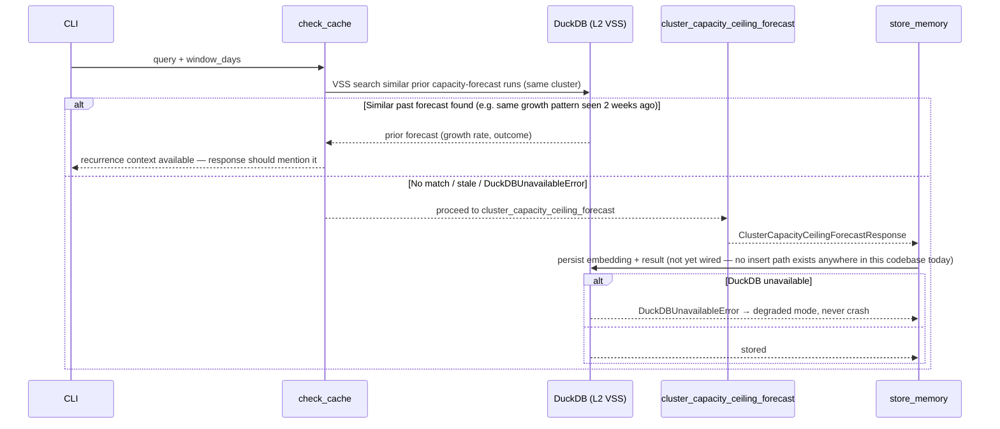

# Use Case 74 — Cluster Capacity Ceiling Forecast

## Sample Questions

- "At the current resource consumption growth rate, when will the cluster run out of node capacity — in days or weeks?"
- "Is the cluster CPU or memory going to run out first?"
- "How many days until we need to add worker nodes?"
- "Is our cluster capacity trending up, down, or flat over the last two weeks?"
- "Did adding that node last week actually change our growth trend?"

---

As a platform engineer, I want hexawyn to predict when the cluster will exhaust node
capacity so I can plan infrastructure scaling before workloads start failing to
schedule. Queries Prometheus for 14 days of cluster-wide CPU/memory usage, computes a
daily growth rate for each, extrapolates to total allocatable capacity, and reports
current utilization %, growth rate/day, and predicted saturation date — whichever
resource saturates sooner is flagged as critical.

**Prometheus range-querying is reused as-is (ECA-31), not re-implemented** — the
existing `MetricsQueryPort.range_query(promql, start, end, step, timeout_seconds)`
already returns exactly the daily time series needed (`step="1d"`); the service
composes it directly rather than building a second Prometheus client. The only
genuinely new adapter capability is Kubernetes-specific: total allocatable
CPU/memory across all nodes, and whether a cluster-autoscaler is present.

**Growth rate is computed by a small manual least-squares fit (stdlib only)** — no
regression helper existed anywhere in this codebase prior to this feature. A discrete
capacity jump (e.g. a node joining mid-window) is detected as a single outlier delta
and the slope is then computed only over the post-jump segment; a *sustained*
multi-day acceleration is deliberately treated as a different case (a "recent spike"
caveat) rather than conflated with a one-time jump.

### Flow 1 — Happy Path: CPU Critical, Both Resources Growing (TC1, TC3)



### Flow 2 — Error/Edge Flows: Decline, Flat, Capacity Jump, Insufficient History (TC4, TC5, edge cases)

```mermaid
sequenceDiagram
    participant Service as ClusterCapacityCeilingForecastService
    participant Domain as build_cluster_capacity_forecast

    alt TC4: usage declining (workloads decommissioned)
        Domain-->>Service: growth_rate_per_day &lt; 0 → days_to_saturation=null, critical_resource="None"
        Note over Domain: capacity freeing — never presented as risk
    else TC5: usage flat for 14 days
        Domain-->>Service: growth_rate_per_day ≈ 0 → days_to_saturation=null, critical_resource="None"
    else Edge case: node added mid-window (capacity jump)
        Domain->>Domain: detect_capacity_jump finds a single outlier delta
        Domain-->>Service: capacity_jump_detected=true, slope computed on post-jump segment only
    else Edge case: fewer than 7 days of Prometheus history
        Domain-->>Service: confidence="low", window_days_used=&lt;7 (not a hard failure)
    else Edge case: zero usable datapoints for both resources
        Service-->>Service: raise InsufficientDataError("No Prometheus data available...")
        Note over Service: propagates to the MCP tool's outer try/except
    end
```

### Flow 3 — Checker Node: 7 Verification Cases

```mermaid
sequenceDiagram
    participant Checker as Checker Node
    participant LLM as LLM Response

    Checker->>LLM: Validate cluster_capacity_ceiling_forecast findings
    alt Saturation date mathematically incorrect
        Checker-->>LLM: ❌ FAIL — must equal (100 - current_pct) / growth_rate_per_day, recomputed independently
    alt CPU/Memory critical resource inverted
        Checker-->>LLM: ❌ FAIL — critical resource must equal min(days_to_cpu_saturation, days_to_memory_saturation)
    alt Node added mid-window not disclosed
        Checker-->>LLM: ⚠️ FLAG — `capacity_jump_detected=true` must be mentioned ("trend computed on post-node-addition period only")
    alt Autoscaler ignored
        Checker-->>LLM: ⚠️ FLAG (mandatory) — if `autoscaler_enabled=true`, the response must note the autoscaler will add nodes before the raw prediction is reached
    alt Decline presented as risk
        Checker-->>LLM: ❌ FAIL — a negative `growth_rate_per_day` must never be framed as "possible saturation"
    alt Unreasonable prediction horizon
        Checker-->>LLM: ⚠️ FLAG — any date beyond 365 days out is wrong; the tool itself caps and returns `capped_horizon=true` with no literal date
    alt Allocatable vs capacity confused
        Checker-->>LLM: ❌ FAIL — the ceiling used must be `status.allocatable`, never `status.capacity`
    else All checks pass
        Checker-->>LLM: ✅ PASS
    end
```

### Flow 4 — DuckDB Memory: Trend-History Recurrence



## Key Points

- **Prometheus querying is composed, not duplicated** — `ClusterCapacityCeilingForecastService`
  takes the existing `MetricsQueryPort` as a constructor dependency and calls
  `range_query` directly; no new Prometheus HTTP client was written.
- **Adapter naming reflects its real responsibility, not the ticket's literal name**
  — `KubernetesCapacityForecastAdapter` (not "PrometheusCapacityForecastAdapter")
  only reads Kubernetes node-allocatable data and detects the cluster-autoscaler;
  Prometheus is entirely ECA-31's job.
- **Allocatable, never capacity** — the adapter reads `node.status.allocatable`
  (mirroring `vanilla_adapter.py`'s existing `m`/`u`/`n`/`Ki`/`Mi`/`Gi`/`Ti` unit
  parsing, reimplemented locally per this codebase's no-shared-quantity-parser
  convention), never `node.status.capacity` — the two differ by system-reserved
  resources and only allocatable reflects what's actually schedulable.
- **Capacity jump vs. recent spike are deliberately distinct edge cases** — a single
  outlier delta (a discrete step, like a node joining) restricts the regression to
  the post-jump segment; several elevated deltas in a row (a sustained acceleration)
  is instead flagged as `spike_caveat` without discarding any data — conflating the
  two would silently distort the growth rate in either direction.
- **A capped, negligible-growth resource is never picked as `critical_resource`** — by
  construction, `capped_horizon=True` always pairs with `days_to_saturation=None`,
  and `_pick_critical_resource` only selects a resource whose saturation date is
  known; this makes an absurd multi-thousand-day prediction structurally impossible
  to surface as "critical," not just something the Checker catches after the fact.
- **A short Prometheus history degrades confidence, it does not fail the request** —
  `confidence` drops to `"low"`/`"medium"` below 7/14 days rather than raising, per
  the ticket's own wording; `InsufficientDataError` is reserved for the genuine
  zero-datapoints case.
- **Autoscaler detection is real code, not just a documentation note** — the ticket's
  own Checker edge case requires the semantic layer to cross-check the tool's own
  disclosed `autoscaler_enabled` flag against the real Kubernetes API, so the flag
  itself must be a genuine field on the response, sourced from an actual
  kube-system Deployment check (`"cluster-autoscaler"` in the name).
- **DuckDB VSS / trend-history recurrence and the Checker Node are documentation
  conventions here too** — unchanged from every prior feature this session:
  `search_similar()` still has zero production call sites, no `insert_incident.sql`
  exists, and no `src/hexawyn/lang_graph/` exists in this codebase.

## Tests

Unit test stubs for the domain logic the ticket calls out — growth rate computation,
capacity extrapolation, saturation date prediction — plus the full
port/service/use-case/tool/adapter stack:

| Test | File | Status |
|---|---|---|
| `test_clean_linear_series_has_no_jump` / `test_single_step_change_is_detected` / `test_sustained_acceleration_is_not_a_single_jump` / `test_flat_series_with_one_jump_and_zero_baseline` / `test_capacity_jump_restricts_slope_to_post_jump_segment` (edge case) / `test_recent_spike_flagged_as_caveat_without_being_a_jump` (edge case) / `test_declining_series_has_negative_slope` (TC4) / `test_flat_series_has_near_zero_slope` (TC5) (growth rate + capacity jump) | `tests/unit/cluster_capacity_forecast/test_growth_rate.py` | ✅ |
| `test_cpu_saturates_in_fifteen_days` (TC1) / `test_memory_saturates_in_forty_days` (TC2) / `test_negative_growth_means_no_risk` (edge case) / `test_zero_growth_means_stable` (TC5) / `test_horizon_beyond_max_is_capped` (checker edge case) (saturation prediction) | `tests/unit/cluster_capacity_forecast/test_saturation_prediction.py` | ✅ |
| `test_cpu_saturates_sooner_is_critical` / `test_memory_saturates_sooner_is_critical` (TC3) / `test_declining_usage_is_no_risk` (TC4) / `test_flat_usage_is_stable_no_prediction` (TC5) / `test_capped_horizon_never_becomes_the_critical_resource` (checker edge case) / confidence tiers vs. window length (edge case) / autoscaler passthrough (edge case) (forecast composition) | `tests/unit/cluster_capacity_forecast/test_forecast_builder.py` | ✅ |
| `TestResourceForecast` / `TestClusterCapacityForecastRequest` / `TestClusterCapacityForecastReport` / `TestClusterCapacityRawData` | `tests/unit/test_cluster_capacity_forecast.py` | ✅ |
| `test_is_abstract` / `test_cannot_instantiate` | `tests/unit/test_capacity_forecast_port.py` | ✅ |
| `test_defaults` / `test_custom_window_days` | `tests/unit/test_cluster_capacity_ceiling_forecast_command.py` | ✅ |
| `test_defaults` / `test_error_field` | `tests/unit/test_cluster_capacity_ceiling_forecast_response.py` | ✅ |
| `test_is_abstract` / `test_cannot_instantiate` | `tests/unit/test_cluster_capacity_ceiling_forecast_service_port.py` | ✅ |
| `test_calls_range_query_twice_with_daily_step` / `test_window_days_affects_query_start` / `test_calls_capacity_port_once` / `test_raises_when_both_series_empty` (edge case) / `test_response_populated_with_forecast_fields` | `tests/unit/test_cluster_capacity_ceiling_forecast_service.py` | ✅ |
| `test_execute_delegates_to_service` | `tests/unit/test_cluster_capacity_ceiling_forecast_use_case.py` | ✅ |
| `test_returns_forecast` / `test_insufficient_data_surfaces_as_error` / `test_handles_error` / `test_has_register` | `tests/unit/test_cluster_capacity_ceiling_forecast_tool.py` | ✅ |
| `test_sums_allocatable_cpu_and_memory_across_nodes` / `test_handles_nanocore_and_bare_numeric_cpu_units` / `test_handles_microcore_and_nanocore_cpu_suffixes` / `test_handles_ti_memory_suffix_and_unparseable_values` / `test_detects_cluster_autoscaler_deployment` (edge case) / `test_autoscaler_check_failure_defaults_to_false` / `test_forbidden_translates_to_insufficient_permissions` / `test_other_errors_translate_to_cluster_unreachable` | `tests/unit/test_kubernetes_capacity_forecast_adapter.py` | ✅ |

## Related Files

- `src/hexawyn/domain/models/constants.py` — `ClusterCapacityForecastConstants` (`default_window_days=14`, `min_medium_confidence_days=7`, `max_forecast_horizon_days=365`, `trend_window_days=3`, `jump_outlier_multiplier=3.0`)
- `src/hexawyn/domain/models/cluster_capacity_forecast.py` — `ClusterCapacityRawData`, `ResourceForecast`, `ClusterCapacityForecastRequest`, `ClusterCapacityForecastReport`
- `src/hexawyn/domain/services/cluster_capacity_forecast/growth_rate.py` — `detect_capacity_jump`, `compute_growth_rate`
- `src/hexawyn/domain/services/cluster_capacity_forecast/saturation_prediction.py` — `predict_saturation`
- `src/hexawyn/domain/services/cluster_capacity_forecast/forecast_builder.py` — `build_cluster_capacity_forecast`
- `src/hexawyn/application/ports/driven/capacity_forecast_port.py` — `CapacityForecastPort`, `ClusterCapacityInfoRaw`
- `src/hexawyn/application/ports/driven/metrics_query_port.py` — `MetricsQueryPort` (ECA-31, reused)
- `src/hexawyn/application/ports/driving/cluster_capacity_ceiling_forecast/` — command, response, service_port
- `src/hexawyn/application/service/cluster_capacity_ceiling_forecast_service.py` — `ClusterCapacityCeilingForecastService`
- `src/hexawyn/application/use_case/cluster_capacity_ceiling_forecast/cluster_capacity_ceiling_forecast_use_case.py`
- `src/hexawyn/adapters/secondary/gitops/kubernetes_capacity_forecast_adapter.py` — `KubernetesCapacityForecastAdapter`
- `src/hexawyn/mcp/tools/cluster_capacity_ceiling_forecast.py` — MCP tool (auto-registered)
- `src/hexawyn/mcp/server.py` — `build_capacity_forecast_adapter` (new)
