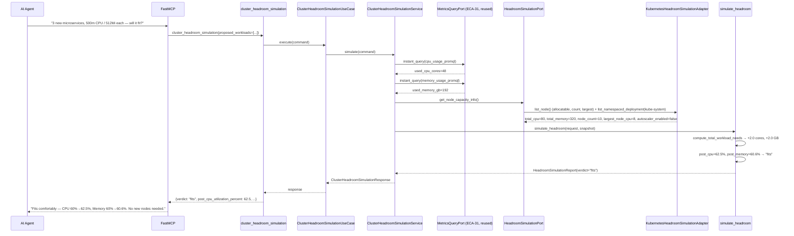
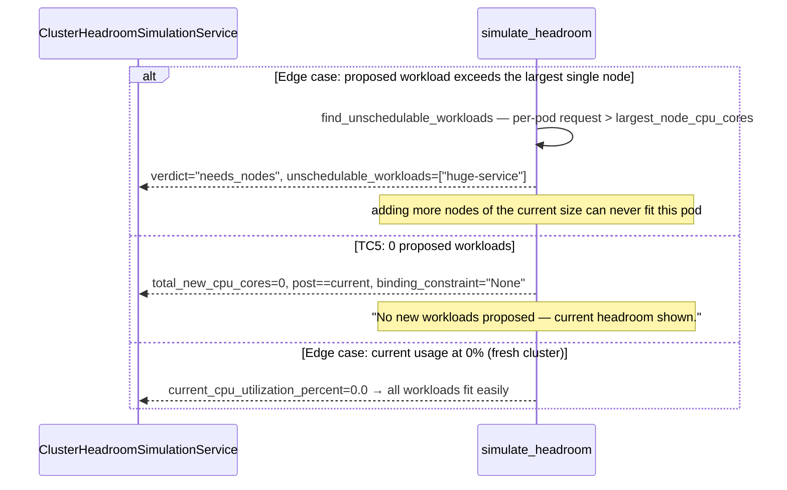

# Use Case 75 — Cluster Headroom Simulation

## Sample Questions

- "If I deploy 3 new microservices next sprint, each requiring 500m CPU and 512Mi memory, will the cluster handle the load without adding new nodes?"
- "Do we have enough headroom to add another 2 replicas of the payment service?"
- "Would these proposed workloads fit, or do we need to scale the node pool first?"
- "Is memory or CPU going to be the bottleneck if we ship these three services?"
- "Can this pod's resource request even fit on any of our current nodes?"

---

As a platform engineer, I want hexawyn to simulate whether the cluster has enough
headroom for upcoming new workloads so I can make data-driven node-scaling decisions
before the next sprint deployment. Accepts a list of proposed workloads (resource
requests + replica counts), queries current cluster allocatable capacity and usage,
simulates adding the workloads, and returns current headroom, post-deployment
utilization %, and a verdict — `fits` / `tight` / `needs_nodes` — plus a node-count
recommendation when insufficient.

**No mutations, ever** — this is a pure simulation. Nothing is created, scaled, or
scheduled; the tool only reads current cluster state and does arithmetic on proposed
numbers.

**Reuses ECA-31's Prometheus querying and mirrors ECA-74's adapter parsing, but is
its own port** — `MetricsQueryPort.instant_query` (not `range_query` — this feature
only needs "right now", not a history) supplies current usage; node-allocatable
totals, node count, and the largest single node's capacity come from a new,
narrower `HeadroomSimulationPort` (ECA-74's `CapacityForecastPort` only exposes
summed totals, not the per-node granularity this feature needs for the
unschedulable-workload and average-node-size checks).

### Flow 1 — Happy Path: Fits and Needs-Nodes (TC1, TC3)



### Flow 2 — Error/Edge Flows: Unschedulable Workload, Zero Workloads, Fresh Cluster (TC5, edge cases)



### Flow 3 — Checker Node: Verification Cases

```mermaid
sequenceDiagram
    participant Checker as Checker Node
    participant LLM as LLM Response

    Checker->>LLM: Validate cluster_headroom_simulation findings
    alt Verdict math incorrect
        Checker-->>LLM: ❌ FAIL — post-utilization must equal (used + total_new) / total_allocatable, recomputed independently
    alt Binding constraint inverted
        Checker-->>LLM: ❌ FAIL — binding constraint must be whichever resource has the higher post-deployment utilization
    alt Unschedulable workload treated as merely "tight"
        Checker-->>LLM: ❌ FAIL — a per-pod request exceeding every current node must be flagged `needs_nodes`, not glossed over as headroom pressure
    alt Autoscaler ignored
        Checker-->>LLM: ⚠️ FLAG (mandatory) — if `autoscaler_enabled=true`, the response must note it as a safety net
    alt Default replica count silently assumed wrong
        Checker-->>LLM: ⚠️ FLAG — when a workload omits replicas, the response must reflect the default of 2, not 1
    alt Node recommendation missing when needs_nodes
        Checker-->>LLM: ❌ FAIL — `verdict="needs_nodes"` must always come with a concrete `recommended_additional_nodes`
    else All checks pass
        Checker-->>LLM: ✅ PASS
    end
```

## Key Points

- **Genuinely narrower new port, not a duplicate of ECA-74's** — `HeadroomSimulationPort`
  exposes node count and the largest single node's allocatable capacity in addition to
  totals; `CapacityForecastPort` only ever needed sums for its trend forecast.
- **Quantity parsing is reimplemented a third time in this codebase, now in the
  domain layer** — the two existing parsers live in adapters (parsing real K8s API
  objects); this feature's proposed workloads arrive as plain human-typed strings
  (`"500m"`, `"512Mi"`), so parsing them is pure, I/O-free logic that belongs in
  `domain/services/`, not an adapter.
- **A per-pod request exceeding the largest node forces `needs_nodes`, independent of
  aggregate utilization math** — no amount of headroom elsewhere in the cluster helps
  if a single pod is bigger than every node that exists; adding more of the same node
  size doesn't fix it either.
- **Default replica count is a plain dataclass default (`= 2`), not a branch** — the
  simplest possible way to satisfy "no replicas specified."
- **"Weighted average node size" falls out of honest arithmetic, not a special
  algorithm** — using the real summed total and true node count for the node-count
  recommendation (`total / node_count`) already accounts for heterogeneous node sizes
  without inventing a separate weighting scheme.
- **Binding constraint is independent of verdict severity** — whichever resource has
  the higher post-deployment utilization is reported as binding, even in a comfortably
  "fits" scenario, so a user always knows which resource to watch first.
- **Zero proposed workloads degrades through the same math, not a separate code
  path** — adding zero CPU/memory cores is just a zero-valued input to the same
  formula, with `binding_constraint="None"` and a plainly-worded summary distinguishing
  it from an actual simulation.

## Tests

Unit test stubs for the domain logic the ticket calls out — headroom calculation,
utilization simulation, node recommendation — plus the full
port/service/use-case/tool/adapter stack:

| Test | File | Status |
|---|---|---|
| CPU `m`/bare-core/`u`/`n` suffix parsing, memory `Mi`/`Gi`/`Ki`/bare-byte parsing, unparseable → 0.0 | `tests/unit/headroom_simulation/test_quantity_parsing.py` | ✅ |
| `test_matches_ticket_test_data` / `test_default_replicas_applied_when_unspecified` (edge case) / `test_empty_workload_list_returns_zero` / `test_flags_workload_exceeding_largest_node_cpu` (edge case) / `test_flags_workload_exceeding_largest_node_memory` / `test_fitting_workloads_are_not_flagged` | `tests/unit/headroom_simulation/test_workload_sizing.py` | ✅ |
| `test_tc1_sixty_percent_plus_small_load_fits` (TC1) / `test_tc2_eighty_five_percent_plus_small_load_is_tight` (TC2) / `test_tc3_ninety_percent_plus_large_load_needs_one_node` (TC3) / `test_tc4_memory_abundant_cpu_tight_binding_is_cpu` (TC4) / `test_tc5_zero_workloads_is_current_state_summary` (TC5) / `test_autoscaler_enabled_noted_but_does_not_change_verdict` (edge case) / `test_workload_exceeding_largest_node_forces_needs_nodes` (edge case) / `test_zero_current_usage_all_workloads_fit_easily` (edge case) | `tests/unit/headroom_simulation/test_headroom_builder.py` | ✅ |
| `TestProposedWorkload` / `TestClusterHeadroomSnapshot` / `TestHeadroomSimulationRequest` / `TestHeadroomSimulationReport` | `tests/unit/test_headroom_simulation.py` | ✅ |
| `test_is_abstract` / `test_cannot_instantiate` | `tests/unit/test_headroom_simulation_port.py` | ✅ |
| `test_defaults_to_no_workloads` / `test_accepts_proposed_workloads` | `tests/unit/test_cluster_headroom_simulation_command.py` | ✅ |
| `test_defaults` / `test_error_field` | `tests/unit/test_cluster_headroom_simulation_response.py` | ✅ |
| `test_is_abstract` / `test_cannot_instantiate` | `tests/unit/test_cluster_headroom_simulation_service_port.py` | ✅ |
| `test_calls_instant_query_twice` / `test_missing_prometheus_data_defaults_to_zero_usage` (edge case) / `test_calls_capacity_port_once` / `test_default_replicas_applied_when_omitted` (edge case) / `test_explicit_replicas_respected` / `test_fits_scenario` | `tests/unit/test_cluster_headroom_simulation_service.py` | ✅ |
| `test_execute_delegates_to_service` | `tests/unit/test_cluster_headroom_simulation_use_case.py` | ✅ |
| `test_returns_simulation` / `test_handles_error` / `test_has_register` | `tests/unit/test_cluster_headroom_simulation_tool.py` | ✅ |
| `test_sums_totals_and_finds_largest_node` / `test_handles_microcore_nanocore_and_bare_numeric_cpu` / `test_unparseable_values_return_zero` / `test_no_nodes_returns_zero_largest` / `test_detects_cluster_autoscaler_deployment` (edge case) / `test_autoscaler_check_failure_defaults_to_false` / `test_forbidden_translates_to_insufficient_permissions` / `test_other_errors_translate_to_cluster_unreachable` | `tests/unit/test_kubernetes_headroom_simulation_adapter.py` | ✅ |

## Related Files

- `src/hexawyn/domain/models/constants.py` — `HeadroomSimulationConstants` (`default_replicas=2`, `tight_utilization_threshold=80.0`, `needs_nodes_utilization_threshold=95.0`, `target_utilization_after_scaling_percent=80.0`)
- `src/hexawyn/domain/models/headroom_simulation.py` — `ProposedWorkload`, `ClusterHeadroomSnapshot`, `HeadroomSimulationRequest`, `HeadroomSimulationReport`
- `src/hexawyn/domain/services/headroom_simulation/quantity_parsing.py` — `parse_cpu_quantity`, `parse_memory_quantity`
- `src/hexawyn/domain/services/headroom_simulation/workload_sizing.py` — `compute_total_workload_needs`, `find_unschedulable_workloads`
- `src/hexawyn/domain/services/headroom_simulation/headroom_builder.py` — `simulate_headroom`
- `src/hexawyn/application/ports/driven/headroom_simulation_port.py` — `HeadroomSimulationPort`, `HeadroomCapacityInfoRaw`
- `src/hexawyn/application/ports/driven/metrics_query_port.py` — `MetricsQueryPort` (ECA-31, reused via `instant_query`)
- `src/hexawyn/application/ports/driving/cluster_headroom_simulation/` — command, response, service_port
- `src/hexawyn/application/service/cluster_headroom_simulation_service.py` — `ClusterHeadroomSimulationService`
- `src/hexawyn/application/use_case/cluster_headroom_simulation/cluster_headroom_simulation_use_case.py`
- `src/hexawyn/adapters/secondary/gitops/kubernetes_headroom_simulation_adapter.py` — `KubernetesHeadroomSimulationAdapter`
- `src/hexawyn/mcp/tools/cluster_headroom_simulation.py` — MCP tool (auto-registered)
- `src/hexawyn/mcp/server.py` — `build_headroom_simulation_adapter` (new)
