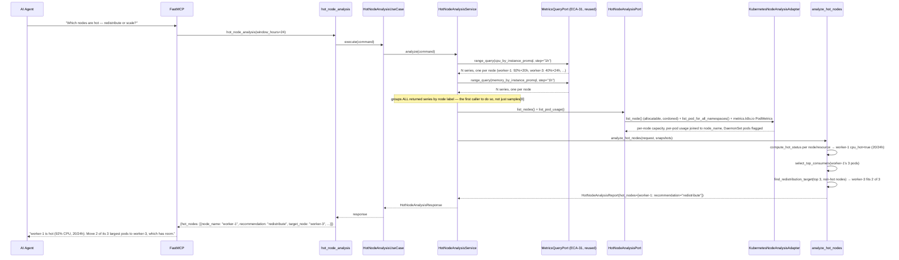
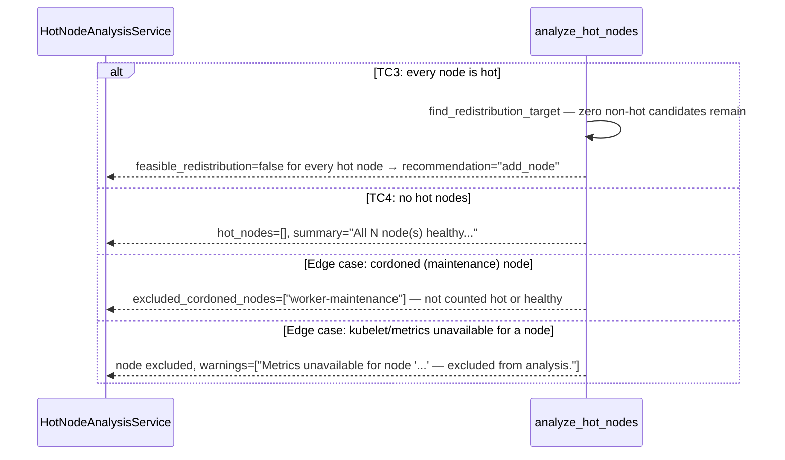

# Use Case 76 — Hot Node Analysis

## Sample Questions

- "Which nodes are consistently above 80% CPU or memory utilization — are they candidates for vertical scaling or workload redistribution?"
- "Is worker-eu-3 actually hot, or was that just a brief spike?"
- "If a node is overloaded, which pods should we move first?"
- "Do we have enough headroom elsewhere to redistribute load off our busiest node?"
- "Are our hot nodes only busy during business hours, or is it constant?"

---

As a platform engineer, I want hexawyn to identify hot nodes consistently running
above 80% CPU or memory so I can decide whether to redistribute workloads or
vertically scale those nodes. Queries per-node CPU/memory utilization over the last
24h, flags a node "hot" when it's above the threshold for more than half the window,
lists its top resource-consuming pods, and recommends `redistribute` / `scale_vertically`
/ `add_node` per hot node.

**The most domain-logic-heavy of the three capacity-planning features this session**
(alongside Cluster Capacity Ceiling Forecast and Cluster Headroom Simulation) — this
is the first feature to actually walk **multiple** Prometheus series from one query
(`by (instance)` grouped node-exporter metrics) instead of indexing a single
aggregate; the first to read a node's cordoned status; and the first to exclude
DaemonSet pods from a "movable workload" candidate pool.

**No mutations** — this tool only reads cluster state and simulates; nothing is
cordoned, drained, or rescheduled.

### Flow 1 — Happy Path: Hot Node with Partial Redistribution (TC1, TC2)



### Flow 2 — Error/Edge Flows: All-Hot, Healthy, Cordoned, Missing Metrics (TC3, TC4, edge cases)



### Flow 3 — Checker Node: Verification Cases

```mermaid
sequenceDiagram
    participant Checker as Checker Node
    participant LLM as LLM Response

    Checker->>LLM: Validate hot_node_analysis findings
    alt Hot threshold/duration math incorrect
        Checker-->>LLM: ❌ FAIL — hot must mean >80% for >50% of the 24h window, recomputed independently
    alt CPU vs memory hot status conflated
        Checker-->>LLM: ❌ FAIL — a node hot on memory but not CPU (or vice versa) must be disclosed per-resource, never collapsed
    alt DaemonSet pod listed as a redistribution candidate
        Checker-->>LLM: ❌ FAIL — DaemonSet pods run on every node by design and can never be "moved"
    alt Cordoned node included in hot/healthy counts
        Checker-->>LLM: ❌ FAIL — a cordoned node must be excluded entirely, not counted either way
    alt "add_node" recommended when redistribution was actually feasible
        Checker-->>LLM: ❌ FAIL — partial redistribution (even 1 of N pods) must be preferred over add_node
    alt Business-hours pattern not disclosed
        Checker-->>LLM: ⚠️ FLAG — if hot hours cluster in business hours, the response should note the pattern, not imply 24/7 saturation
    else All checks pass
        Checker-->>LLM: ✅ PASS
    end
```

## Key Points

- **First caller to walk multiple Prometheus series from one query** — both
  Cluster Capacity Ceiling Forecast and Cluster Headroom Simulation hard-index
  `samples[0]` since they only ever query cluster-wide aggregates; this feature's
  `by (instance)` node-exporter queries return one series per node, and the service
  groups all of them by label instead of assuming a single result.
- **Node-exporter metrics, not container metrics** — `node_cpu_seconds_total`/
  `node_memory_MemAvailable_bytes` are the standard per-node utilization source;
  `sum(container_...)` (used by the two prior features) has no per-node identity at
  all.
- **A DaemonSet pod is filtered out before it ever reaches the domain layer** — the
  `ClusterNodeSnapshot.pods` list arriving at `analyze_hot_nodes` is already
  DaemonSet-free, mirroring the one existing owner-reference precedent in this
  codebase (zombie detection's CronJob check) with `"DaemonSet"` instead.
- **Cordoned-node detection (`node.spec.unschedulable`) is a genuinely new read** —
  confirmed via repo-wide search that nothing in this codebase touched it before
  this feature.
- **Redistribution is a greedy partial-fit simulation, not all-or-nothing** — moving
  2 of 3 pods to a less-loaded node still counts as `"redistribute"`, matching the
  ticket's own worked example directly; candidates are ranked by available headroom
  (`allocatable - sum(pod usage)`) descending.
- **The `scale_vertically` vs. `add_node` split is a real decision, not a coin
  flip** — when redistribution isn't feasible, a single pod dominating the node's
  total usage (a configurable ratio) means the fix is a bigger/dedicated node, not a
  whole new generic one for a single outlier.
- **Missing-metrics handling is split by failure domain** — a node with no
  Prometheus series at all is excluded from hot-detection *with a warning*
  (data-quality gap); a pod missing from `metrics.k8s.io`'s PodMetrics response just
  shows `0` usage (adapter-level degradation) — these are different failure modes
  and don't share one code path.
- **Business-hours pattern uses real timestamps, not a heuristic guess** — each hot
  datapoint's actual ISO timestamp is checked against a 9–18 window, not a
  "contiguous block of hours" approximation.
- **Adapter naming deviates from the ticket's literal "PrometheusNodeAnalysisAdapter"
  once more** — Prometheus querying is composed directly from `MetricsQueryPort` at
  the service layer; the new adapter is entirely Kubernetes-side, so it's named
  `KubernetesNodeAnalysisAdapter` — the third such deviation this session.

## Tests

Unit test stubs for the domain logic the ticket calls out — hot node detection, top
consumer identification, redistribution feasibility — plus the full
port/service/use-case/tool/adapter stack:

| Test | File | Status |
|---|---|---|
| `test_tc1_cpu_ninety_two_percent_for_twenty_of_twentyfour_hours_is_hot` (TC1) / `test_tc4_no_hot_hours_is_not_hot` (TC4) / `test_tc5_eighty_five_percent_cpu_is_hot` (TC5) / `test_thirty_percent_memory_is_not_hot` (TC5) / `test_just_under_duration_threshold_is_not_hot` / `test_empty_series_is_not_hot` / `test_hot_hours_clustered_in_business_hours_is_flagged` (edge case) / `test_hot_hours_scattered_across_day_and_night_is_not_flagged` | `tests/unit/hot_node_analysis/test_hot_node_detection.py` | ✅ |
| `test_sorts_by_cpu_usage_descending` / `test_slices_to_requested_count` / `test_fewer_pods_than_requested_count_returns_all` / `test_empty_pods_returns_empty` | `tests/unit/hot_node_analysis/test_top_consumers.py` | ✅ |
| `test_tc2_partial_fit_two_of_three_pods` (TC2) / `test_tc3_no_candidates_is_infeasible` (TC3) / `test_candidate_with_insufficient_headroom_moves_nothing` / `test_selects_candidate_with_most_headroom` / `test_no_top_consumers_is_infeasible` | `tests/unit/hot_node_analysis/test_redistribution.py` | ✅ |
| `test_tc1_hot_node_triggers_redistribution_check` (TC1) / `test_tc2_partial_redistribution_is_recommended` (TC2) / `test_tc3_all_nodes_hot_recommends_add_node` (TC3) / `test_tc4_no_hot_nodes_is_all_healthy` (TC4) / `test_tc5_cpu_hot_memory_fine_is_disclosed_independently` (TC5) / cordoned exclusion (edge case) / metrics-missing exclusion + warning (edge case) / DaemonSet-only node falls through (edge case) / single-dominant-pod → `scale_vertically` (edge case) / zero-total-usage guard | `tests/unit/hot_node_analysis/test_node_analysis_builder.py` | ✅ |
| `TestTopConsumer` / `TestClusterNodeSnapshot` / `TestHotNodeAnalysisRequest` / `TestHotNodeResult` / `TestHotNodeAnalysisReport` | `tests/unit/test_hot_node_analysis.py` | ✅ |
| `test_is_abstract` / `test_cannot_instantiate` | `tests/unit/test_hot_node_analysis_port.py` | ✅ |
| `test_default_window_hours` / `test_custom_window_hours` | `tests/unit/test_hot_node_analysis_command.py` | ✅ |
| `test_defaults` / `test_error_field` | `tests/unit/test_hot_node_analysis_response.py` | ✅ |
| `test_is_abstract` / `test_cannot_instantiate` | `tests/unit/test_hot_node_analysis_service_port.py` | ✅ |
| `test_calls_range_query_twice_with_hourly_step` / `test_both_node_series_are_used_not_just_the_first` (multi-series grouping) / `test_daemonset_pods_excluded_before_grouping` (edge case) / `test_all_healthy_scenario` | `tests/unit/test_hot_node_analysis_service.py` | ✅ |
| `test_execute_delegates_to_service` | `tests/unit/test_hot_node_analysis_use_case.py` | ✅ |
| `test_returns_analysis` / `test_handles_error` / `test_has_register` | `tests/unit/test_hot_node_analysis_tool.py` | ✅ |
| `test_returns_allocatable_and_cordoned_status` (edge case) / `test_handles_all_cpu_and_memory_unit_suffixes` / `test_joins_pod_to_node_and_metrics` / `test_pod_without_owner_references_is_not_daemonset` / `test_daemonset_owned_pod_is_flagged` (edge case) / `test_unscheduled_pod_is_skipped` / `test_pod_missing_from_metrics_response_defaults_to_zero` (edge case) / error translation tests | `tests/unit/test_kubernetes_node_analysis_adapter.py` | ✅ |

## Related Files

- `src/hexawyn/domain/models/constants.py` — `HotNodeAnalysisConstants` (`default_window_hours=24`, `hot_threshold_percent=80.0`, `hot_duration_percent=50.0`, `top_consumers_count=3`, `business_hours_start=9`, `business_hours_end=18`, `business_hours_match_ratio=0.8`, `single_dominant_pod_ratio=0.6`)
- `src/hexawyn/domain/models/hot_node_analysis.py` — `TopConsumer`, `ClusterNodeSnapshot`, `HotNodeAnalysisRequest`, `HotNodeResult`, `HotNodeAnalysisReport`
- `src/hexawyn/domain/services/hot_node_analysis/hot_node_detection.py` — `compute_hot_status`
- `src/hexawyn/domain/services/hot_node_analysis/top_consumers.py` — `select_top_consumers`
- `src/hexawyn/domain/services/hot_node_analysis/redistribution.py` — `find_redistribution_target`
- `src/hexawyn/domain/services/hot_node_analysis/node_analysis_builder.py` — `analyze_hot_nodes`
- `src/hexawyn/application/ports/driven/hot_node_analysis_port.py` — `HotNodeAnalysisPort`, `NodeInfoRaw`, `PodUsageRaw`
- `src/hexawyn/application/ports/driven/metrics_query_port.py` — `MetricsQueryPort` (ECA-31, reused via `range_query`)
- `src/hexawyn/application/ports/driving/hot_node_analysis/` — command, response, service_port
- `src/hexawyn/application/service/hot_node_analysis_service.py` — `HotNodeAnalysisService`
- `src/hexawyn/application/use_case/hot_node_analysis/hot_node_analysis_use_case.py`
- `src/hexawyn/adapters/secondary/gitops/kubernetes_node_analysis_adapter.py` — `KubernetesNodeAnalysisAdapter`
- `src/hexawyn/mcp/tools/hot_node_analysis.py` — MCP tool (auto-registered)
- `src/hexawyn/mcp/server.py` — `build_node_analysis_adapter` (new)
