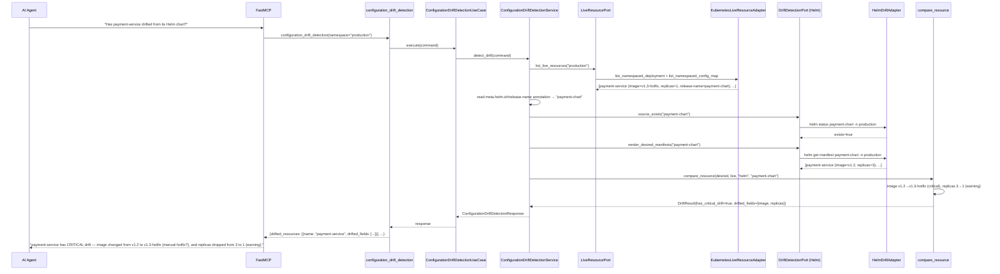
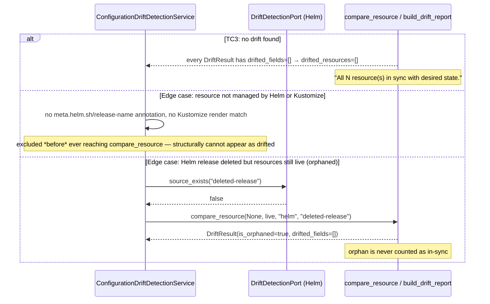

# Use Case 77 — Configuration Drift Detection

## Sample Questions

- "Has any resource configuration drifted from its Helm or Kustomize desired state — which live resources differ from what is declared in Git?"
- "Did someone manually patch the payment-service deployment after it was deployed by Helm?"
- "Is the checkout-config ConfigMap still in sync with what's in the chart?"
- "Are there any resources left over from a Helm release that no longer exists?"
- "Which drifted resources are actually critical, not just cosmetic?"

---

As a GitOps engineer, I want hexawyn to detect configuration drift between live
resources and their Helm/Kustomize desired state so I can identify manual changes or
git-out-of-sync situations before they cause incidents. Compares image, replicas, env
vars, resource limits, and labels; classifies severity (image/RBAC/Secret = critical,
everything else = warning); distinguishes Helm-managed vs Kustomize-managed vs
unmanaged resources; and flags orphaned resources (Helm-labeled but the release no
longer exists).

**The first feature this session to shell out to an external CLI tool** — no
precedent existed anywhere in this codebase for invoking `helm` or `kustomize` (the
only prior `subprocess` usage was a trivial, swallow-everything `kubectl config
current-context` check). This adapter does real timeout/binary-not-found/non-zero-exit
translation into domain errors, following the existing `*NotFoundError` no-arg
template.

**Renders Helm's desired state via `helm get manifest`, never `helm template`** — the
former reads back the frozen manifest from the stored release object; the latter
would re-render fresh every call, baking in a *new* `date`-function timestamp each
time and manufacturing a false drift on every single run. This resolves the ticket's
"dynamic timestamp" edge case by construction rather than an exclusion list.

### Flow 1 — Happy Path: Critical Image Drift and Warning Replica Drift (TC1, TC2)



### Flow 2 — Error/Edge Flows: No Drift, Unmanaged Resource, Orphaned Release (TC3, edge cases)



### Flow 3 — Checker Node: 7 Verification Cases

```mermaid
sequenceDiagram
    participant Checker as Checker Node
    participant LLM as LLM Response

    Checker->>LLM: Validate configuration_drift_detection findings
    alt Drift invented on an excluded dynamic field
        Checker-->>LLM: ❌ FAIL — Helm's `date`-function timestamps are never re-rendered (helm get manifest, not helm template) — no such field could genuinely differ
    alt Severity misclassified (image=warning, replicas=critical)
        Checker-->>LLM: ❌ FAIL — the deterministic matrix must apply: image/RBAC/Secret=critical, replicas/limits/env/data=warning
    alt Non-Helm resource presented as drifting
        Checker-->>LLM: ❌ FAIL — a resource with no helm.sh/chart or app.kubernetes.io/managed-by:Helm label (and no Kustomize match) can never appear as drifted — verify management labels before any diff
    alt Desired vs live values inverted in the narration
        Checker-->>LLM: ❌ FAIL — desired always comes from Helm/Kustomize/Git, live always from the cluster; verify directionality
    alt Excluded annotation cited as drift (kubectl.kubernetes.io/last-applied-configuration)
        Checker-->>LLM: ❌ FAIL — annotations are never a comparison target, only labels are
    alt Orphaned resource presented as "no drift"
        Checker-->>LLM: ❌ FAIL — a deleted Helm release with resources still live must be reported as orphaned, not in-sync
    alt Stale DuckDB drift cache reported as current
        Checker-->>LLM: ⚠️ FLAG — if the cached finding is older than 5 minutes, verify freshness before reporting it as active
    else All checks pass
        Checker-->>LLM: ✅ PASS
    end
```

## Key Points

- **`helm get manifest`, not `helm template`, resolves the dynamic-timestamp edge case
  by construction** — nothing to exclude when the comparison never re-generates a
  fresh value in the first place. Kustomize has no equivalent templating-function
  concept.
- **Annotations are never a comparison target, structurally** — both the "manually
  annotated" and "kubectl.kubernetes.io/last-applied-configuration" edge cases are
  satisfied by simply never reading `metadata.annotations` as a drift field (only
  `metadata.annotations["meta.helm.sh/release-name"]` is read, for identification,
  never for comparison).
- **Two ports, matching the ticket's own "k8s + Helm Adapters" diagram wording** —
  `DriftDetectionPort` (rendering) is implemented by both `HelmDriftAdapter` and
  `KustomizeDriftAdapter`, sharing one interface exactly as the ticket names them;
  `LiveResourcePort` is a separate, narrower new port for the K8s-side listing.
- **Scan strategy is live-resource-first, not release-first** — starting from `helm
  list` would silently miss exactly the resources this ticket cares about: ones whose
  owning release is already gone. Starting from what's actually running and checking
  each resource's Helm-ownership annotation is what catches orphans.
- **Kustomize resources are identified by render-then-match, not a live label** —
  Kustomize has no self-identifying live-resource label the way Helm does; any live
  resource matching (by kind/name/namespace) a resource from a user-supplied
  `kustomize build <path>` is treated as Kustomize-managed for that run.
- **Per-release Helm render/existence-check memoization** — a release with many
  resources is rendered and existence-checked exactly once per request, not once per
  resource.
- **Field extractors avoid `try/except` entirely, using `isinstance` guards instead**
  — unlike the codebase's existing `resource_yaml.py` precedent (which lives in
  `domain/models/`, exempt from the try/except restriction that applies to
  `domain/services/`), this feature's extractors live in `domain/services/` and use
  explicit type-narrowing instead, which is both hexa_guard-clean and arguably more
  type-safe (mypy strict verifies every branch rather than trusting a blind cast).
- **`Mapping[str, object]`, not `dict[str, object]`, for manifest-data parameters** —
  the literal substring `dict[str, object]` is banned in `domain/services/` by this
  repo's architecture guard; since these functions only ever read the manifest,
  `Mapping` is both accurate and compliant.
- **MVP scope covers Deployment + ConfigMap concretely** — the only kinds the
  ticket's own Test Data and Test Scenarios name — while severity classification and
  the domain model treat `kind` as a plain string, so RBAC/Secret kind support is a
  pure adapter extension later, not a domain change.
- **`pyyaml` is now an explicit direct dependency**, not just transitively locked via
  `kubernetes`/`fastmcp` — `types-pyyaml` was already a direct dev dependency,
  confirming typed usage was anticipated.

## Tests

Unit test stubs for the domain logic the ticket calls out — manifest diff, field
comparison, drift severity classification — plus the full
port/service/use-case/tool/adapter stack:

| Test | File | Status |
|---|---|---|
| Field-based severity (image→critical, replicas/limits/env/configmap→warning, labels→info) / kind-based override (Role/ClusterRole/RoleBinding/ClusterRoleBinding/Secret→always critical) | `tests/unit/configuration_drift/test_drift_severity.py` | ✅ |
| `get_image`/`get_replicas`/`get_env_vars`/`get_resource_limits`/`get_labels`/`get_configmap_data` extractors / `compare_scalar_field`/`compare_dict_field` (no-diff → empty, key-absent handling) | `tests/unit/configuration_drift/test_field_comparison.py` | ✅ |
| `test_tc1_image_tag_change_is_critical` (TC1) / `test_tc2_replicas_change_is_warning` (TC2) / `test_tc4_data_key_changed_is_flagged` (TC4) / `test_configmap_data_not_compared_for_deployment` / `test_identical_manifests_produce_no_drifted_fields` / `test_no_desired_manifest_is_orphaned` (edge case) | `tests/unit/configuration_drift/test_manifest_diff.py` | ✅ |
| `test_tc3_no_drift_found_summary` (TC3) / `test_tc5_five_drifted_across_three_namespaces` (TC5) / `test_orphaned_resource_counted_as_drifted_not_in_sync` / `test_excluded_resources_noted_in_summary` / `test_summary_mentions_critical_count` | `tests/unit/configuration_drift/test_drift_report_builder.py` | ✅ |
| `TestDriftedField` / `TestResourceManifest` / `TestConfigurationDriftRequest` / `TestDriftResult` / `TestConfigurationDriftReport` | `tests/unit/test_configuration_drift.py` | ✅ |
| `test_is_abstract` / `test_cannot_instantiate` | `tests/unit/test_drift_detection_port.py`, `tests/unit/test_live_resource_port.py` | ✅ |
| `test_defaults_to_no_kustomize_paths` / `test_accepts_kustomize_paths` | `tests/unit/test_configuration_drift_detection_command.py` | ✅ |
| `test_defaults` / `test_error_field` | `tests/unit/test_configuration_drift_detection_response.py` | ✅ |
| `test_is_abstract` / `test_cannot_instantiate` | `tests/unit/test_configuration_drift_detection_service_port.py` | ✅ |
| `test_resource_without_helm_annotation_or_kustomize_match_is_excluded` (edge case) / `test_deleted_helm_release_marks_resource_orphaned` (edge case) / `test_live_resource_matching_kustomize_render_is_kustomize_managed` / `test_same_release_rendered_only_once_for_multiple_resources` (memoization) / `test_empty_cluster_produces_empty_report` | `tests/unit/test_configuration_drift_detection_service.py` | ✅ |
| `test_execute_delegates_to_service` | `tests/unit/test_configuration_drift_detection_use_case.py` | ✅ |
| `test_returns_drift_report` / `test_handles_error` / `test_has_register` | `tests/unit/test_configuration_drift_detection_tool.py` | ✅ |
| Multi-doc YAML parse / binary-not-found → `HelmNotFoundError` / timeout / non-zero-exit → `ManifestRenderError` / "release not found" → `source_exists() == False` / other failure re-raises | `tests/unit/test_helm_drift_adapter.py` | ✅ |
| YAML parse / binary-not-found → `KustomizeNotFoundError` / timeout / non-zero-exit / `source_exists` via real `Path.exists()` | `tests/unit/test_kustomize_drift_adapter.py` | ✅ |
| Deployments+ConfigMaps with labels/annotations extracted / empty namespace / error translation (both API calls) | `tests/unit/test_kubernetes_live_resource_adapter.py` | ✅ |

## Related Files

- `src/hexawyn/domain/models/constants.py` — `ConfigurationDriftConstants` (`helm_command_timeout_seconds=30.0`, `kustomize_command_timeout_seconds=15.0`, `helm_managed_by_label_key`, `helm_managed_by_label_value`, `helm_release_annotation_key`)
- `src/hexawyn/domain/errors.py` — `HelmNotFoundError`, `KustomizeNotFoundError`, `ManifestRenderError`
- `src/hexawyn/domain/models/configuration_drift.py` — `DriftedField`, `ResourceManifest`, `DriftResult`, `ConfigurationDriftRequest`, `ConfigurationDriftReport`
- `src/hexawyn/domain/services/configuration_drift/drift_severity.py` — `classify_severity`
- `src/hexawyn/domain/services/configuration_drift/field_comparison.py` — field extractors + comparison helpers
- `src/hexawyn/domain/services/configuration_drift/manifest_diff.py` — `compare_resource`
- `src/hexawyn/domain/services/configuration_drift/drift_report_builder.py` — `build_drift_report`
- `src/hexawyn/application/ports/driven/drift_detection_port.py` — `DriftDetectionPort`, `ResourceManifestRaw`
- `src/hexawyn/application/ports/driven/live_resource_port.py` — `LiveResourcePort`, `LiveResourceRaw`
- `src/hexawyn/application/ports/driving/configuration_drift_detection/` — command, response, service_port
- `src/hexawyn/application/service/configuration_drift_detection_service.py` — `ConfigurationDriftDetectionService`
- `src/hexawyn/application/use_case/configuration_drift_detection/configuration_drift_detection_use_case.py`
- `src/hexawyn/adapters/secondary/gitops/helm_drift_adapter.py` — `HelmDriftAdapter`
- `src/hexawyn/adapters/secondary/gitops/kustomize_drift_adapter.py` — `KustomizeDriftAdapter`
- `src/hexawyn/adapters/secondary/gitops/kubernetes_live_resource_adapter.py` — `KubernetesLiveResourceAdapter`
- `src/hexawyn/mcp/tools/configuration_drift_detection.py` — MCP tool (auto-registered)
- `src/hexawyn/mcp/server.py` — `build_helm_drift_adapter`, `build_kustomize_drift_adapter`, `build_live_resource_adapter` (new)
- `pyproject.toml` — `pyyaml` added as an explicit direct dependency
