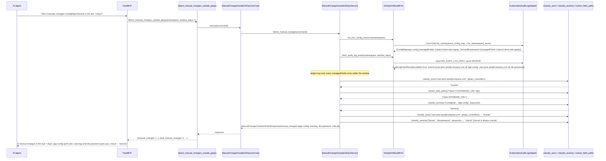
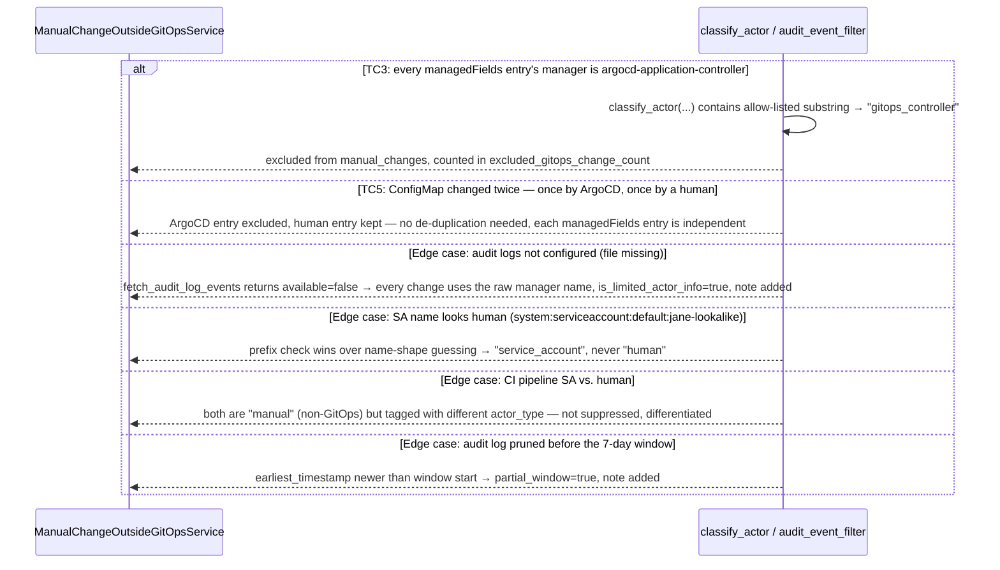

# Use Case 78 — Manual Change Outside GitOps Detection

## Sample Questions

- "Which ConfigMaps or Secrets were manually modified outside of GitOps in the last 7 days — who changed them and when?"
- "Did anyone edit the payment-service Secret directly instead of going through Git?"
- "Are all of our recent ConfigMap changes coming from ArgoCD, or is someone bypassing GitOps?"
- "Which changes in the last 3 days were made by a real person versus a CI pipeline?"
- "Is our audit logging even configured, or are we flying blind on manual changes?"

---

As a GitOps engineer, I want hexawyn to detect ConfigMap/Secret modifications made
outside of GitOps workflows so I can identify unauthorized changes and maintain audit
trail integrity. Compares `managedFields` on live ConfigMaps/Secrets (always
available from the Kubernetes API) against an optional k8s audit log, over a
trailing window (default 7 days), and flags every write not attributable to a
GitOps controller (ArgoCD/Flux) — surfacing actor, timestamp, changed field paths,
and a sensitivity severity, without ever exposing Secret values.

**No k8s audit-log-API precedent exists in this codebase** — every existing
"audit"-flavored port (`SecurityAuditPort`, `ComplianceAuditPort`) is backed by
OpenTelemetry spans, not real Kubernetes audit logs, and nothing previously read
`metadata.managedFields`. Both are genuinely new territory for this feature.

**One unified loop, not two data-source branches** — `managedFields` is always
fetched and is the *only* reliable source of *which fields changed* (`fieldsV1`'s
`"f:data".."f:KEY"` paths translate directly into dotted `changed_fields`, and never
carry actual values — satisfying "Secret values not exposed" by construction, not
redaction). A local k8s audit log file (if configured via `K8S_AUDIT_LOG_PATH`) is
used purely as an **actor-identity enrichment lookup**: when a real audit event
matches a `managedFields` entry's `(kind, name, namespace, time)`, its real
`user.username` replaces the raw `manager` client-tool name as the actor. No log
configured, or no match found → the raw manager name is used and
`is_limited_actor_info=True` — this *is* the "fall back to managedFields with
limited actor info" edge case, arising naturally rather than via an if/else on
data-source availability.

### Flow 1 — Happy Path: Human ConfigMap + Critical Secret Change (TC1, TC2)



### Flow 2 — Error/Edge Flows: All-GitOps, Fallback, Mixed Actors (TC3, TC5, edge cases)



### Flow 3 — Checker Node: Verification Cases

```mermaid
sequenceDiagram
    participant Checker as Checker Node
    participant LLM as LLM Response

    Checker->>LLM: Validate detect_manual_changes_outside_gitops findings
    alt Drift invented on an excluded dynamic field
        Checker-->>LLM: ❌ FAIL — changed_fields must come only from managedFields fieldsV1 paths actually present
    alt Incorrect severity classification
        Checker-->>LLM: ❌ FAIL — Secret must always be critical; ConfigMap only critical on an RBAC/TLS keyword match
    alt Non-GitOps resource presented as GitOps-managed
        Checker-->>LLM: ❌ FAIL — actor must be checked against the gitops_controllers allow-list, not assumed
    alt Desired/live values inverted
        Checker-->>LLM: ❌ FAIL — n/a for this ticket (no desired-state diff, only actor/field/timestamp), but any field-order swap must still fail
    alt Excluded annotation cited as a change
        Checker-->>LLM: ❌ FAIL — annotations are never a comparison target; only managedFields field paths count
    alt Orphan/GitOps-managed resource presented as manually changed
        Checker-->>LLM: ❌ FAIL — a gitops_controller-classified actor must never appear in manual_changes
    alt Audit-log/managedFields cache staleness (>5 min) not disclosed
        Checker-->>LLM: ⚠️ FLAG — stale data should be noted, not presented as current without qualification
    else All checks pass
        Checker-->>LLM: ✅ PASS
    end
```

## Key Points

- **`managedFields` is the only source of `changed_fields`, in both the enriched and
  fallback paths** — real k8s audit events (even at the safe `Metadata` logging
  level) never need to carry a request/response body for this feature to work, since
  field-path detection never depends on the audit log at all.
- **GitOps-controller exclusion is substring-based, not exact-match** — a
  `managedFields` `manager` is often a short name (`argocd-application-controller`)
  while a real audit-log `user.username` for the same controller is typically a full
  SA identity (`system:serviceaccount:argocd:argocd-application-controller`); a
  substring-containment check against the `gitops_controllers` allow-list matches
  both forms.
- **Human vs. service-account is a structural prefix check**
  (`system:serviceaccount:` prefix), never name-shape guessing — a service account
  with a human-sounding name is still classified `service_account`, and a CI
  pipeline's SA is differentiated from a human actor via `actor_type` rather than
  suppressed (only GitOps-controller identity is a suppression criterion).
- **Severity mirrors the drift-detection `classify_severity` idiom** — `Secret` is
  always `critical`; `ConfigMap` is `critical` only when its name matches an
  RBAC/TLS keyword (`rbac`, `role`, `tls`, `cert`, `certificate`), else `warning`.
- **The audit log is read as a local NDJSON file**, not a live K8s API call — this
  matches how real k8s audit logging actually works (`--audit-log-path` on the API
  server or a webhook sink written to disk); the path is configurable via
  `K8S_AUDIT_LOG_PATH` (default `/var/log/kubernetes/audit.log`), hardcoded locally
  in the adapter (not imported from `domain.models.constants`, per the adapter
  import-boundary rule).
- **Partial-window detection is a genuine physical-log fact, not the request
  window** — `fetch_audit_log_events` reports the earliest timestamp found in the
  file regardless of the requested window; if that's newer than the window start,
  older data has been pruned/rotated away, surfaced as a note rather than an error.
- **No de-duplication needed for the "changed twice" scenario** — real
  `managedFields` entries are already one-per-manager-per-write, so the loop
  processing each entry independently naturally keeps the human write and excludes
  the GitOps one.
- **This feature is standalone** — built on `feat/detect-manual-change-to-configmap`
  (cut from `dev`), which does not include the still-unmerged Configuration Drift
  Detection feature (ECA-77); the ticket's ECA-68/69 references are context only,
  not literal code dependencies.

## Tests

Unit test stubs for the domain logic the ticket calls out — audit event filtering,
human vs. controller detection, sensitive change flagging — plus the full
port/service/use-case/tool/adapter stack:

| Test | File | Status |
|---|---|---|
| `test_exact_manager_name_is_gitops_controller` / `test_full_service_account_identity_containing_controller_name_is_gitops_controller` / `test_flux_controller_is_gitops_controller` / `test_ci_pipeline_service_account_is_service_account` / `test_human_sounding_service_account_name_is_still_service_account` (edge case) / `test_user_prefixed_actor_is_human` / `test_managed_fields_manager_name_is_human_by_default` / `test_bare_email_is_human` | `tests/unit/manual_change_detection/test_actor_classifier.py` | ✅ |
| `test_secret_is_always_critical` / `test_secret_with_unrelated_name_is_still_critical` / `test_plain_configmap_is_warning` / `test_rbac_related_configmap_is_critical` / `test_tls_related_configmap_is_critical` / `test_keyword_match_is_case_insensitive` | `tests/unit/manual_change_detection/test_sensitive_change_classifier.py` | ✅ |
| `test_single_nested_field_becomes_dotted_path` / `test_multiple_sibling_fields_all_extracted` / `test_multiple_top_level_fields` / `test_dot_marker_means_whole_field_was_set_atomically` / `test_k_prefixed_list_item_key_does_not_produce_a_deep_path` / `test_empty_mapping_returns_no_paths` / `test_non_mapping_input_returns_no_paths` | `tests/unit/manual_change_detection/test_managed_fields_parser.py` | ✅ |
| `test_timestamp_three_days_ago_is_within_seven_day_window` / `test_timestamp_ten_days_ago_is_outside_seven_day_window` / `test_timestamp_exactly_at_window_start_is_within` / `test_human_is_manual` / `test_service_account_is_manual` / `test_gitops_controller_is_not_manual` / `test_earliest_timestamp_newer_than_window_start_is_partial` / `test_earliest_timestamp_covering_full_window_is_not_partial` / `test_no_earliest_timestamp_is_not_partial` | `tests/unit/manual_change_detection/test_audit_event_filter.py` | ✅ |
| `test_no_changes_produces_empty_report_with_no_notes` / `test_changes_and_excluded_count_reflected` / `test_used_fallback_adds_limited_actor_info_note` (edge case) / `test_no_fallback_omits_the_note` / `test_partial_window_adds_pruned_note` (edge case) / `test_both_fallback_and_partial_window_notes_present` | `tests/unit/manual_change_detection/test_manual_change_report_builder.py` | ✅ |
| `TestManualChange` / `TestManualChangeOutsideGitOpsRequest` / `TestManualChangeOutsideGitOpsReport` | `tests/unit/test_manual_change.py` | ✅ |
| `test_is_abstract` / `test_cannot_instantiate` | `tests/unit/test_gitops_drift_audit_port.py` | ✅ |
| `test_defaults_window_days_to_seven` / `test_accepts_custom_window_days` | `tests/unit/test_manual_change_outside_gitops_command.py` | ✅ |
| `test_defaults` / `test_accepts_explicit_values` | `tests/unit/test_manual_change_outside_gitops_response.py` | ✅ |
| `test_is_abstract` / `test_cannot_instantiate` | `tests/unit/test_manual_change_outside_gitops_service_port.py` | ✅ |
| `test_tc1_configmap_modified_by_human_is_flagged_manual_with_warning` (TC1) / `test_tc2_secret_modified_by_human_is_critical` (TC2) / `test_tc3_all_argocd_changes_produce_no_manual_changes` (TC3) / `test_tc4_five_manual_changes_all_listed` (TC4) / `test_tc5_configmap_changed_by_argocd_then_human_only_human_flagged` (TC5) / `test_no_audit_log_falls_back_to_managed_fields_with_limited_actor_info` (edge case) / `test_earliest_audit_timestamp_newer_than_window_start_flags_partial` (edge case) / `test_ci_service_account_and_human_both_manual_but_differentiated` (edge case) / `test_entry_older_than_window_is_excluded` / `test_empty_namespace_produces_empty_report` | `tests/unit/test_manual_change_outside_gitops_service.py` | ✅ |
| `test_execute_delegates_to_service` | `tests/unit/test_manual_change_outside_gitops_use_case.py` | ✅ |
| `test_returns_report` / `test_handles_error` / `test_build_audit_log_adapter_returns_gitops_drift_audit_port` / `test_has_register` | `tests/unit/test_manual_change_outside_gitops_tool.py` | ✅ |
| `test_returns_configmaps_and_secrets_with_managed_fields` / `test_no_managed_fields_returns_empty_list` / `test_non_dict_fields_v1_defaults_to_empty_mapping` / `test_forbidden_raises_insufficient_permissions` / `test_other_failure_raises_cluster_unreachable` / `test_missing_file_returns_unavailable` (edge case) / `test_valid_ndjson_parsed_into_events` / `test_malformed_line_is_skipped` / `test_other_namespace_and_resource_kind_are_filtered_out` / `test_non_dict_json_line_is_skipped` / `test_object_ref_missing_fields_is_skipped` / `test_missing_user_or_timestamp_is_skipped` / `test_default_path_used_when_env_var_not_set` | `tests/unit/test_kubernetes_audit_log_adapter.py` | ✅ |

## Related Files

- `src/hexawyn/domain/models/constants.py` — `ManualChangeDetectionConstants` (`default_window_days=7`, `gitops_controllers=(...)`, `sensitive_configmap_keywords=(...)`)
- `src/hexawyn/domain/models/manual_change.py` — `ActorType`, `ManualChangeSeverity`, `ManualChange`, `ManualChangeOutsideGitOpsRequest`, `ManualChangeOutsideGitOpsReport`
- `src/hexawyn/domain/services/manual_change_detection/actor_classifier.py` — `classify_actor`
- `src/hexawyn/domain/services/manual_change_detection/sensitive_change_classifier.py` — `classify_severity`
- `src/hexawyn/domain/services/manual_change_detection/managed_fields_parser.py` — `extract_field_paths`
- `src/hexawyn/domain/services/manual_change_detection/audit_event_filter.py` — `is_within_window`, `is_manual_change`, `is_partial_window`
- `src/hexawyn/domain/services/manual_change_detection/manual_change_report_builder.py` — `build_report`
- `src/hexawyn/application/ports/driven/gitops_drift_audit_port.py` — `GitOpsDriftAuditPort`, `ManagedFieldsEntryRaw`, `LiveConfigResourceRaw`, `AuditEventRaw`, `AuditLogFetchResult`
- `src/hexawyn/application/ports/driving/manual_change_outside_gitops/` — command, response, service_port
- `src/hexawyn/application/service/manual_change_outside_gitops_service.py` — `ManualChangeOutsideGitOpsService`
- `src/hexawyn/application/use_case/manual_change_outside_gitops/manual_change_outside_gitops_use_case.py`
- `src/hexawyn/adapters/secondary/gitops/kubernetes_audit_log_adapter.py` — `KubernetesAuditLogAdapter`
- `src/hexawyn/mcp/tools/manual_change_outside_gitops_detection.py` — MCP tool (auto-registered)
- `src/hexawyn/mcp/server.py` — `build_audit_log_adapter` (new)
