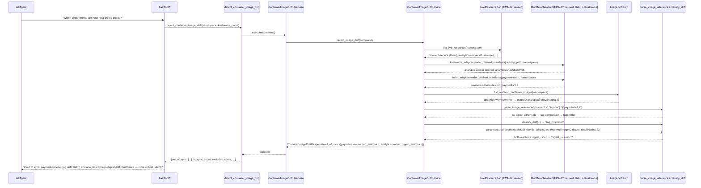
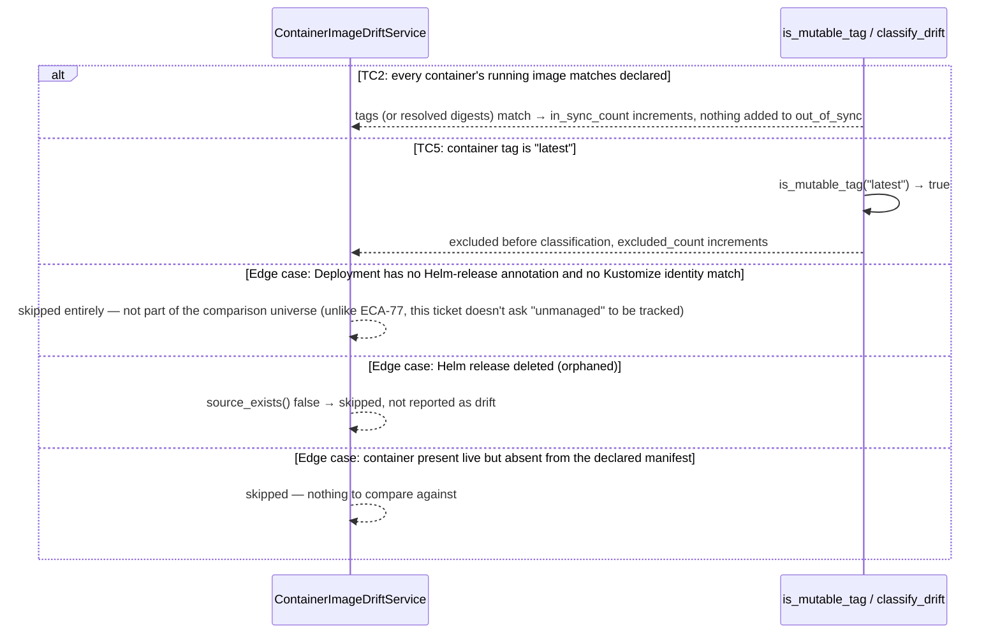

# Use Case 79 — Container Image Drift Detection

## Sample Questions

- "Show me all deployments running a container image that differs from what is declared in the Git repository — which ones are out of sync?"
- "Is payment-service running the Helm-declared image, or has someone deployed a hotfix directly?"
- "Are any of our mutable image tags actually pointing to different bytes than what we deployed?"
- "Which containers are out of sync because of a tag change versus a digest change?"
- "Ignore anything still pinned to `latest` — what's genuinely drifted?"

---

As a GitOps engineer, I want hexawyn to detect deployments running container images
that differ from what is declared in the Git repository so I can identify
out-of-sync workloads and potential unauthorized image changes. For every running
Deployment, this compares each container's image against the Helm-release or
Kustomize-rendered declared image, flags a **tag** mismatch vs. the more severe,
silent **digest** mismatch, and reports the source of truth (`helm-release:<name>`
or `kustomize:<path>`).

**Built almost entirely on reuse** — the ticket's own Dependencies section cites
"ECA-68, ECA-69 (drift detection domain)", and research confirmed why: this feature
reuses `LiveResourcePort`/`KubernetesLiveResourceAdapter` (Deployment identity,
Helm-release annotation, Kustomize identity matching) and `DriftDetectionPort`/
`HelmDriftAdapter`+`KustomizeDriftAdapter` (declared-manifest rendering) **unchanged**
from Configuration Drift Detection (ECA-77) — same kustomize-match-first-else-Helm
idiom, same per-release memoization caches. `HelmImageAdapter` (the ticket's named
adapter) was **not** built — `HelmDriftAdapter` already renders a release's manifest;
building a second, parallel one would duplicate `helm get manifest` shelling for no
reason. The **only** genuinely new piece is `ImageDriftPort`/
`KubernetesImageDriftAdapter`, resolving each running container's actually-pulled
image digest via `pod.status.containerStatuses[].imageID` (kubelet-populated after
every pull — reading it needs no registry auth of our own, regardless of registry
privacy).

**How digest drift is actually detected** (this needed real design work — the
ticket names the scenario but not the mechanism): no container-registry API is ever
called. The *declared* side's image string (from the already-rendered Helm/Kustomize
manifest) is parsed for an explicit digest (`repo@sha256:...` or the ticket's own
test-data shorthand `repo:sha256:...`). The *running* side's effective digest is the
Deployment spec's own image string if it's digest-pinned, or — the common case — the
resolved `imageID` from a live Pod, joined by label-selector match (the same
pod-to-owner join style `KubernetesNodeAnalysisAdapter` already uses for pod-to-node).
Digest comparison only runs when **both** sides resolve one; otherwise it
transparently falls back to tag-only comparison — one mechanism covers "digest
unavailable" for every reason (tag-only declared manifest, pod not yet scheduled, or
the private-registry edge case), without ever needing to know *why*.

### Flow 1 — Happy Path: Tag Mismatch (Helm) + Digest Mismatch (Kustomize) (TC1, TC3)



### Flow 2 — Error/Edge Flows: All In Sync, `latest` Excluded, Unmanaged (TC2, TC5)



### Flow 3 — Checker Node: Verification Cases

```mermaid
sequenceDiagram
    participant Checker as Checker Node
    participant LLM as LLM Response

    Checker->>LLM: Validate detect_container_image_drift findings
    alt Tag mismatch misclassified as digest mismatch or vice versa
        Checker-->>LLM: ❌ FAIL — drift_type must reflect which side actually differed (digest only when both sides resolved one)
    alt Digest drift not flagged as more severe
        Checker-->>LLM: ❌ FAIL — digest_mismatch must be surfaced distinctly from tag_mismatch (Acceptance Criteria: "digest drift is more critical")
    alt Source of truth wrong (Helm cited when it was actually Kustomize, or vice versa)
        Checker-->>LLM: ❌ FAIL — source_of_truth must match the actual match path (kustomize-first-else-helm)
    alt A `latest`-tagged container reported as in sync or out of sync
        Checker-->>LLM: ❌ FAIL — mutable/unresolvable tags must be excluded entirely, never classified
    alt Registry auth attempted for digest comparison
        Checker-->>LLM: ❌ FAIL — this feature never calls a registry; digest comparison only uses already-resolved imageID + declared manifest strings
    alt Only the first container checked on a multi-container Deployment
        Checker-->>LLM: ❌ FAIL — every container must be checked individually
    else All checks pass
        Checker-->>LLM: ✅ PASS
    end
```

## Key Points

- **Three of four ports are pure reuse, zero new code** — `LiveResourcePort`,
  `DriftDetectionPort` (×2 adapters, Helm + Kustomize) are unchanged from ECA-77.
  Only `ImageDriftPort`/`KubernetesImageDriftAdapter` is new.
- **`HelmImageAdapter` was deliberately not built** — `HelmDriftAdapter` already
  does exactly what's needed; a second Helm adapter would be pure duplication. One
  documented adapter-naming deviation, the same kind made for prior features.
- **No registry API calls, ever** — digest comparison only uses the declared
  manifest's own image string (if digest-pinned) and the kubelet-resolved
  `imageID` (always readable, any registry). This is what makes the
  "private registry, auth required" edge case a non-issue by construction rather
  than a conditional skip.
- **Severity is always `"critical"` for any reported drift** — both Test Data rows
  in the ticket say `severity: critical` (one `tag_mismatch`, one
  `digest_mismatch`); "digest drift is more critical" is communicated via the
  separate `drift_type` field for consumer prioritization, not an invented second
  severity tier with zero test evidence. `classify_severity(drift_type)` is the
  one place this decision lives, so it's a one-function change later if needed.
- **`get_container_images` is new, not a reuse of `field_comparison.get_image`** —
  the existing extractor is deliberately first-container-only (built for a
  different feature); this ticket's "multiple containers checked individually"
  edge case needed a genuinely new, all-containers extractor.
- **Helm variable interpolation and Kustomize `images:` transforms are satisfied
  by construction** — `helm get manifest`/`kustomize build` (already used by the
  reused adapters) return the fully-rendered, already-substituted manifest; there's
  no raw template placeholder or unapplied transformer left over for this feature
  to resolve.
- **ArgoCD cross-reference is explicitly out of scope** — `GitOpsPort`'s only
  adapter (`GitOpsDetector`) unconditionally raises `GitOpsEngineNotFoundError` on
  this branch (no real Flux/ArgoCD adapter exists yet); wiring it in would either
  crash every call or require a `try/except` in `application/service/`, which R6
  forbids. A documented scope exclusion, not an oversight.

## Tests

Unit test stubs for the domain logic the ticket calls out — image tag comparison,
digest drift detection, source-of-truth resolution — plus the full
port/service/use-case/tool/adapter stack:

| Test | File | Status |
|---|---|---|
| `test_repo_and_tag` / `test_no_tag_no_digest` / `test_registry_with_port_is_not_mistaken_for_tag` / `test_registry_with_port_and_no_tag` / `test_at_sign_digest_format` / `test_colon_sha256_shorthand_format` / `test_at_sign_takes_priority_over_colon_parsing` / `test_none_is_mutable` / `test_latest_is_mutable` / `test_explicit_version_is_not_mutable` | `tests/unit/image_drift/test_image_reference.py` | ✅ |
| `test_extracts_all_containers_by_name` / `test_single_container` / missing spec/template/pod_spec/containers guards / `test_non_dict_container_entry_is_skipped` / `test_container_missing_name_or_image_is_skipped` | `tests/unit/image_drift/test_container_image_extractor.py` | ✅ |
| `test_tc1_tags_differ_no_digest_anywhere_is_tag_mismatch` (TC1) / `test_tc2_same_tag_no_digest_is_in_sync` (TC2) / `test_tc3_declared_digest_vs_resolved_running_image_id_differ` (TC3) / `test_image_id_with_scheme_prefix_is_parsed` / `test_image_id_using_colon_sha256_shorthand_is_parsed` / `test_running_ref_itself_digest_pinned_and_differs` / `test_matching_digests_are_in_sync_even_if_tags_differ` / falls-back-to-tag tests (edge case) | `tests/unit/image_drift/test_drift_classifier.py` | ✅ |
| `test_tag_mismatch_is_critical` / `test_digest_mismatch_is_critical` | `tests/unit/image_drift/test_image_drift_severity.py` | ✅ |
| `test_no_drifts_produces_empty_out_of_sync` / `test_drifts_reflected_and_total_checked_sums_correctly` / `test_excluded_count_noted_in_summary` | `tests/unit/image_drift/test_image_drift_report_builder.py` | ✅ |
| `TestImageReference` / `TestContainerImageDrift` / `TestContainerImageDriftRequest` / `TestContainerImageDriftReport` | `tests/unit/test_image_drift.py` | ✅ |
| `test_is_abstract` / `test_cannot_instantiate` | `tests/unit/test_image_drift_port.py` | ✅ |
| `test_defaults_kustomize_paths_to_empty_list` / `test_accepts_custom_kustomize_paths` | `tests/unit/test_container_image_drift_command.py` | ✅ |
| `test_defaults` / `test_accepts_explicit_values` | `tests/unit/test_container_image_drift_response.py` | ✅ |
| `test_is_abstract` / `test_cannot_instantiate` | `tests/unit/test_container_image_drift_service_port.py` | ✅ |
| `test_tc1_payment_service_tag_mismatch_via_helm` (TC1) / `test_tc2_running_image_matches_declared` (TC2) / `test_tc3_resolved_image_id_digest_differs_from_kustomize_declared_digest` (TC3) / `test_tc4_five_out_of_sync_deployments_all_listed` (TC4) / `test_tc5_latest_tag_excluded_from_comparison` (TC5) / `test_each_container_checked_individually` (edge case) / `test_kustomize_identity_match_takes_priority` / `test_same_release_rendered_only_once_for_multiple_deployments` / `test_deleted_helm_release_is_skipped_not_reported` / `test_no_helm_annotation_and_no_kustomize_match_is_skipped` / `test_container_missing_from_desired_manifest_is_skipped` / `test_deployment_not_found_in_release_manifest_is_skipped` / `test_no_deployments_produces_empty_report` | `tests/unit/test_container_image_drift_service.py` | ✅ |
| `test_execute_delegates_to_service` | `tests/unit/test_container_image_drift_use_case.py` | ✅ |
| `test_returns_report` / `test_handles_error` / `test_build_image_drift_adapter_returns_image_drift_port` / `test_has_register` | `tests/unit/test_container_image_drift_tool.py` | ✅ |
| `test_joins_pod_to_deployment_via_label_selector` / `test_multiple_containers_in_one_pod` (edge case) / `test_pod_not_matching_selector_is_excluded` / `test_no_matching_pods_returns_empty_not_an_error` / `test_container_status_missing_image_id_is_skipped` / `test_pod_with_no_container_statuses_is_skipped` / error translation tests | `tests/unit/test_kubernetes_image_drift_adapter.py` | ✅ |

## Related Files

- `src/hexawyn/domain/models/image_drift.py` — `DriftType`, `ImageDriftSeverity`, `ImageReference`, `ContainerImageDrift`, `ContainerImageDriftRequest`, `ContainerImageDriftReport`
- `src/hexawyn/domain/services/image_drift/image_reference.py` — `parse_image_reference`, `is_mutable_tag`
- `src/hexawyn/domain/services/image_drift/container_image_extractor.py` — `get_container_images`
- `src/hexawyn/domain/services/image_drift/drift_classifier.py` — `classify_drift`
- `src/hexawyn/domain/services/image_drift/drift_severity.py` — `classify_severity`
- `src/hexawyn/domain/services/image_drift/image_drift_report_builder.py` — `build_report`
- `src/hexawyn/application/ports/driven/image_drift_port.py` — `ImageDriftPort`, `ResolvedContainerImageRaw`
- `src/hexawyn/application/ports/driven/live_resource_port.py` — `LiveResourcePort` (ECA-77, reused)
- `src/hexawyn/application/ports/driven/drift_detection_port.py` — `DriftDetectionPort` (ECA-77, reused via Helm + Kustomize adapters)
- `src/hexawyn/application/ports/driving/container_image_drift/` — command, response, service_port
- `src/hexawyn/application/service/container_image_drift_service.py` — `ContainerImageDriftService`
- `src/hexawyn/application/use_case/container_image_drift/container_image_drift_use_case.py`
- `src/hexawyn/adapters/secondary/gitops/kubernetes_image_drift_adapter.py` — `KubernetesImageDriftAdapter`
- `src/hexawyn/mcp/tools/container_image_drift_detection.py` — MCP tool (auto-registered)
- `src/hexawyn/mcp/server.py` — `build_image_drift_adapter` (new; `build_live_resource_adapter`/`build_helm_drift_adapter`/`build_kustomize_drift_adapter` reused as-is)
