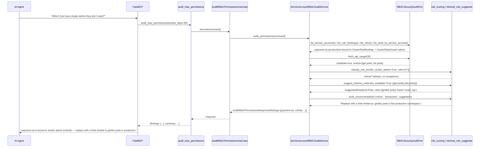
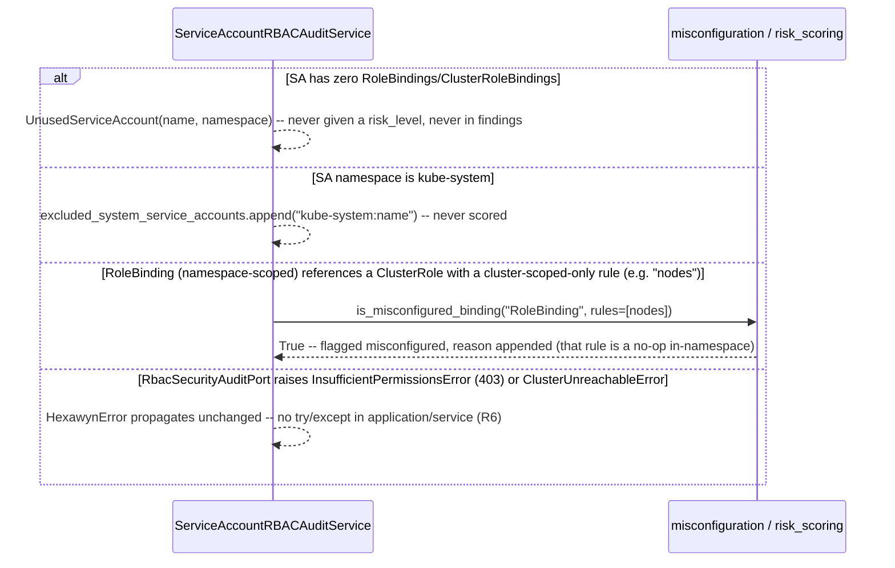

# Use Case 80 — Service Account RBAC Audit

## Sample Questions

- "Which service accounts have cluster-admin or overly broad permissions they don't actually need — what is the minimal required RBAC for each?"
- "Is any service account in production bound to cluster-admin that shouldn't be?"
- "Show me every service account with wildcard verbs or access to all resources."
- "Which service accounts have permissions they've never actually used, based on the audit log?"
- "Are there any service accounts with no bindings at all — just dead weight in the cluster?"

---

As a security engineer, I want hexawyn to audit service accounts with excessive
RBAC permissions so I can enforce least-privilege and reduce the blast radius
of a potential compromise. For every non-system ServiceAccount, this resolves
its ClusterRoleBindings/RoleBindings to the referenced Role/ClusterRole (unioning
aggregated ClusterRoles), classifies risk with a **deterministic** matrix
(cluster-admin is always `critical`, no exceptions), and suggests a
namespace-scoped `Role` replacement — built from actual audit-log usage when
available, or a conservative read-only estimate when it isn't.

**Deterministic risk matrix, not an LLM judgment call.** The ticket's own
"Checker Node Edge Cases" describe a downstream semantic-layer check (in the
private `hexa-control-plane` repo, out of scope here per AGENTS.md's repo
boundary) that verifies an LLM's narrative against this tool's ground truth.
That means the domain layer *is* the ground truth: `classify_risk_level`
(`domain/services/rbac_audit/risk_scoring.py`) resolves cluster-admin → all
resources (`*`) → wildcard verb → breadth score, in that fixed order, with no
heuristic ambiguity. A wildcard verb on `secrets` stays `high` (matching the
ticket's own Test Data for `monitoring-sa`), but `build_risk_reasons` always
appends a dedicated secrets-access reason regardless of the risk bucket — this
reconciles the ticket's Test Scenario ("high risk") with its Checker case
("must always flag secrets access") without contradiction.

**Aggregated ClusterRoles are unioned, not just listed.** `KubernetesRBACAdapter`
returns each ClusterRole's own labels and raw `aggregationRule.clusterRoleSelectors`
`matchLabels` — unresolved. `resolve_effective_rules`
(`domain/services/rbac_audit/aggregation_resolver.py`) is the one place that
does the actual label-selector matching and rule union, so it's independently
unit-testable against the ticket's "3 sub-roles" edge case.

**"Estimated" vs. "audit_log" is a first-class, never-silent distinction.**
`suggest_minimal_role` always tags its output `basis="estimated"` when no audit
log is configured (narrowing current verbs to read-only) or `basis="audit_log"`
when real usage data drove the suggestion — including the zero-usage case
(Test Scenario 5), where an audit-log-backed suggestion of `rules=[]` still
correctly overrides even a "low risk" breadth score, because confirmed
non-use always outranks a heuristic bucket (see `build_recommendation`'s
ordering in `minimal_role_suggester.py`).

**`kube-system` and no-bindings are structurally excluded, not just filtered.**
The Checker's harshest edge case ("a no-bindings SA presented as a risk = FAIL")
is enforced by construction: `ServiceAccountRBACAuditService.audit_permissions`
puts unused SAs into a disjoint `unused_service_accounts` list and
`kube-system` SAs into `excluded_system_service_accounts` — neither ever
reaches `findings`, so there's no risk_level field to mis-set in the first
place.

### Flow 1 — Happy Path: Cluster-Admin Binding Resolved to a Minimal Role Suggestion (TC1)



### Flow 2 — Error/Edge Flows: Unused SA, kube-system Exclusion, Misconfigured Binding



### Flow 3 — Checker Node: Verification Cases (documented ground truth — checker itself lives in hexa-control-plane, out of scope here)

```mermaid
sequenceDiagram
    participant Checker as Checker Node
    participant LLM as LLM Response

    Checker->>LLM: Validate audit_rbac_permissions findings
    alt cluster-admin binding classified as anything but critical
        Checker-->>LLM: ❌ FAIL — classify_risk_level checks cluster-admin first, unconditionally, no exception path exists
    alt wildcard verb on secrets never mentioned in reasons
        Checker-->>LLM: ❌ FAIL — build_risk_reasons always appends the secrets-access reason when a wildcard verb targets secrets
    alt aggregated ClusterRole's sub-roles listed individually, no union computed
        Checker-->>LLM: ❌ FLAG — resolve_effective_rules must be called; effective_rules is the union, not a list of sub-role names
    alt kube-system service account presented as a risk finding
        Checker-->>LLM: ❌ FLAG — kube-system SAs are excluded_system_service_accounts by construction, never findings
    alt minimal-permission suggestion given precise verbs with no audit log configured
        Checker-->>LLM: ❌ FLAG — suggested_role.basis must be "estimated" whenever fetch_api_usage.available is False
    alt SA with zero bindings listed as an over-privileged risk
        Checker-->>LLM: ❌ FAIL — no-bindings SAs are unused_service_accounts, structurally disjoint from findings
    else All checks pass
        Checker-->>LLM: ✅ PASS
    end
```

## Key Points

- **Deterministic risk matrix, no LLM ambiguity** — cluster-admin is always
  `critical`; all-resources (`*`) is always `critical`; wildcard verb is
  `high` with a guaranteed secrets-access reason when applicable; everything
  else is breadth-scored into `medium`/`low`. One function
  (`classify_risk_level`) is the single source of truth a downstream checker
  validates against.
- **Aggregated ClusterRoles are actually unioned** — `resolve_effective_rules`
  matches raw `aggregationRule` label selectors against every other
  ClusterRole and unions their rules, not just the aggregating role's own
  (usually empty) rule list.
- **"estimated" vs. "audit_log" is never silently dropped** — every
  `SuggestedRole` carries its `basis` explicitly; a confirmed zero-usage
  audit-log result recommends removal even when the breadth heuristic alone
  would call the permissions "low risk" (Test Scenario 5).
- **Unused and system service accounts are structurally, not just
  cosmetically, excluded from risk findings** — they live in separate
  response fields (`unused_service_accounts`, `excluded_system_service_accounts`)
  that never acquire a `risk_level`, so the Checker's harshest edge case
  (no-bindings SA presented as a risk) is impossible by construction.
- **Namespace-scoped bindings to cluster-scoped resources are flagged as
  misconfigured** — a real, common RBAC-authoring mistake (the rule is a
   no-op inside the namespace), surfaced as its own boolean plus a reason.

## Tests

Unit test stubs for the domain logic the ticket calls out by name — permission
breadth scoring, wildcard detection, minimal role suggestion — plus the full
port/service/use-case/tool/adapter stack:

| Test | File | Status |
|---|---|---|
| `TestHasWildcardVerb` / `TestHasWildcardResource` / `TestTargetsSecrets` | `tests/unit/rbac_audit/test_wildcard_detection.py` | ✅ |
| `test_tc1_cluster_admin_binding_is_always_critical` (TC1) / `test_tc2_wildcard_verb_on_secrets_is_high_not_critical` (TC2) / `test_tc3_narrow_single_verb_single_resource_is_low` (TC3) / `test_wildcard_resource_is_critical` / `test_broad_non_wildcard_permissions_are_medium` / `TestBuildRiskReasons` (secrets reason never missing) / `TestComputePermissionBreadth` | `tests/unit/rbac_audit/test_risk_scoring.py` | ✅ |
| `test_aggregates_three_sub_roles_matching_selector` (aggregated ClusterRole edge case) / `test_partial_label_match_does_not_qualify` / `test_duplicate_rules_are_not_repeated` | `tests/unit/rbac_audit/test_aggregation_resolver.py` | ✅ |
| `test_role_binding_targeting_cluster_scoped_resource_is_misconfigured` / `test_cluster_role_binding_is_never_misconfigured` | `tests/unit/rbac_audit/test_misconfiguration.py` | ✅ |
| `test_suggests_role_from_observed_verb_resource_pairs` / `test_tc5_zero_observed_usage_recommends_empty_rules` (TC5) / `test_narrows_wildcard_verb_to_read_only_and_tags_estimated` / `test_confirmed_zero_usage_overrides_low_risk_shortcut` | `tests/unit/rbac_audit/test_minimal_role_suggester.py` | ✅ |
| `test_tc4_five_over_privileged_service_accounts_all_listed` (TC4) / `test_summary_mentions_unused_service_accounts` / `test_summary_mentions_excluded_system_service_accounts` | `tests/unit/rbac_audit/test_rbac_audit_report_builder.py` | ✅ |
| `TestPolicyRule` / `TestRoleBindingRef` / `TestClusterRoleCandidate` / `TestSuggestedRole` / `TestRBACFinding` / `TestUnusedServiceAccount` / `TestRBACAuditReport` | `tests/unit/test_rbac_audit.py` | ✅ |
| `test_is_abstract` / `test_cannot_instantiate` | `tests/unit/test_rbac_security_audit_port.py` | ✅ |
| `test_defaults_window_days_to_thirty` / `test_accepts_custom_window_days` | `tests/unit/test_audit_rbac_permissions_command.py` | ✅ |
| `test_defaults` / `test_accepts_explicit_values` | `tests/unit/test_audit_rbac_permissions_response.py` | ✅ |
| `test_is_abstract` / `test_cannot_instantiate` | `tests/unit/test_audit_rbac_permissions_service_port.py` | ✅ |
| `test_tc1_...critical_with_namespace_scoped_suggestion` (TC1) / `test_tc2_wildcard_verbs_on_secrets_is_high...` (TC2) / `test_tc3_sa_with_only_get_on_pods_is_low_and_healthy` (TC3) / `test_tc4_five_over_privileged...` (TC4) / `test_tc5_audit_log_shows_no_usage_recommends_removing_permissions` (TC5) / `test_edge_case_multiple_pods_are_all_listed_in_impact` / `test_edge_case_aggregated_cluster_role_computes_effective_union` / `test_edge_case_no_bindings_is_unused_not_a_risk` / `test_edge_case_role_binding_to_cluster_scoped_resource_is_misconfigured` / `test_edge_case_kube_system_service_accounts_are_excluded_not_scored` | `tests/unit/test_audit_rbac_permissions_service.py` | ✅ |
| `test_execute_delegates_to_service` | `tests/unit/test_audit_rbac_permissions_use_case.py` | ✅ |
| `test_returns_report` / `test_handles_error` / `test_build_rbac_audit_adapter_returns_rbac_security_audit_port` / `test_has_register` | `tests/unit/test_rbac_permission_audit_tool.py` | ✅ |
| `test_returns_cluster_and_namespaced_bindings` / `test_resolves_aggregation_selectors_from_aggregation_rule` / `test_service_account_events_are_parsed` / `test_non_service_account_user_is_skipped` / error translation tests | `tests/unit/test_kubernetes_rbac_adapter.py` | ✅ |

## Related Files

- `src/hexawyn/domain/models/rbac_audit.py` — `PolicyRule`, `RoleBindingRef`, `ClusterRoleCandidate`, `SuggestedRole`, `RBACFinding`, `UnusedServiceAccount`, `RBACAuditReport`
- `src/hexawyn/domain/services/rbac_audit/wildcard_detection.py` — `has_wildcard_verb`, `has_wildcard_resource`, `targets_secrets`
- `src/hexawyn/domain/services/rbac_audit/risk_scoring.py` — `classify_risk_level`, `build_risk_reasons`, `compute_permission_breadth`
- `src/hexawyn/domain/services/rbac_audit/aggregation_resolver.py` — `resolve_effective_rules`
- `src/hexawyn/domain/services/rbac_audit/misconfiguration.py` — `is_misconfigured_binding`
- `src/hexawyn/domain/services/rbac_audit/minimal_role_suggester.py` — `suggest_minimal_role`, `build_recommendation`
- `src/hexawyn/domain/services/rbac_audit/rbac_audit_report_builder.py` — `build_report`
- `src/hexawyn/application/ports/driven/rbac_security_audit_port.py` — `RBACSecurityAuditPort`
- `src/hexawyn/application/ports/driving/audit_rbac_permissions/` — command, response, service_port
- `src/hexawyn/application/service/audit_rbac_permissions_service.py` — `ServiceAccountRBACAuditService`
- `src/hexawyn/application/use_case/audit_rbac_permissions/audit_rbac_permissions_use_case.py`
- `src/hexawyn/adapters/secondary/gitops/kubernetes_rbac_adapter.py` — `KubernetesRBACAdapter`
- `src/hexawyn/mcp/tools/rbac_permission_audit.py` — MCP tool (auto-registered)
- `src/hexawyn/mcp/server.py` — `build_rbac_audit_adapter`
