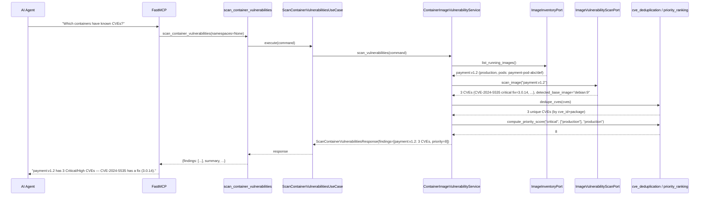
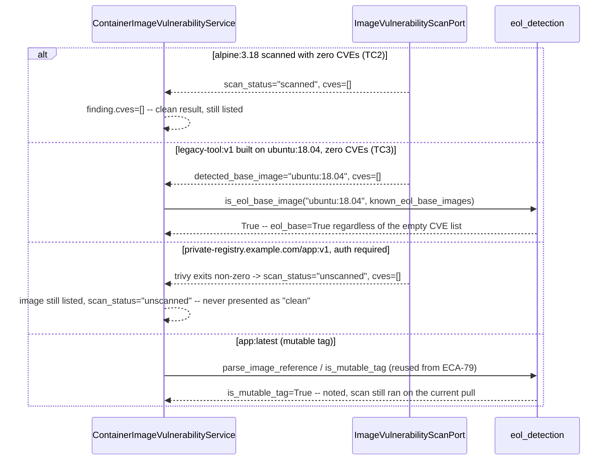

# Use Case 82 — Container Image Vulnerability (CVE) Scanning

## Sample Questions

- "Which containers are using deprecated or known-vulnerable base images — which CVEs affect our current running workloads?"
- "Does payment:v1.2 have any Critical CVEs, and is there a fix version available?"
- "Are we running any images with an end-of-life base image like ubuntu:18.04 or python:3.8-slim?"
- "Which Critical CVEs in production should we patch first?"
- "How many of our running images are actually affected by known vulnerabilities?"
- "Are any of our images running on a mutable `latest` tag we can't pin a scan to?"

---

As a security engineer, I want hexawyn to scan running container images for
known CVEs so I can identify vulnerable workloads and prioritize patching
before exploitation. This lists every unique image currently running in the
cluster, scans each once via Trivy, deduplicates CVEs per image, flags
deprecated/EOL base images independently of CVE data, and ranks findings by
a deterministic priority formula (severity × production-namespace weight).

**Two driven ports, not the ticket's single `ImageVulnerabilityPort`.** The
ticket names two adapters (`TrivyCVEScanAdapter`, `KubernetesImageInventoryAdapter`)
touching two unrelated external systems — a K8s cluster vs. an external CLI
scanner. That's the same split ECA-79 (`container_image_drift`) already made
(3 ports for 1 use case) when infra dependencies diverge. `ImageInventoryPort`
(→ `KubernetesImageInventoryAdapter`) answers "what's running, where"; the
CVE-scanning half becomes `ImageVulnerabilityScanPort` (→ `TrivyCVEScanAdapter`)
— matching the ticket's own two adapter names 1:1.

**Every scan failure becomes data, never an exception.** Neither `trivy` nor
`grype` is installed in this environment (confirmed) — the same situation
Helm/Kustomize were in for ECA-77. But unlike those (which raise
`HelmNotFoundError`/`KustomizeNotFoundError` on a missing binary), this
ticket's own edge cases *require* graceful degradation ("scanner unavailable
→ tool still lists images"; "private registry → scan skipped, listed as
unscanned"). `TrivyCVEScanAdapter.scan_image` therefore catches every
failure mode (`FileNotFoundError`, `TimeoutExpired`, non-zero exit, bad JSON)
internally and returns `scan_status="unscanned"` — it never raises. No new
`TrivyNotFoundError` domain error exists; this is a deliberate, documented
deviation from the raise-on-missing-CLI precedent.

**Mutable-tag detection is reused, not reimplemented.** `parse_image_reference`/
`is_mutable_tag` (`domain/services/image_drift/image_reference.py`, built
for ECA-79) already do exactly what Edge Case 3 needs. No new module.

**"Base image" comes from Trivy's own detected OS metadata.** Trivy reports
`Metadata.OS.Family`/`Metadata.OS.Name` (e.g. `"ubuntu"`/`"18.04"`); the
adapter formats this as `f"{family}:{name}"`, naturally reproducing the
ticket's own test-data shorthand (`"ubuntu:18.04"`). EOL-ness is then a
deterministic allow-list match in the domain layer, entirely independent of
whether any CVEs were found — Checker case 2 explicitly requires this.

**Every scanned image appears in the response, not just the vulnerable
ones** — a deliberate difference from ECA-71/72 (which split
compliant/unused items into count-only buckets). AC1 says "lists all unique
container images," and Test Scenario 5 ("10 images, 3 with CVEs → 3/10")
only makes sense if all 10 are actually listed.

### Flow 1 — Happy Path: Three Critical CVEs, Deduplicated, Fix Versions Returned (TC1)



### Flow 2 — Error/Edge Flows: Clean Image, EOL Regardless of CVEs, Private Registry Unscanned



### Flow 3 — Checker Node: Verification Cases (semantic-layer validation against the tool's deterministic ground truth)

```mermaid
sequenceDiagram
    participant Checker as Checker Node
    participant LLM as LLM Response

    Checker->>LLM: Validate scan_container_vulnerabilities findings
    alt CVE severity re-judged instead of passed through from the scanner
        Checker-->>LLM: ❌ FAIL — severity in the response must exactly match Trivy's own grading, never re-classified
    alt EOL image with no CVEs presented as "safe"
        Checker-->>LLM: ❌ FAIL — is_eol_base_image is independent of the CVE list; eol_base=true always flags
    alt Unscanned image (private registry) presented as "no CVEs" / "clean"
        Checker-->>LLM: ❌ FAIL — scan_status="unscanned" must never be conflated with a clean scan
    alt A fix version invented for a CVE where fixed_version is null
        Checker-->>LLM: ❌ FAIL — fix_version in the response must equal fix_version from the scanner, verbatim
    alt Same image, 5 pods -> CVEs listed 5 times instead of once
        Checker-->>LLM: ❌ FLAG — findings are keyed by unique image; CVEs deduped, pods_using lists all 5
    alt Staging Critical CVE presented before Production Medium CVE
        Checker-->>LLM: ❌ FAIL — priority = severity_weight * (2 if production else 1); ignoring the namespace weight is a bug
    else All checks pass
        Checker-->>LLM: ✅ PASS
    end
```

## Key Points

- **Severity is passed through from the scanner verbatim, never re-judged**
  — `CVE.severity` is exactly what Trivy reported (lowercased), the single
  fact a downstream checker validates against.
- **EOL detection is a fixed allow-list match, completely independent of
  CVEs** — an EOL image with zero known vulnerabilities is still flagged;
  `is_eol_base_image` doesn't even accept a CVE list as an argument.
- **Scanner unavailability and private-registry auth failures are the same
  data state** (`scan_status="unscanned"`), never a raised exception and
  never conflated with "clean" — the image is still listed either way.
- **CVEs are deduplicated by (cve_id, package) per unique image**, and
  findings are keyed by image (not by pod) — a 5-pod deployment of the same
  image produces one finding with 5 `pods_using` entries, never 5 duplicate
  CVE listings.
- **Priority is `severity_weight × namespace_weight` (2× for production)**
  — a fixed formula, not a heuristic; Critical-in-production always outranks
  Critical-in-staging, and the weighting is applied even when severities
  differ.
 - **Every scanned image is returned, not just the violators** — a
  deliberate difference from ECA-71/72, driven by AC1's explicit "lists all
  unique container images" requirement.

## Tests

Unit test stubs for the domain logic the ticket calls out by name — CVE
aggregation, severity ranking, EOL image detection — plus the full
port/service/use-case/tool/adapter stack:

| Test | File | Status |
|---|---|---|
| `TestDedupeCves` (exact duplicate removed / different package kept distinct / order preserved) | `tests/unit/image_vulnerability/test_cve_deduplication.py` | ✅ |
| `TestSeverityWeight` / `TestHighestSeverity` | `tests/unit/image_vulnerability/test_severity_ranking.py` | ✅ |
| `TestIsEolBaseImage` (incl. `test_flagged_regardless_of_empty_cve_list`) | `tests/unit/image_vulnerability/test_eol_detection.py` | ✅ |
| `test_tc4_production_critical_outranks_staging_critical` (TC4) / `TestSortByPriority` | `tests/unit/image_vulnerability/test_priority_ranking.py` | ✅ |
| `test_tc5_ten_images_three_with_cves_summary_ratio` (TC5) / `test_images_with_critical_cves_count` / `test_eol_image_count` | `tests/unit/image_vulnerability/test_vulnerability_report_builder.py` | ✅ |
| `TestCVE` / `TestImageVulnerabilityFinding` / `TestImageVulnerabilityReport` | `tests/unit/test_image_vulnerability.py` | ✅ |
| `test_is_abstract` / `test_cannot_instantiate` | `tests/unit/test_image_inventory_port.py`, `tests/unit/test_image_vulnerability_scan_port.py` | ✅ |
| `test_defaults_namespaces_to_none` / `test_accepts_custom_namespaces` | `tests/unit/test_scan_container_vulnerabilities_command.py` | ✅ |
| `test_defaults` / `test_accepts_explicit_values` | `tests/unit/test_scan_container_vulnerabilities_response.py` | ✅ |
| `test_is_abstract` / `test_cannot_instantiate` | `tests/unit/test_scan_container_vulnerabilities_service_port.py` | ✅ |
| `test_tc1_three_critical_cves_returned_with_ids_and_fix_versions` (TC1) / `test_tc2_alpine_with_no_cves_is_a_clean_result` (TC2) / `test_tc3_eol_base_is_flagged_even_with_zero_cves` (TC3) / `test_tc4_production_critical_cve_is_prioritized_over_staging` (TC4) / `test_tc5_ten_unique_images_three_with_cves_summary_ratio` (TC5) / `test_edge_case_private_registry_scan_skipped_listed_as_unscanned` / `test_edge_case_same_image_multiple_pods_cve_reported_once_pods_listed` / `test_edge_case_latest_tag_is_noted_as_mutable` / `test_edge_case_scanner_unavailable_tool_still_lists_all_images` / `test_edge_case_scanned_at_timestamp_is_exposed` | `tests/unit/test_container_image_vulnerability_service.py` | ✅ |
| `test_execute_delegates_to_service` | `tests/unit/test_scan_container_vulnerabilities_use_case.py` | ✅ |
| `test_returns_report` / `test_handles_error` / `test_build_image_inventory_adapter_returns_image_inventory_port` / `test_build_image_vulnerability_scan_adapter_returns_scan_port` / `test_has_register` | `tests/unit/test_scan_container_vulnerabilities_tool.py` | ✅ |
| `test_iterates_init_regular_and_ephemeral_containers` / `test_same_image_used_by_multiple_pods_produces_multiple_entries` / error translation tests | `tests/unit/test_kubernetes_image_inventory_adapter.py` | ✅ |
| `test_parses_vulnerabilities_into_cve_raw` / `test_unknown_severity_is_dropped` / `test_detects_base_image_from_os_metadata` / `test_missing_trivy_binary_is_unscanned_not_raised` / `test_non_zero_exit_code_is_unscanned_not_raised` / `test_invalid_json_output_is_unscanned_not_raised` | `tests/unit/test_trivy_cve_scan_adapter.py` | ✅ |

## Related Files

- `src/hexawyn/domain/models/image_vulnerability.py` — `CVE`, `ImageVulnerabilityFinding`, `ImageVulnerabilityReport`
- `src/hexawyn/domain/services/image_vulnerability/cve_deduplication.py` — `dedupe_cves`
- `src/hexawyn/domain/services/image_vulnerability/severity_ranking.py` — `severity_weight`, `highest_severity`
- `src/hexawyn/domain/services/image_vulnerability/eol_detection.py` — `is_eol_base_image`
- `src/hexawyn/domain/services/image_vulnerability/priority_ranking.py` — `compute_priority_score`, `sort_by_priority`
- `src/hexawyn/domain/services/image_vulnerability/vulnerability_report_builder.py` — `build_report`
- `src/hexawyn/domain/services/image_drift/image_reference.py` — `parse_image_reference`, `is_mutable_tag` (ECA-79, reused)
- `src/hexawyn/application/ports/driven/image_inventory_port.py` — `ImageInventoryPort`
- `src/hexawyn/application/ports/driven/image_vulnerability_scan_port.py` — `ImageVulnerabilityScanPort`
- `src/hexawyn/application/ports/driving/scan_container_vulnerabilities/` — command, response, service_port
- `src/hexawyn/application/service/container_image_vulnerability_service.py` — `ContainerImageVulnerabilityService`
- `src/hexawyn/application/use_case/scan_container_vulnerabilities/scan_container_vulnerabilities_use_case.py`
- `src/hexawyn/adapters/secondary/gitops/kubernetes_image_inventory_adapter.py` — `KubernetesImageInventoryAdapter`
- `src/hexawyn/adapters/secondary/gitops/trivy_cve_scan_adapter.py` — `TrivyCVEScanAdapter`
- `src/hexawyn/mcp/tools/scan_container_vulnerabilities.py` — MCP tool (auto-registered)
- `src/hexawyn/mcp/server.py` — `build_image_inventory_adapter`, `build_image_vulnerability_scan_adapter`
