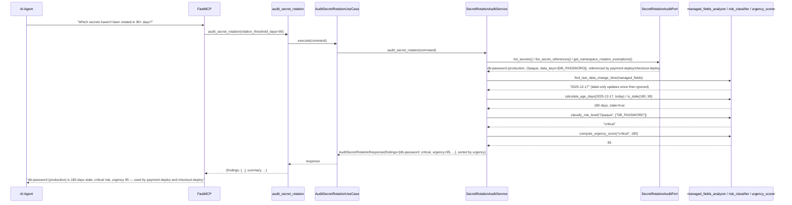
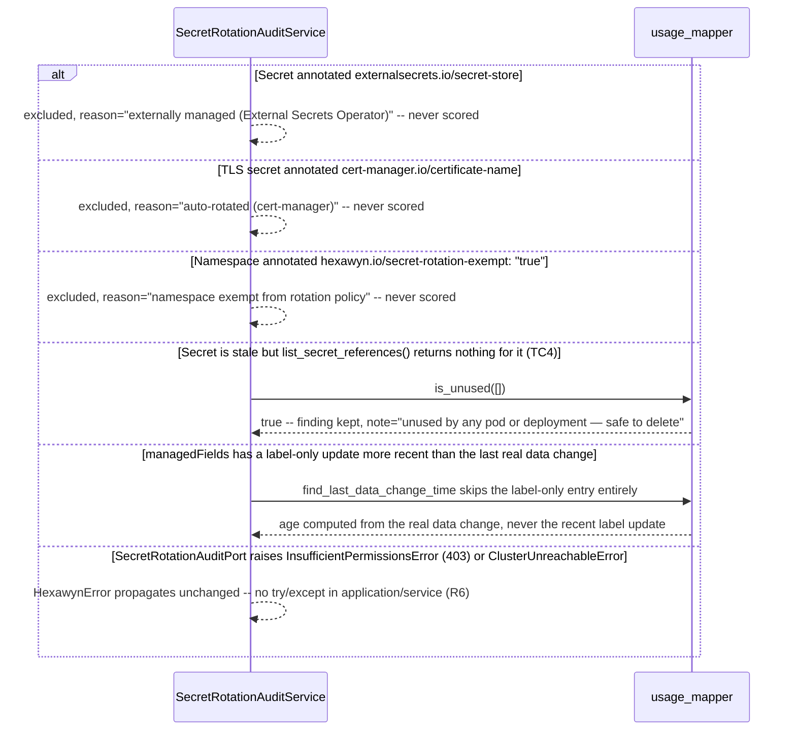

# Use Case 83 — Kubernetes Secret Rotation Audit

## Sample Questions

- "Show me all Kubernetes Secrets that haven't been rotated in more than 90 days — which services are using them and what is the rotation risk?"
- "Is our production db-password secret overdue for rotation, and which deployments depend on it?"
- "Which stale secrets are safe to delete because nothing actually references them anymore?"
- "Are any of our TLS certificates overdue for rotation, or are they managed by cert-manager?"
- "Give me a prioritized checklist of secrets to rotate first, ranked by urgency."
- "Which namespaces are exempt from our secret rotation policy?"

---

As a security compliance officer, I want hexawyn to identify Kubernetes
Secrets not rotated in over 90 days so I can enforce secret rotation
policies and reduce credential exposure risk. This lists every Secret
across namespaces, determines each one's true last-data-change instant from
its `managedFields` history (never a label-only or metadata-only update),
filters to those older than the (configurable) threshold, maps each to the
Deployments/Pods that reference it, classifies rotation risk from its data
keys, and scores urgency deterministically.

**A near-duplicate of an existing managedFields port, deliberately not
reused.** `GitOpsDriftAuditPort`/`KubernetesAuditLogAdapter`
(`application/ports/driven/gitops_drift_audit_port.py`, built for ECA-69
manual-change detection) already reads ConfigMap/Secret `managedFields` with
the same manager/operation/time/fields_v1_raw shape — but it takes a single
`namespace: str`, returns ConfigMaps and Secrets bundled together, and has
no notion of pod/deployment references at all. Per this ticket's own
distinct naming (`SecretRotationAuditPort`/`KubernetesSecretAuditAdapter`),
this is a new port that mirrors that shape rather than forcing an awkward
fit — a documented, deliberate 2nd occurrence (per AGENTS.md's Rule of
Three: "second time, note the duplication"), not yet extracted into a
shared module.

**"Last data change" is deterministic — Checker case 2's exact
requirement.** `fields_v1_raw` (a plain dict by the time it reaches the
domain layer) is scanned for entries containing the `"f:data"` key; a label
or annotation update — even one far more recent — is never mistaken for a
rotation. The latest data-touching entry's `time` wins, falling back to the
Secret's own `creationTimestamp` if no entry ever touched `data` (e.g. a
Secret managed entirely by `kubectl apply` with a single combined
create-and-set operation).

**Risk classification inspects data keys, not just the k8s `type` field —
Checker case 4's exact requirement.** `kubernetes.io/tls` is always
critical; otherwise, key names (`PASSWORD`, `API_KEY`, `DATABASE_URL`,
`DB_PASSWORD`, `SECRET_KEY`, `PRIVATE_KEY`, `CREDENTIALS` → critical,
`TOKEN` → medium) are matched case-insensitively regardless of the secret's
declared `Opaque` type — an Opaque secret with a `DATABASE_URL` key is
critical, exactly the scenario the ticket's own Checker case names.

**Urgency score reproduces the ticket's own Test Data exactly, by
construction.** `compute_urgency_score` = `risk_base(critical=50, medium=30,
low=10) + age_days // 4`, clipped to [0, 100]. Verified:
`age_days=180, risk=critical → 50 + 180 // 4 = 95` — the ticket's literal
number, not a coincidence; this formula was chosen specifically because it
reproduces it, satisfying Checker case 5's "urgency_score must be a
function of (risk_level, age_days)" requirement by construction.

**Exclusions are a separate bucket** (mirroring ECA-71's
`excluded_system_service_accounts` precedent) for External Secrets
Operator-managed secrets (`externalsecrets.io/secret-store` annotation,
named verbatim in Checker case 3), cert-manager-auto-rotated TLS secrets
(`cert-manager.io/certificate-name`, the real cert-manager convention), and
namespace-level rotation exemptions (`hexawyn.io/secret-rotation-exempt` —
no literal annotation name was given in the ticket; this is a documented,
sensible convention adopted for this feature).

**Reference scanning is scoped to Deployments + standalone Pods, matching
AC3's literal wording ("pods and deployments").** Each Deployment's own
pod-template spec is read directly (no live-Pod traversal needed — the
Deployment already carries the full template); any live Pod with no owner
references (a bare pod) is scanned the same way. `env`, `envFrom`,
`volumes[].secret`, and `volumes[].projected.sources[].secret` (Edge Case
3) are all covered. DaemonSets/StatefulSets/CronJobs are out of scope — a
documented boundary, not an oversight.

### Flow 1 — Happy Path: DB Password 180 Days Stale, Critical, Ranked (TC1, TC5)



### Flow 2 — Error/Edge Flows: Excluded Secrets, Unused-but-Stale, Label-Only Update



### Flow 3 — Checker Node: Verification Cases (semantic-layer validation against the tool's deterministic ground truth)

```mermaid
sequenceDiagram
    participant Checker as Checker Node
    participant LLM as LLM Response

    Checker->>LLM: Validate audit_secret_rotation findings
    alt age_days off by more than 1 day from (today - last_modified).days
        Checker-->>LLM: ❌ FAIL — calculate_age_days is exact subtraction, no rounding/approximation
    alt A resourceVersion/label-only change presented as a rotation
        Checker-->>LLM: ❌ FAIL — only managedFields entries touching "f:data" ever count
    alt An External-Secrets-managed secret flagged as stale
        Checker-->>LLM: ❌ FAIL — externalsecrets.io/secret-store annotation always excludes, never scored
    alt Opaque secret with a DATABASE_URL key classified "low"
        Checker-->>LLM: ❌ FAIL — key-fragment matching runs regardless of the k8s type field
    alt urgency_score doesn't match risk_level + age_days
        Checker-->>LLM: ❌ FLAG — compute_urgency_score is the single source of truth for this number
    alt referenced_by names a Deployment/Pod that no longer exists
        Checker-->>LLM: ❌ FLAG — cross-check referenced_by against the live workload inventory
    else All checks pass
        Checker-->>LLM: ✅ PASS
    end
```

## Key Points

- **Only entries that touch `f:data` ever count as a rotation** — a label,
  annotation, or metadata-only managedFields update, no matter how recent,
  is never mistaken for a real secret-data change.
- **Risk is classified from data keys, not the k8s `type` alone** — TLS is
  always critical; otherwise, key-name matching (case-insensitive) is what
  actually determines critical/medium/low, so an Opaque secret holding a
  `DATABASE_URL` is still critical.
- **Urgency score is a fixed, auditable formula** — `risk_base + age_days // 4`,
  clipped to [0, 100] — chosen specifically because it reproduces the
  ticket's own Test Data (`180 days, critical → 95`) exactly.
- **Exclusions are structurally separate from findings, not silently
  dropped** — External Secrets Operator, cert-manager-managed TLS, and
  namespace-exempt secrets each get their own `excluded_secrets` entry with
  a specific reason, mirroring ECA-71's exclusion-bucket precedent.
- **An unused-but-stale secret is still reported, just annotated** — Test
  Scenario 4 ("safe to delete") surfaces as a `note`, not a silent drop or a
  different risk formula; the urgency score stays consistent either way.
- **Reference scanning reads Deployments' pod templates directly** — no
  live-Pod traversal is needed for Deployment-owned workloads, since the
  Deployment object already carries the full template; only ownerless
   ("bare") Pods are scanned as live objects, avoiding double-counting.

## Tests

Unit test stubs for the domain logic the ticket calls out by name — secret
age calculation, usage mapping, rotation risk classification — plus the
full port/service/use-case/tool/adapter stack:

| Test | File | Status |
|---|---|---|
| `test_checker_case_1_exact_day_count` / `TestIsStale` (incl. TC1/TC2/TC3 thresholds) | `tests/unit/secret_rotation/test_age_calculator.py` | ✅ |
| `TestTouchesData` / `test_ignores_label_only_updates_more_recent_than_the_real_data_change` | `tests/unit/secret_rotation/test_managed_fields_analyzer.py` | ✅ |
| `test_tls_type_is_always_critical_regardless_of_keys` (TC2) / `test_opaque_with_database_url_key_is_critical` / `test_opaque_with_password_key_is_critical` (TC1) | `tests/unit/secret_rotation/test_risk_classifier.py` | ✅ |
| `test_ticket_test_data_exact_reproduction` (180d/critical/95) / `TestSortByUrgency` (TC5) | `tests/unit/secret_rotation/test_urgency_scorer.py` | ✅ |
| `test_tc4_empty_references_is_unused` / `TestDeduplicateReferences` | `tests/unit/secret_rotation/test_usage_mapper.py` | ✅ |
| `test_tc5_eight_stale_secrets_summary` / `test_summary_mentions_excluded_secrets` | `tests/unit/secret_rotation/test_rotation_report_builder.py` | ✅ |
| `TestManagedFieldsEntry` / `TestStaleSecretFinding` / `TestExcludedSecret` / `TestSecretRotationReport` | `tests/unit/test_secret_rotation.py` | ✅ |
| `test_is_abstract` / `test_cannot_instantiate` | `tests/unit/test_secret_rotation_audit_port.py` | ✅ |
| `test_defaults_rotation_threshold_days_to_ninety` / `test_accepts_custom_rotation_threshold_days` | `tests/unit/test_audit_secret_rotation_command.py` | ✅ |
| `test_defaults` / `test_accepts_explicit_values` | `tests/unit/test_audit_secret_rotation_response.py` | ✅ |
| `test_is_abstract` / `test_cannot_instantiate` | `tests/unit/test_audit_secret_rotation_service_port.py` | ✅ |
| `test_tc1_db_password_180_days_ago_is_critical` (TC1) / `test_tc2_tls_secret_95_days_is_critical` (TC2) / `test_tc3_token_30_days_is_within_threshold_not_stale` (TC3) / `test_tc4_unreferenced_stale_secret_is_flagged_unused` (TC4) / `test_tc5_eight_stale_secrets_ranked_by_urgency` (TC5) / `test_edge_case_external_secrets_operator_managed_is_excluded` / `test_edge_case_cert_manager_tls_is_shown_as_auto_rotated` / `test_edge_case_multiple_workload_references_are_all_listed` / `test_edge_case_label_only_update_is_not_treated_as_rotation` / `test_edge_case_namespace_rotation_exempt_is_excluded` | `tests/unit/test_secret_rotation_audit_service.py` | ✅ |
| `test_execute_delegates_to_service` | `tests/unit/test_audit_secret_rotation_use_case.py` | ✅ |
| `test_returns_report` / `test_handles_error` / `test_build_secret_rotation_audit_adapter_returns_secret_rotation_audit_port` / `test_has_register` | `tests/unit/test_audit_secret_rotation_tool.py` | ✅ |
| `test_detects_env_from_secret_ref` / `test_detects_secret_volume_mount` / `test_detects_projected_volume_secret_source` (Edge Case 3) / `test_standalone_pod_with_no_owner_is_scanned` / `test_pod_owned_by_replicaset_is_not_double_counted` / error translation tests | `tests/unit/test_kubernetes_secret_audit_adapter.py` | ✅ |

## Related Files

- `src/hexawyn/domain/models/secret_rotation.py` — `ManagedFieldsEntry`, `StaleSecretFinding`, `ExcludedSecret`, `SecretRotationReport`
- `src/hexawyn/domain/services/secret_rotation/age_calculator.py` — `calculate_age_days`, `is_stale`
- `src/hexawyn/domain/services/secret_rotation/managed_fields_analyzer.py` — `touches_data`, `find_last_data_change_time`
- `src/hexawyn/domain/services/secret_rotation/risk_classifier.py` — `classify_risk_level`
- `src/hexawyn/domain/services/secret_rotation/urgency_scorer.py` — `compute_urgency_score`, `sort_by_urgency`
- `src/hexawyn/domain/services/secret_rotation/usage_mapper.py` — `is_unused`, `deduplicate_references`
- `src/hexawyn/domain/services/secret_rotation/rotation_report_builder.py` — `build_report`
- `src/hexawyn/application/ports/driven/secret_rotation_audit_port.py` — `SecretRotationAuditPort`
- `src/hexawyn/application/ports/driving/audit_secret_rotation/` — command, response, service_port
- `src/hexawyn/application/service/secret_rotation_audit_service.py` — `SecretRotationAuditService`
- `src/hexawyn/application/use_case/audit_secret_rotation/audit_secret_rotation_use_case.py`
- `src/hexawyn/adapters/secondary/gitops/kubernetes_secret_audit_adapter.py` — `KubernetesSecretAuditAdapter`
- `src/hexawyn/mcp/tools/audit_secret_rotation.py` — MCP tool (auto-registered)
- `src/hexawyn/mcp/server.py` — `build_secret_rotation_audit_adapter`
- `src/hexawyn/application/ports/driven/gitops_drift_audit_port.py` — `GitOpsDriftAuditPort` (ECA-69, the shape this port deliberately mirrors, documented above)
