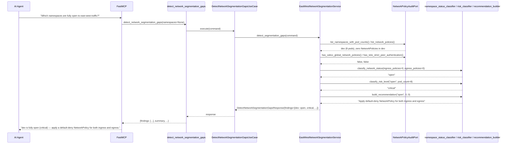
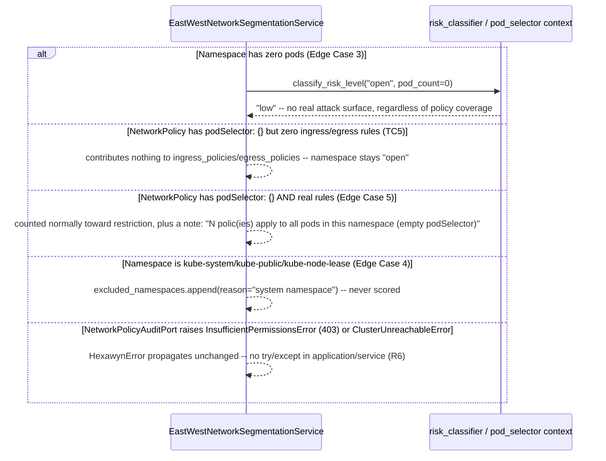

# Use Case 84 — East-West Network Segmentation Gap Detection

## Sample Questions

- "Are there pods that can communicate with each other without any network policy restriction — which namespaces are fully open to east-west traffic?"
- "Which of our namespaces have zero NetworkPolicies at all?"
- "Is the dev namespace still fully open, or did someone add a default-deny policy?"
- "Which namespaces have ingress restrictions but no egress restrictions?"
- "Give me a prioritized list of namespaces that need a default-deny NetworkPolicy."
- "Does Calico or Istio already provide segmentation we're not seeing in vanilla NetworkPolicies?"

---

As a network security engineer, I want hexawyn to detect namespaces with
unrestricted east-west pod communication so I can identify zero-trust gaps
and enforce network segmentation. This checks every namespace for
NetworkPolicy coverage, classifies each as `open` (no ingress and no
egress restriction), `partially_restricted` (one but not both), or
`restricted` (both), computes a risk level from that status *and* the
namespace's actual pod count, and recommends a specific default-deny
NetworkPolicy for open/partial namespaces.

**No pre-generated scaffold this time** — unlike the four preceding
security tickets, there was no empty `application/use_case/` folder or
`mcp/tools/*.py` stub for this one. The use-case/tool name
(`detect_network_segmentation_gaps`) is therefore this implementation's own
choice, following the repo's existing `detect_zombies`/`detect_privileged_pods`
naming style; the ticket's own names for the port, adapter, and domain
service (`NetworkPolicyAuditPort` / `KubernetesNetworkPolicyAdapter` /
`EastWestNetworkSegmentationService`) are used verbatim.

**Calico/Istio detection reuses an existing graceful-degradation
precedent.** `IstioTopologyPort`/`IstioTopologyAdapter`
(`application/ports/driven/istio_topology_port.py`) already queries Istio
`VirtualService` CRDs via `CustomObjectsApi.list_cluster_custom_object`,
returning `None` rather than raising when the mesh isn't installed. This
plan reuses the exact same CRD-query mechanism for two new, simpler
presence checks — Calico `GlobalNetworkPolicy` and Istio
`PeerAuthentication` with `mtls.mode: STRICT` — returning `bool` instead of
`Optional[list]` since there's no edge data to hand back, just a yes/no.
Both degrade to `False` on any failure (CRD not installed, RBAC denied),
never raising — matching the same spirit as the mesh-optional precedent.

**"No rules = no effective restriction," taken literally from the
ticket's own Checker case 2 wording** — not full K8s `policyTypes`
defaulting semantics (a genuinely confusing corner of the API: an empty
`ingress: []` combined with `policyTypes: [Ingress]` technically means
"deny all ingress," the *opposite* of "no restriction"). No Test Scenario
here exercises that corner case, and the ticket's Checker case 2 explicitly
directs the simpler rule, so `provides_ingress_restriction`/
`provides_egress_restriction` just check whether the rule list is
non-empty. This also prevents Checker case 5's ingress/egress-inversion bug
by construction: the two counts come from two independent rule arrays, so
nothing can flip them.

**Risk is a function of network status *and* pod count — Checker case 1's
exact requirement.** A namespace with zero pods is always `low` risk
regardless of policy coverage (no real attack surface — Edge Case 3).
Verified against the ticket's own Test Data: dev (0/0 policies, 8 pods) →
critical ✓; staging (2/0, 12 pods) → medium ✓; production (5/3, 45 pods) →
low ✓. The recommendation text is reproduced exactly too — dev's "Apply
default-deny NetworkPolicy for both ingress and egress" and staging's "Add
default-deny egress NetworkPolicy" both fall out of the same small decision
function, not hand-copied strings.

**System namespaces are a separate bucket, not silently dropped** —
mirroring ECA-71's `excluded_system_service_accounts` precedent exactly —
for `kube-system`/`kube-public`/`kube-node-lease` (Edge Case 4 / Checker
case 6).

**Every checked namespace appears in the response** — the ticket's own
summary arithmetic (`fully_open: 2 + partially_restricted: 3 + restricted:
3 = total_namespaces: 8`) only adds up if every namespace is listed, not
just the open ones — same shape decision as the CVE-scanning ticket.

### Flow 1 — Happy Path: Dev Fully Open, Critical, Default-Deny Recommended (TC1)



### Flow 2 — Error/Edge Flows: Zero-Pod Namespace, Empty Pod Selector, System Namespace Exclusion



### Flow 3 — Checker Node: Verification Cases (semantic-layer validation against the tool's deterministic ground truth)

```mermaid
sequenceDiagram
    participant Checker as Checker Node
    participant LLM as LLM Response

    Checker->>LLM: Validate detect_network_segmentation_gaps findings
    alt Empty namespace (0 pods) classified critical
        Checker-->>LLM: ❌ FAIL — classify_risk_level always returns low when pod_count == 0
    alt A no-rules NetworkPolicy presented as providing restriction
        Checker-->>LLM: ❌ FAIL — provides_ingress/egress_restriction require a non-empty rule list
    alt Calico GlobalNetworkPolicy present but namespace called "fully open" with no mention of it
        Checker-->>LLM: ❌ FLAG — has_calico_global_network_policies must be checked and noted before classifying
    alt Istio strict PeerAuthentication present but "no network segmentation" claimed
        Checker-->>LLM: ❌ FLAG — has_istio_strict_peer_authentication must be checked; note "Istio mTLS provides equivalent protection"
    alt Egress-only namespace described as "ingress protected, egress open"
        Checker-->>LLM: ❌ FAIL — ingress_policies and egress_policies are independent counts; egress-only means ingress=open, egress=restricted, never the reverse
    alt kube-system cited as a critical vulnerability
        Checker-->>LLM: ❌ FLAG — system namespaces are excluded_namespaces, never findings
    else All checks pass
        Checker-->>LLM: ✅ PASS
    end
```

## Key Points

- **Network status is a pure function of independent ingress/egress
  counts** — `open`/`partially_restricted`/`restricted` can never be
  inverted, since ingress and egress are counted from two separate rule
  arrays with no shared state.
- **A NetworkPolicy with zero rules provides no effective restriction,
  regardless of its podSelector** — a deliberate simplification of real K8s
  `policyTypes` semantics, taken directly from the ticket's own Checker
  case 2 wording, since no Test Scenario exercises the full defaulting
  corner case.
- **Risk always accounts for actual pod count, not just policy coverage**
  — an empty namespace is never "critical" no matter how open its (nonexistent)
  workloads are.
- **Calico and Istio presence are checked and surfaced, never silently
  ignored** — both reuse `IstioTopologyAdapter`'s exact CRD-query pattern,
  degrading to `False` (not raising) when the CRD isn't installed.
- **System namespaces are structurally separate from findings** — same
  `excluded_*` bucket pattern as ECA-71's RBAC audit, so there's no field to
  mis-set a risk level on in the first place.
- **Every namespace checked is returned, not just the open ones** — the
  ticket's own summary counts (2+3+3=8) only make sense that way.

## Tests

Unit test stubs for the domain logic the ticket calls out by name —
namespace NetworkPolicy coverage, ingress/egress gap detection, risk
classification — plus the full port/service/use-case/tool/adapter stack:

| Test | File | Status |
|---|---|---|
| `TestProvidesIngressRestriction` / `TestProvidesEgressRestriction` | `tests/unit/network_policy/test_policy_coverage_analyzer.py` | ✅ |
| `test_tc1_zero_ingress_zero_egress_is_open` (TC1) / `test_egress_only_is_partially_restricted_not_inverted` (Checker case 5) / `test_tc3_both_present_is_restricted` (TC3) | `tests/unit/network_policy/test_namespace_status_classifier.py` | ✅ |
| `test_tc1_open_with_pods_is_critical` / `test_checker_case_1_open_namespace_with_zero_pods_is_low_not_critical` | `tests/unit/network_policy/test_risk_classifier.py` | ✅ |
| `test_tc1_open_namespace_ticket_exact_text` / `test_tc2_missing_egress_ticket_exact_text` / `test_tc3_restricted_namespace_has_no_recommendation` | `tests/unit/network_policy/test_recommendation_builder.py` | ✅ |
| `TestHasEmptyPodSelector` | `tests/unit/network_policy/test_pod_selector_analyzer.py` | ✅ |
| `test_tc4_five_namespaces_three_fully_open_counts` (TC4) / `test_ticket_summary_arithmetic_matches_total` | `tests/unit/network_policy/test_network_segmentation_report_builder.py` | ✅ |
| `TestNamespaceNetworkFinding` / `TestExcludedNamespace` / `TestNetworkSegmentationReport` | `tests/unit/test_network_policy.py` | ✅ |
| `test_is_abstract` / `test_cannot_instantiate` | `tests/unit/test_network_policy_audit_port.py` | ✅ |
| `test_defaults_namespaces_to_none` / `test_accepts_custom_namespaces` | `tests/unit/test_detect_network_segmentation_gaps_command.py` | ✅ |
| `test_defaults` / `test_accepts_explicit_values` | `tests/unit/test_detect_network_segmentation_gaps_response.py` | ✅ |
| `test_is_abstract` / `test_cannot_instantiate` | `tests/unit/test_detect_network_segmentation_gaps_service_port.py` | ✅ |
| `test_tc1_dev_namespace_zero_policies_is_fully_open_critical` (TC1) / `test_tc2_ingress_only_is_partially_restricted` (TC2) / `test_tc3_default_deny_with_allow_rules_is_restricted_healthy` (TC3) / `test_tc4_all_open_namespaces_listed_with_default_deny_recommendation` (TC4) / `test_tc5_empty_pod_selector_with_zero_rules_is_open` (TC5) / `test_edge_case_calico_global_network_policy_is_noted` / `test_edge_case_istio_strict_mtls_is_noted` / `test_edge_case_namespace_with_no_pods_is_low_impact` / `test_edge_case_system_namespaces_excluded_shown_separately` / `test_edge_case_empty_pod_selector_with_rules_is_noted` | `tests/unit/test_east_west_network_segmentation_service.py` | ✅ |
| `test_execute_delegates_to_service` | `tests/unit/test_detect_network_segmentation_gaps_use_case.py` | ✅ |
| `test_returns_report` / `test_handles_error` / `test_build_network_policy_audit_adapter_returns_network_policy_audit_port` / `test_has_register` | `tests/unit/test_detect_network_segmentation_gaps_tool.py` | ✅ |
| `test_counts_pods_per_namespace` / `test_maps_rule_counts_and_pod_selector` / `test_empty_pod_selector_and_no_rules` / `TestHasCalicoGlobalNetworkPolicies` / `TestHasIstioStrictPeerAuthentication` / error translation tests | `tests/unit/test_kubernetes_network_policy_adapter.py` | ✅ |

## Related Files

- `src/hexawyn/domain/models/network_policy.py` — `NamespaceNetworkFinding`, `ExcludedNamespace`, `NetworkSegmentationReport`
- `src/hexawyn/domain/services/network_policy/policy_coverage_analyzer.py` — `provides_ingress_restriction`, `provides_egress_restriction`
- `src/hexawyn/domain/services/network_policy/namespace_status_classifier.py` — `classify_network_status`
- `src/hexawyn/domain/services/network_policy/risk_classifier.py` — `classify_risk_level`
- `src/hexawyn/domain/services/network_policy/recommendation_builder.py` — `build_recommendation`
- `src/hexawyn/domain/services/network_policy/pod_selector_analyzer.py` — `has_empty_pod_selector`
- `src/hexawyn/domain/services/network_policy/network_segmentation_report_builder.py` — `build_report`
- `src/hexawyn/application/ports/driven/network_policy_audit_port.py` — `NetworkPolicyAuditPort`
- `src/hexawyn/application/ports/driving/detect_network_segmentation_gaps/` — command, response, service_port
- `src/hexawyn/application/service/east_west_network_segmentation_service.py` — `EastWestNetworkSegmentationService`
- `src/hexawyn/application/use_case/detect_network_segmentation_gaps/detect_network_segmentation_gaps_use_case.py`
- `src/hexawyn/adapters/secondary/kubernetes_network_policy_adapter.py` — `KubernetesNetworkPolicyAdapter`
- `src/hexawyn/mcp/tools/detect_network_segmentation_gaps.py` — MCP tool (auto-registered)
- `src/hexawyn/mcp/server.py` — `build_network_policy_audit_adapter`
- `src/hexawyn/application/ports/driven/istio_topology_port.py` / `src/hexawyn/adapters/secondary/istio_topology_adapter.py` — the graceful-degradation precedent this ticket's Calico/Istio checks reuse
