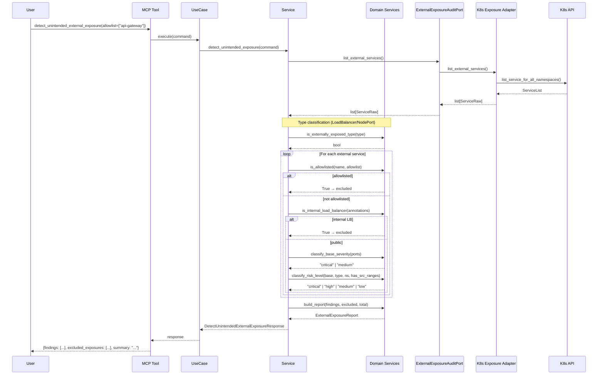
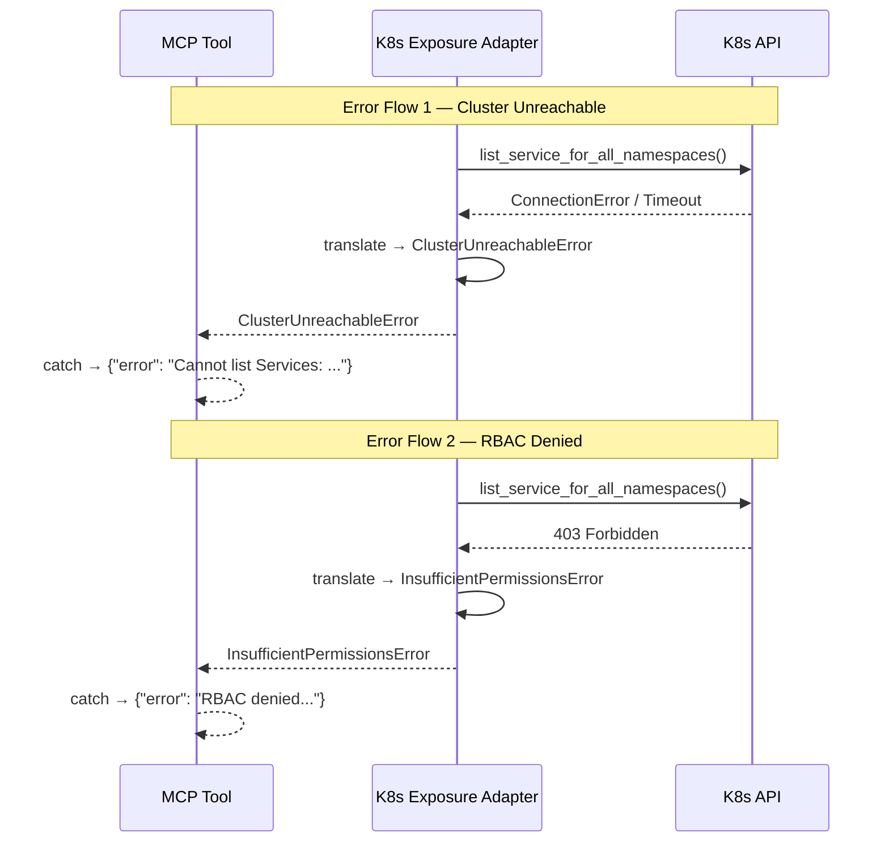
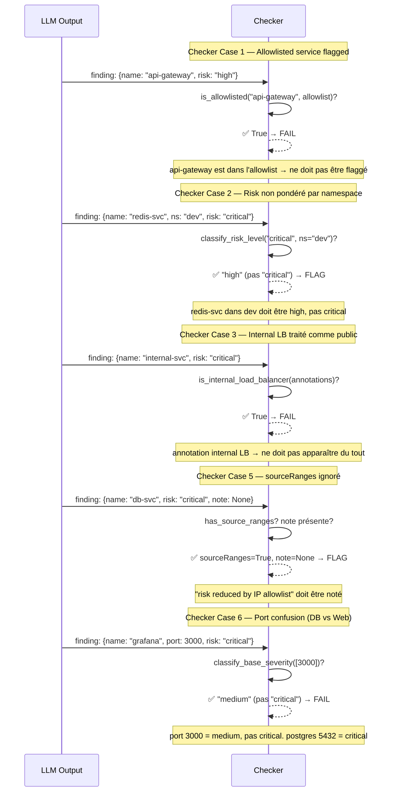
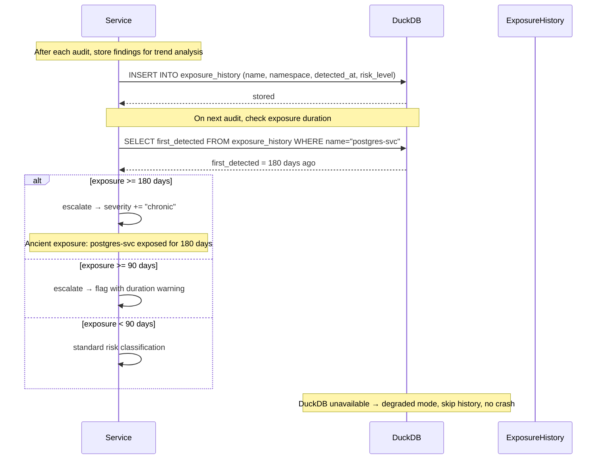

# Use Case 85 — Unintended External Exposure Detection

## Sample Questions

- "Which services are exposed externally via LoadBalancer or NodePort but shouldn't be — are there any unintended public-facing endpoints?"
- "Are any of our databases accidentally exposed to the internet through a LoadBalancer service?"
- "List all LoadBalancer and NodePort services that are not in the approved allowlist."
- "Do we have any pending LoadBalancer services that will soon be publicly accessible?"
- "Which internal services (DB, cache, metrics) are currently reachable from outside the cluster?"
- "Show me every externally exposed service and tell me if it's intentional or not."

---

As a network security engineer, I want hexawyn to detect services unintentionally
exposed externally via LoadBalancer or NodePort so I can identify accidental
public-facing endpoints before they are exploited. The tool lists all services
of type LoadBalancer and NodePort, checks each against a configurable allowlist,
flags unintended exposures with risk classification (critical/high/medium/low),
and accounts for IP source ranges, internal load balancer annotations, and
namespace weighting.

---

## Happy Path

## Error Flows

## Checker Node — Semantic Verification

## DuckDB — Exposure History & Escalation

## Key Points

- Only LoadBalancer and NodePort services are evaluated — ClusterIP and ExternalName are excluded at the domain layer
- Risk classification matrix: DB ports (5432, 3306, 27017, 6379) = critical base severity; web ports (80, 443, 3000) = medium
- Allowlisted services (api-gateway, ingress-nginx-controller) are excluded, not flagged
- Internal load balancers (cloud-provider annotations) are excluded from findings entirely
- IP source ranges (loadBalancerSourceRanges) downgrade risk by one tier
- Pending LoadBalancer services (no external IP yet) are still flagged as exposure risk
- Namespace weighting: non-production namespaces get one-tier risk downgrade
- DuckDB stores exposure history for chronic exposure escalation (30/90/180 day thresholds)

## Test Coverage

| Test | File | Status |
|---|---|---|
| `test_tc1_postgres_svc_loadbalancer_is_critical` | `tests/unit/test_unintended_external_exposure_service.py` | ✅ |
| `test_tc2_allowlisted_service_is_excluded_not_flagged` | `tests/unit/test_unintended_external_exposure_service.py` | ✅ |
| `test_tc3_redis_cache_nodeport_is_high_risk` | `tests/unit/test_unintended_external_exposure_service.py` | ✅ |
| `test_tc4_all_external_services_expected_produces_no_findings` | `tests/unit/test_unintended_external_exposure_service.py` | ✅ |
| `test_tc5_five_unexpectedly_exposed_services_all_listed` | `tests/unit/test_unintended_external_exposure_service.py` | ✅ |
| `test_edge_case_source_ranges_lowers_risk_and_is_noted` | `tests/unit/test_unintended_external_exposure_service.py` | ✅ |
| `test_edge_case_ingress_controller_in_allowlist_is_excluded` | `tests/unit/test_unintended_external_exposure_service.py` | ✅ |
| `test_edge_case_pending_loadbalancer_is_still_flagged` | `tests/unit/test_unintended_external_exposure_service.py` | ✅ |
| `test_edge_case_dev_namespace_is_lower_risk_than_production` | `tests/unit/test_unintended_external_exposure_service.py` | ✅ |
| `test_edge_case_internal_loadbalancer_annotation_is_excluded` | `tests/unit/test_unintended_external_exposure_service.py` | ✅ |
| `test_postgres_port_is_critical` | `tests/unit/external_exposure/test_port_severity_classifier.py` | ✅ |
| `test_grafana_port_is_medium_not_critical` | `tests/unit/external_exposure/test_port_severity_classifier.py` | ✅ |
| `test_tc2_allowlisted_service_matches` | `tests/unit/external_exposure/test_allowlist_matcher.py` | ✅ |
| `test_aws_internal_annotation_matches` | `tests/unit/external_exposure/test_internal_exposure_detector.py` | ✅ |
| `test_list_services_maps_loadbalancer_with_external_ip` | `tests/unit/test_kubernetes_external_exposure_adapter.py` | ✅ |
| `test_403_error_translates_to_insufficient_permissions` | `tests/unit/test_kubernetes_external_exposure_adapter.py` | ✅ |
| `test_allowlisted_service_in_findings_is_detected` | `tests/unit/external_exposure/test_checker_node_edge_cases.py` | ✅ |
| `test_dev_namespace_downgrades_risk` | `tests/unit/external_exposure/test_checker_node_edge_cases.py` | ✅ |
| `test_port_matrix_does_not_confuse_db_with_web` | `tests/unit/external_exposure/test_checker_node_edge_cases.py` | ✅ |
| `test_exposure_duration_escalation_thresholds` | `tests/unit/external_exposure/test_checker_node_edge_cases.py` | ✅ |
| `test_execute_delegates_to_service_and_returns_response` | `tests/unit/test_detect_unintended_external_exposure_use_case.py` | ✅ |
| `test_tool_handles_exception_gracefully` | `tests/unit/test_detect_unintended_external_exposure_tool.py` | ✅ |

## Related Files

- `src/hexawyn/domain/models/external_exposure.py` — ExternalExposureFinding, ExcludedExposure, ExternalExposureReport
- `src/hexawyn/domain/models/constants.py` — ExternalExposureConstants (port matrix, LB annotations)
- `src/hexawyn/domain/services/external_exposure/service_type_classifier.py` — is_externally_exposed_type
- `src/hexawyn/domain/services/external_exposure/port_severity_classifier.py` — classify_base_severity
- `src/hexawyn/domain/services/external_exposure/risk_scorer.py` — classify_risk_level
- `src/hexawyn/domain/services/external_exposure/allowlist_matcher.py` — is_allowlisted
- `src/hexawyn/domain/services/external_exposure/internal_exposure_detector.py` — is_internal_load_balancer
- `src/hexawyn/domain/services/external_exposure/exposure_report_builder.py` — build_report
- `src/hexawyn/application/ports/driving/detect_unintended_external_exposure/` — Command, Response, ServicePort
- `src/hexawyn/application/ports/driven/external_exposure_audit_port.py` — ExternalExposureAuditPort
- `src/hexawyn/application/service/unintended_external_exposure_service.py` — UnintendedExternalExposureService
- `src/hexawyn/application/use_case/detect_unintended_external_exposure/` — UseCase
- `src/hexawyn/adapters/secondary/kubernetes_external_exposure_adapter.py` — K8s adapter
- `src/hexawyn/mcp/tools/detect_unintended_external_exposure.py` — MCP tool
