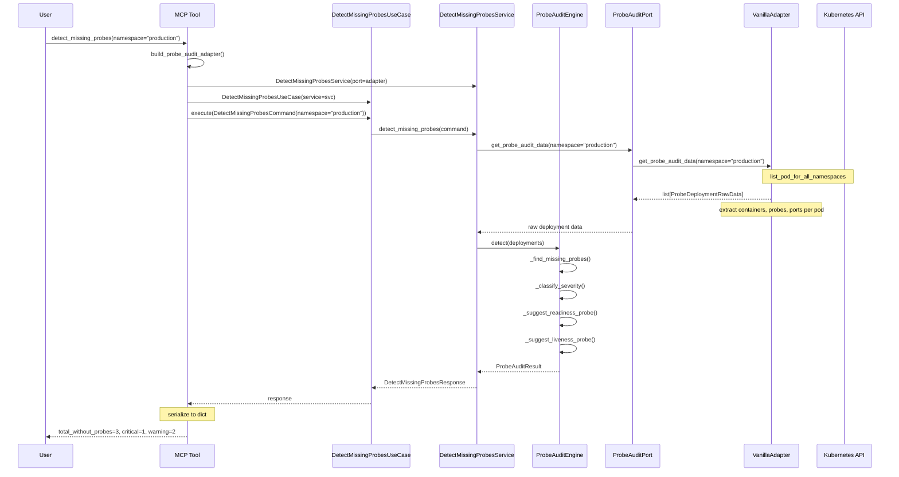
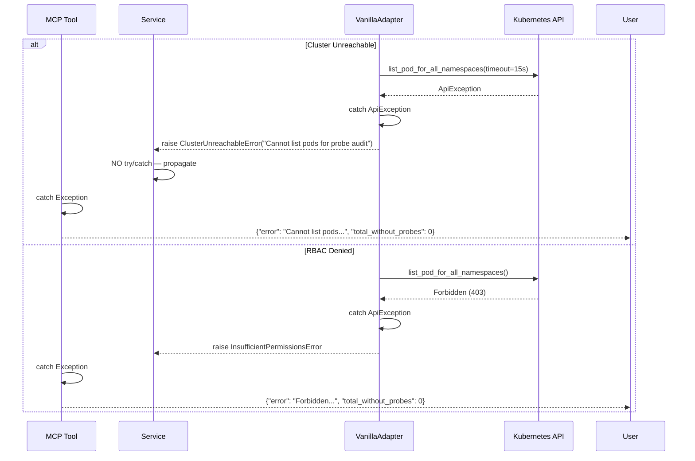
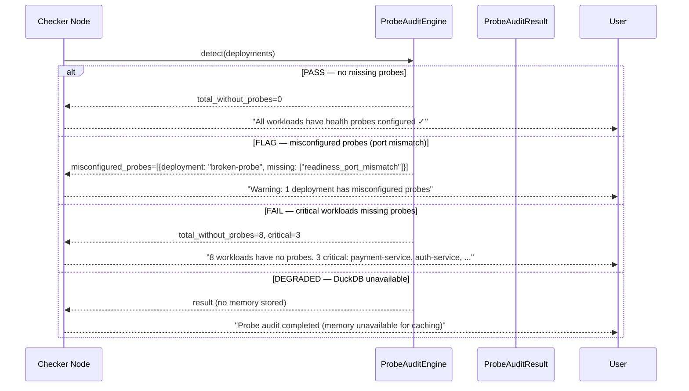
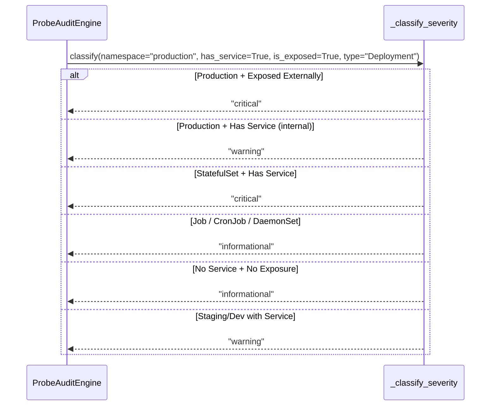

# 86 — Detect Missing Probes

Scan all deployments/pods across namespaces for probe configuration.
Detect missing liveness probes, readiness probes, or both.
Prioritize production workloads serving external traffic with no probes (critical).
Suggest appropriate probe types based on the container's exposed ports.

## Sample Questions

- "Which services have no liveness or readiness probes configured — which workloads are flying blind with no health check?"
- "Are there any production deployments missing health probes?"
- "List all deployments without readiness probes in the production namespace."
- "How many critical workloads have no probes at all?"
- "Show me pods with misconfigured probe ports that don't match their exposed ports."

---

## 1. Happy Path — Full Hexagonal Chain

## 2. Error Flows

## 3. Checker Node Flow

## 4. Severity Classification Logic

---

## Key Points

- Scans all deployments/pods across namespaces for liveness and readiness probe configuration
- Excludes init containers from probe checks (probes not applicable to init containers)
- DaemonSet workloads without probes receive `informational` severity (node-level infrastructure)
- StatefulSet workloads without probes receive `critical` severity when they have a service (stateful = harder to restart)
- Detects misconfigured probes (port mismatch between exposed ports and probe ports)
- Generates probe suggestions based on container ports: HTTP ports (80, 443, 8080...) get `httpGet`, others get `tcpSocket`, no-port containers get `exec` suggestion

---

## Test Coverage

| Test | File | Status |
|---|---|---|
| `test_both_probes_missing_critical` | `tests/unit/test_probe_audit_engine.py` | ✅ |
| `test_has_readiness_but_no_liveness_warning` | `tests/unit/test_probe_audit_engine.py` | ✅ |
| `test_batch_job_no_probes_informational` | `tests/unit/test_probe_audit_engine.py` | ✅ |
| `test_all_probes_present_no_issues` | `tests/unit/test_probe_audit_engine.py` | ✅ |
| `test_eight_deployments_missing_probes_all_listed` | `tests/unit/test_probe_audit_engine.py` | ✅ |
| `test_daemonset_no_probes_informational` | `tests/unit/test_probe_audit_engine.py` | ✅ |
| `test_statefulset_no_probes_critical` | `tests/unit/test_probe_audit_engine.py` | ✅ |
| `test_init_containers_excluded_from_check` | `tests/unit/test_probe_audit_engine.py` | ✅ |
| `test_no_exposed_ports_exec_probe_suggestion` | `tests/unit/test_probe_audit_engine.py` | ✅ |
| `test_only_init_containers_no_main_container` | `tests/unit/test_probe_audit_engine.py` | ✅ |
| `test_probe_misconfigured_wrong_path_detected` | `tests/unit/test_probe_audit_engine.py` | ✅ |
| `test_http_probe_suggestion_for_port_8080` | `tests/unit/test_probe_audit_engine.py` | ✅ |
| `test_tcp_probe_suggestion_for_non_http_port` | `tests/unit/test_probe_audit_engine.py` | ✅ |
| `test_delegates_to_use_case_and_returns_dict` | `tests/unit/test_detect_missing_probes_mcp.py` | ✅ |
| `test_is_abstract` | `tests/unit/test_probe_audit_port_and_service.py` | ✅ |
| `test_calls_port_with_namespace_filter` | `tests/unit/test_probe_audit_port_and_service.py` | ✅ |
| `test_build_probe_audit_adapter_returns_probe_audit_port` | `tests/unit/test_server.py` | ✅ |

---

## Related Files

- `src/hexawyn/domain/models/probe_audit.py` — MissingProbe, ProbeAuditResult models
- `src/hexawyn/domain/services/probe_audit/probe_audit_engine.py` — pure domain logic
- `src/hexawyn/application/ports/driven/probe_audit_port.py` — driven port ABC + TypedDict
- `src/hexawyn/application/ports/driving/detect_missing_probes/` — command, response, service port
- `src/hexawyn/application/service/detect_missing_probes_service.py` — application service
- `src/hexawyn/application/use_case/detect_missing_probes/` — use case orchestrator
- `src/hexawyn/adapters/secondary/vanilla/vanilla_adapter.py` — VanillaAdapter (get_probe_audit_data)
- `src/hexawyn/mcp/server.py` — build_probe_audit_adapter()
- `src/hexawyn/mcp/tools/detect_missing_probes.py` — MCP tool
