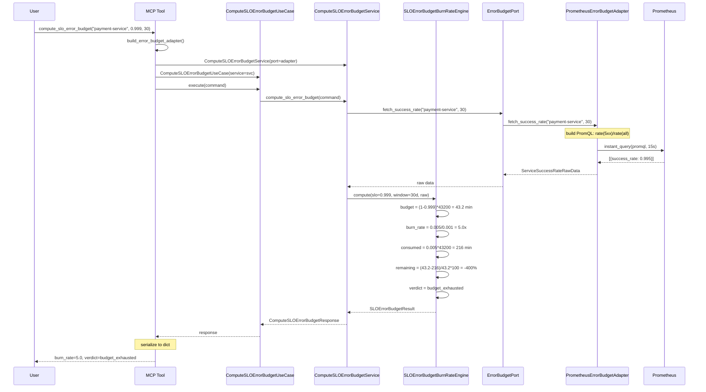
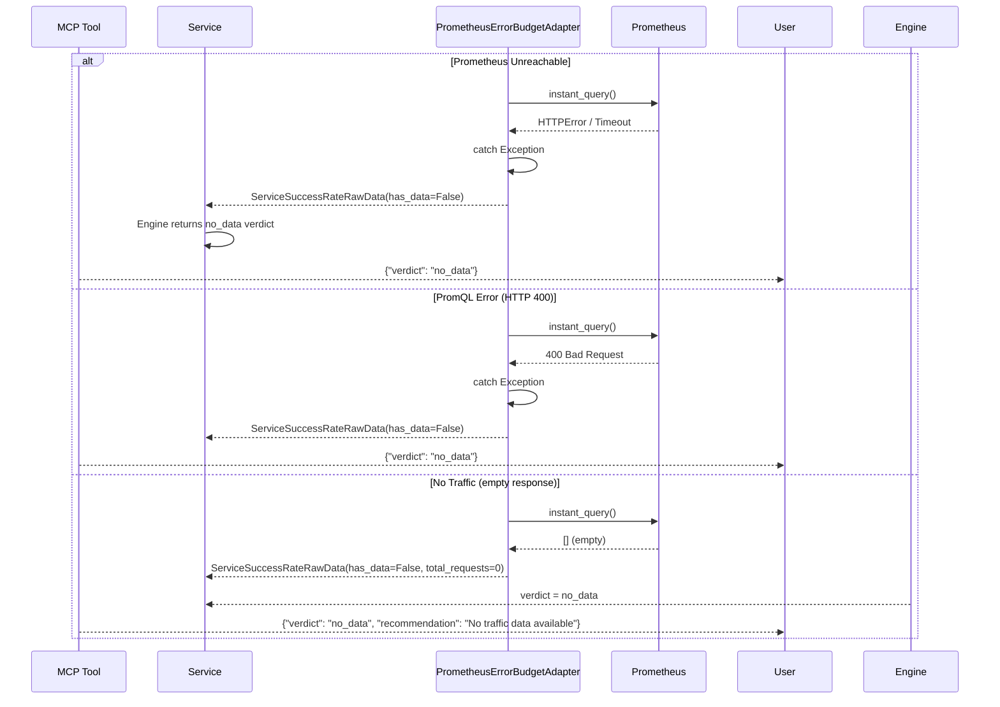
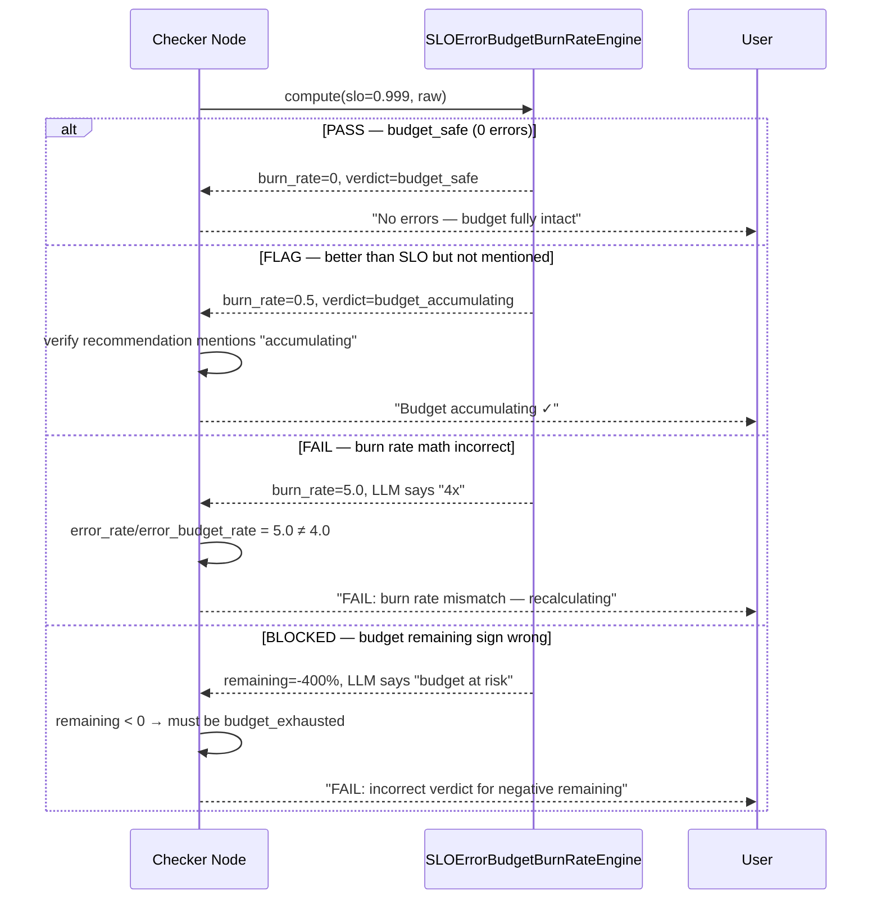
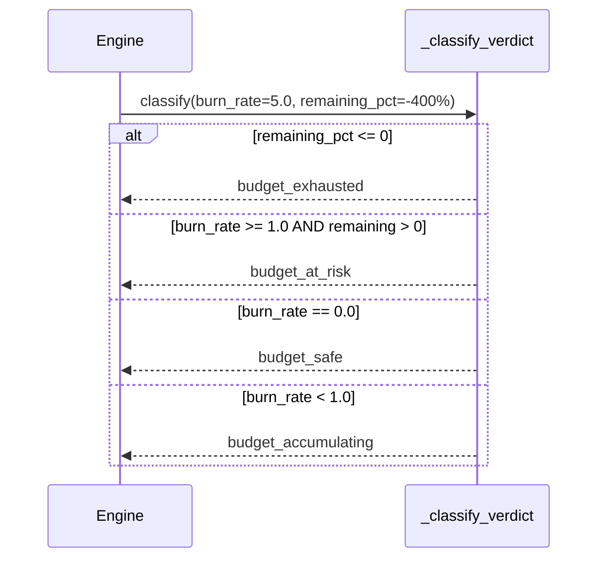

# 87 — Compute SLO Error Budget Burn Rate

Compute the SLO error budget burn rate for a service by querying Prometheus
for actual success rate, then calculating total error budget, consumed budget,
remaining budget, burn rate multiplier, and time-to-exhaustion.

## Sample Questions

- "What is the current error budget burn rate for the payment-service SLO — are we on track to exhaust the error budget before end of month?"
- "How much error budget remains for auth-service with an SLO of 99.9%?"
- "Is the payment-service at risk of breaching its 30-day SLO?"
- "Show me the burn rate and time-to-exhaustion for all production services"
- "Has the checkout-service already exhausted its error budget this month?"

---

## 1. Happy Path — Full Hexagonal Chain

## 2. Error Flows

## 3. Checker Node Flow

## 4. Verdict Classification Logic

---

## Key Points

- Queries Prometheus for actual success rate via `MetricsQueryPort` (PromQL aggregation on HTTP codes)
- Computes error budget as `(1 - SLO_target) × window_minutes` — deterministic domain math
- Burn rate multiplier = `error_rate / (1 - SLO_target)` — how many times faster than allowed
- Budget consumption uses observation window (e.g. 7-day partial window into 30-day SLO) — partial windows can have remaining budget even with burn_rate > 1
- Default SLO of 99.5% when none is configured for the service
- Prometheus errors (unreachable, bad query, empty result) are caught in the adapter and translate to `no_data` verdict — never crash

---

## Test Coverage

| Test | File | Status |
|---|---|---|
| `test_burn_rate_5x_when_burning_fast` | `tests/unit/test_slo_error_budget_engine.py` | ✅ |
| `test_burn_rate_zero_when_no_errors` | `tests/unit/test_slo_error_budget_engine.py` | ✅ |
| `test_budget_already_exhausted_negative_remaining` | `tests/unit/test_slo_error_budget_engine.py` | ✅ |
| `test_at_risk_with_partial_window_observation` | `tests/unit/test_slo_error_budget_engine.py` | ✅ |
| `test_budget_barely_below_slo_at_risk` | `tests/unit/test_slo_error_budget_engine.py` | ✅ |
| `test_no_data_verdict` | `tests/unit/test_slo_error_budget_engine.py` | ✅ |
| `test_default_slo_995_when_not_configured` | `tests/unit/test_slo_error_budget_engine.py` | ✅ |
| `test_zero_requests_in_window_budget_not_consumed` | `tests/unit/test_slo_error_budget_engine.py` | ✅ |
| `test_calls_port_with_correct_args` | `tests/unit/test_error_budget_port_and_service.py` | ✅ |
| `test_burn_rate_5x_returns_exhausted_verdict` | `tests/unit/test_error_budget_port_and_service.py` | ✅ |
| `test_delegates_to_service` | `tests/unit/test_error_budget_port_and_service.py` | ✅ |
| `test_delegates_and_returns_dict` | `tests/unit/test_compute_slo_error_budget_mcp.py` | ✅ |
| `test_build_error_budget_adapter_returns_error_budget_port` | `tests/unit/test_server.py` | ✅ |

---

## Related Files

- `src/hexawyn/domain/models/error_budget.py` — SLOErrorBudgetRequest, SLOErrorBudgetResult
- `src/hexawyn/domain/services/error_budget/slo_error_budget_engine.py` — pure domain computation
- `src/hexawyn/application/ports/driven/error_budget_port.py` — driven port ABC + TypedDict
- `src/hexawyn/application/ports/driving/compute_slo_error_budget/` — command, response, service port
- `src/hexawyn/application/service/compute_slo_error_budget_service.py` — application service
- `src/hexawyn/application/use_case/compute_slo_error_budget/` — use case orchestrator
- `src/hexawyn/adapters/secondary/gitops/prometheus_error_budget_adapter.py` — Prometheus adapter
- `src/hexawyn/mcp/server.py` — build_error_budget_adapter()
- `src/hexawyn/mcp/tools/compute_slo_error_budget.py` — MCP tool
