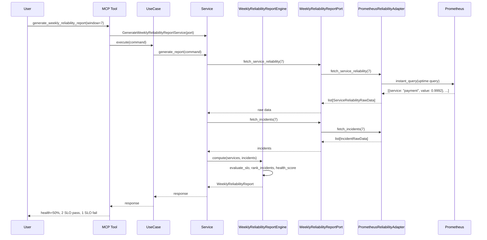
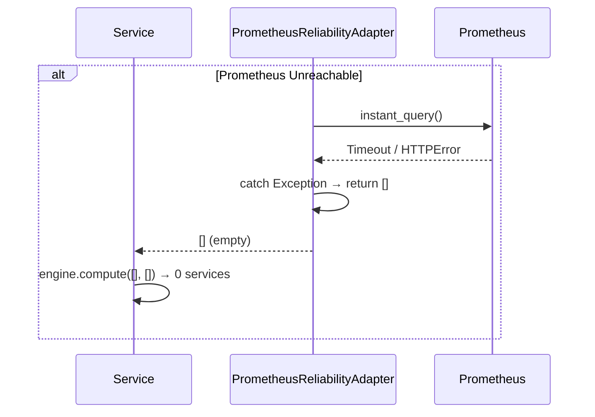
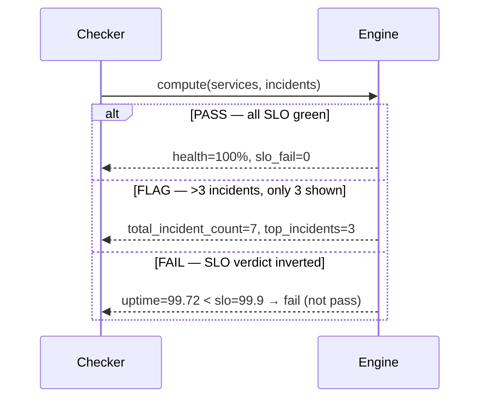

# 88 — Generate Weekly Reliability Report

Generate a weekly reliability report for all production services including uptime,
error rate, p99 latency, SLO compliance, top 3 incidents, and overall health score.

## Sample Questions

- "Generate a weekly reliability report for all production services — include uptime, error rate, p99 latency, SLO compliance, and top 3 incidents."
- "How did our services perform this week against their SLOs?"
- "Show me a health report with SLO pass/fail for all production services."
- "What were the top 3 incidents last week ranked by impact?"
- "Give me the weekly reliability summary for stakeholder review."

---

## 1. Happy Path

## 2. Error Flows

## 3. Checker Node

---

## Key Points

- Computes uptime from Prometheus success rate (rate of non-5xx / rate of all requests)
- SLO evaluation: `uptime_pct >= slo_target → pass, else fail`
- Incidents ranked by impact: `duration_minutes * error_rate` descending, top 3 only
- Health score: `(slo_pass_count / total_services) * 100`
- Prometheus errors return empty lists → engine handles gracefully (0 services, 0 incidents)
- Each service evaluated against its own SLO target

---

## Test Coverage

| Test | File | Status |
|---|---|---|
| `test_slo_pass_when_uptime_above_target` | `test_weekly_reliability_report_engine.py` | ✅ |
| `test_slo_fail_when_uptime_below_target` | `test_weekly_reliability_report_engine.py` | ✅ |
| `test_top_three_incidents_by_impact` | `test_weekly_reliability_report_engine.py` | ✅ |
| `test_more_than_three_incidents_keeps_total_count` | `test_weekly_reliability_report_engine.py` | ✅ |
| `test_all_slo_pass_health_100` | `test_weekly_reliability_report_engine.py` | ✅ |
| `test_mixed_slo_targets_evaluated_individually` | `test_weekly_reliability_report_engine.py` | ✅ |
| `test_delegates_to_service` | `test_weekly_reliability_report_port_and_service.py` | ✅ |
| `test_calls_port_with_window` | `test_weekly_reliability_report_port_and_service.py` | ✅ |
| `test_fetch_service_reliability_returns_data` | `test_reliability_report_adapter.py` | ✅ |
| `test_delegates_and_returns_dict` | `test_generate_weekly_report_mcp.py` | ✅ |

---

## Related Files

- `src/hexawyn/domain/models/weekly_reliability_report.py`
- `src/hexawyn/domain/services/reliability_report/weekly_reliability_report_engine.py`
- `src/hexawyn/application/ports/driven/weekly_reliability_report_port.py`
- `src/hexawyn/application/ports/driving/generate_weekly_reliability_report/`
- `src/hexawyn/application/service/generate_weekly_reliability_report_service.py`
- `src/hexawyn/application/use_case/generate_weekly_reliability_report/`
- `src/hexawyn/adapters/secondary/gitops/prometheus_reliability_adapter.py`
- `src/hexawyn/mcp/tools/generate_weekly_reliability_report.py`
- `src/hexawyn/mcp/server.py`
