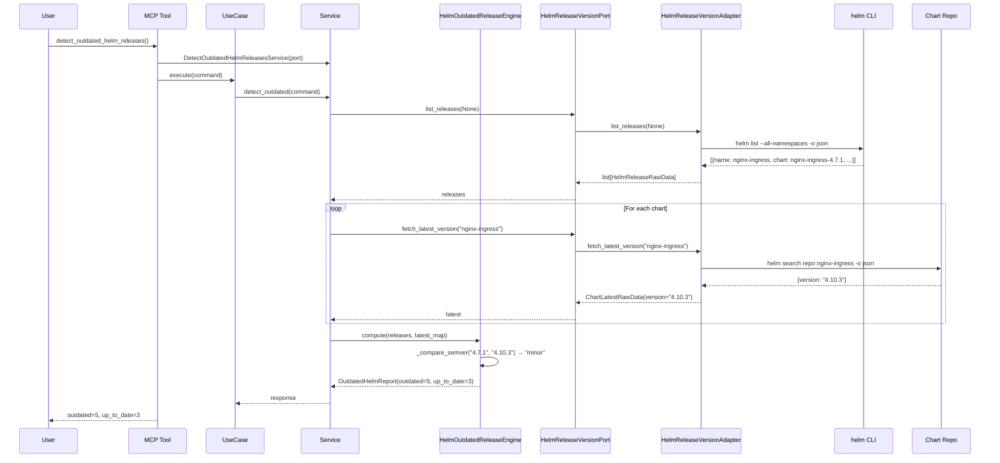
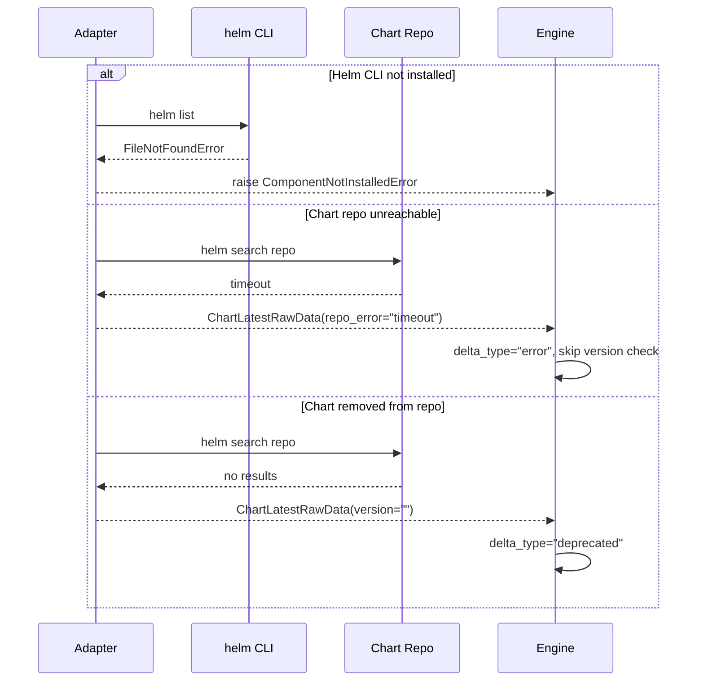

# 89 — Detect Outdated Helm Releases

Detect Helm releases that are outdated compared to the latest available chart version
by querying installed releases and chart repositories, computing version deltas,
and flagging breaking changes for major upgrades.

## Sample Questions

- "Which Helm releases are out of date compared to the latest available chart version?"
- "Show me all Helm charts that need a version upgrade with changelogs."
- "Are there any major version updates pending that could break our services?"
- "List outdated Helm releases grouped by namespace."
- "What breaking changes should I be aware of before upgrading cert-manager?"

---

## 1. Happy Path

## 2. Error Flows

---

## Key Points

- Lists all Helm releases via `helm list --all-namespaces -o json`
- Queries chart repos via `helm search repo` for latest version
- SemVer comparison: major.minor.patch → delta classification
- Major updates always flagged with breaking changes warning
- Pinned releases (annotation `helm.sh/upgrade: skip`) excluded from report
- Chart repo errors return `delta_type="error"` without crashing
- Each chart queried only once (deduplication per chart name)

---

## Test Coverage

| Test | File | Status |
|---|---|---|
| `test_minor_delta_detected` | `test_outdated_helm_engine.py` | ✅ |
| `test_major_delta_critical` | `test_outdated_helm_engine.py` | ✅ |
| `test_up_to_date_not_counted_as_outdated` | `test_outdated_helm_engine.py` | ✅ |
| `test_repo_error_marks_as_skipped` | `test_outdated_helm_engine.py` | ✅ |
| `test_pinned_release_excluded` | `test_outdated_helm_engine.py` | ✅ |
| `test_chart_removed_from_repo_deprecated` | `test_outdated_helm_engine.py` | ✅ |
| `test_five_of_eight_outdated` | `test_outdated_helm_engine.py` | ✅ |
| `test_fetches_latest_once_per_chart` | `test_outdated_helm_port_and_service.py` | ✅ |
| `test_detects_minor_outdated_release` | `test_outdated_helm_port_and_service.py` | ✅ |
| `test_delegates_and_returns_dict` | `test_detect_outdated_helm_mcp.py` | ✅ |
| `test_build_helm_release_version_adapter_returns_port` | `tests/unit/test_server.py` | ✅ |

---

## Related Files

- `src/hexawyn/domain/models/outdated_helm.py`
- `src/hexawyn/domain/services/outdated_helm/outdated_helm_engine.py`
- `src/hexawyn/application/ports/driven/helm_release_version_port.py`
- `src/hexawyn/application/ports/driving/detect_outdated_helm_releases/`
- `src/hexawyn/application/service/detect_outdated_helm_releases_service.py`
- `src/hexawyn/application/use_case/detect_outdated_helm_releases/`
- `src/hexawyn/adapters/secondary/gitops/helm_release_version_adapter.py`
- `src/hexawyn/mcp/tools/detect_outdated_helm_releases.py`
- `src/hexawyn/mcp/server.py`
