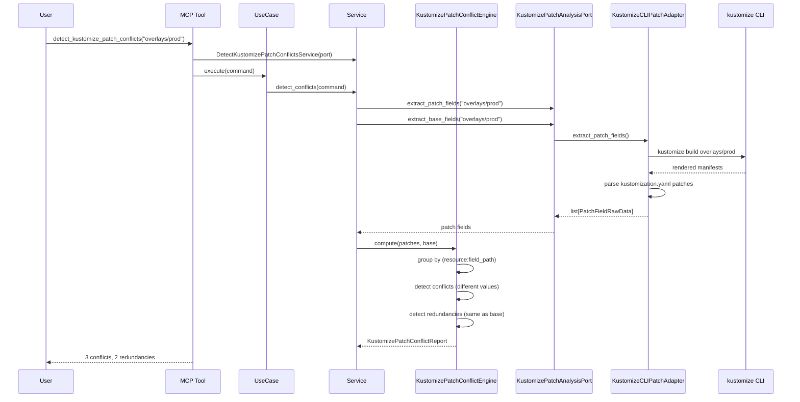
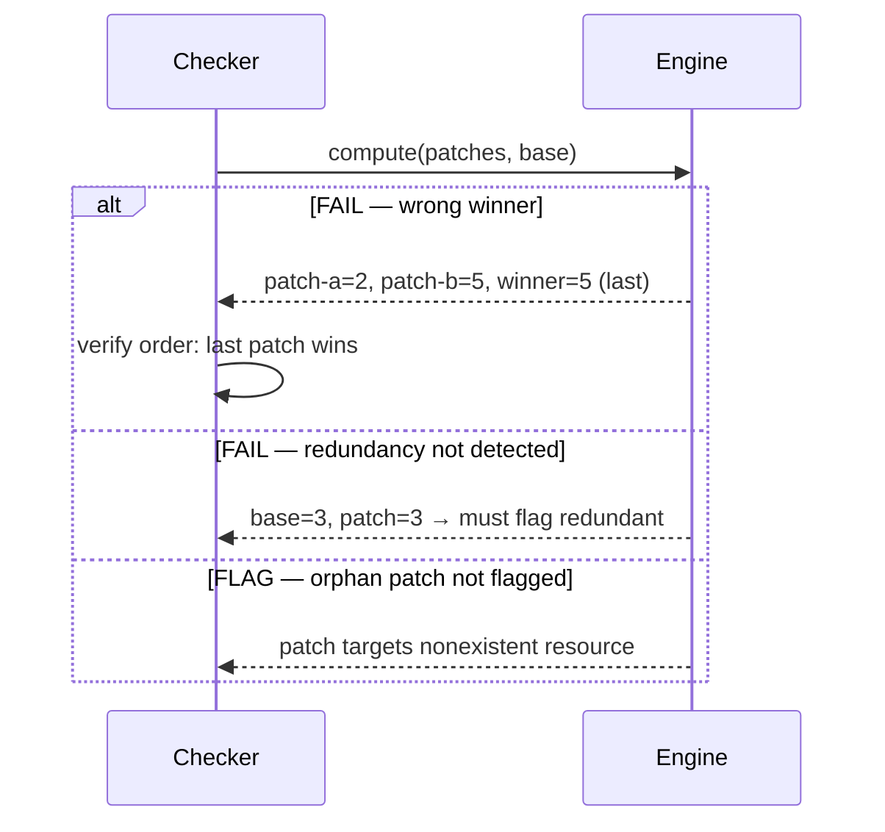

# 90 — Detect Kustomize Patch Conflicts

Detect conflicting or redundant patches in Kustomize overlay directories
by parsing patch files and identifying fields overwritten by multiple
patches with different or identical values.

## Sample Questions

- "Which Kustomize overlays override the same field across multiple patches?"
- "Are any of my Kustomize patches setting the same field to different values in production?"
- "Show me redundant patches that set values already defined in the base."
- "Which patches target resources that don't exist in my base — flag orphan patches."
- "List all conflicting fields in the production overlay with the winning value."

---

## 1. Happy Path

## 2. Checker Node

---

## Key Points

- Groups patches by `(resource, field_path)` key for conflict detection
- Last patch in `kustomization.yaml` order wins (Kustomize linear application)
- Fields with same value across patches are not conflicts (no diverging intent)
- Redundancy: patch sets field to same value as base or earlier patch
- Orphan: patch targets resource not present in base manifests
- JSON6902 vs strategic merge distinguished by `patch_type` field

---

## Related Files

- `src/hexawyn/domain/models/kustomize_patch_conflict.py`
- `src/hexawyn/domain/services/kustomize_patch_conflict/kustomize_patch_conflict_engine.py`
- `src/hexawyn/application/ports/driven/kustomize_patch_analysis_port.py`
- `src/hexawyn/application/ports/driving/detect_kustomize_patch_conflicts/`
- `src/hexawyn/application/service/detect_kustomize_patch_conflicts_service.py`
- `src/hexawyn/application/use_case/detect_kustomize_patch_conflicts/`
- `src/hexawyn/adapters/secondary/gitops/kustomize_patch_adapter.py`
- `src/hexawyn/mcp/tools/detect_kustomize_patch_conflicts.py`
