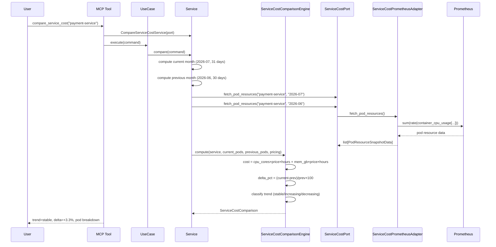

# 91 — Compare Service Cost (Month-over-Month)

Compare the total infrastructure cost of a service between current month
and previous month, with pod-level breakdown and trend indication.

## Sample Questions

- "What is the total infrastructure cost of the payment-service this month vs last month?"
- "How has the cost of auth-service changed month-over-month?"
- "Show me the cost breakdown by pod for payment-service this month."
- "Did the checkout-service cost decrease after our optimization efforts?"

---

## 1. Happy Path

---

## Key Points

- Cost formula: `(cpu_cores × price_per_core_hour + memory_gb × price_per_gb_hour) × days × 24`
- Month lengths auto-detected (28/29/30/31 days)
- Trend classification: >10% delta = increasing, <-10% = decreasing, else stable
- No Prometheus data → no_data verdict with recommendation
- Pod-level breakdown shows per-pod CPU/memory cost

---

## Related Files

- `src/hexawyn/domain/models/service_cost_comparison.py`
- `src/hexawyn/domain/services/service_cost/service_cost_comparison_engine.py`
- `src/hexawyn/application/ports/driven/service_cost_port.py`
- `src/hexawyn/application/ports/driving/compare_service_cost/`
- `src/hexawyn/application/service/compare_service_cost_service.py`
- `src/hexawyn/mcp/tools/compare_service_cost.py`
