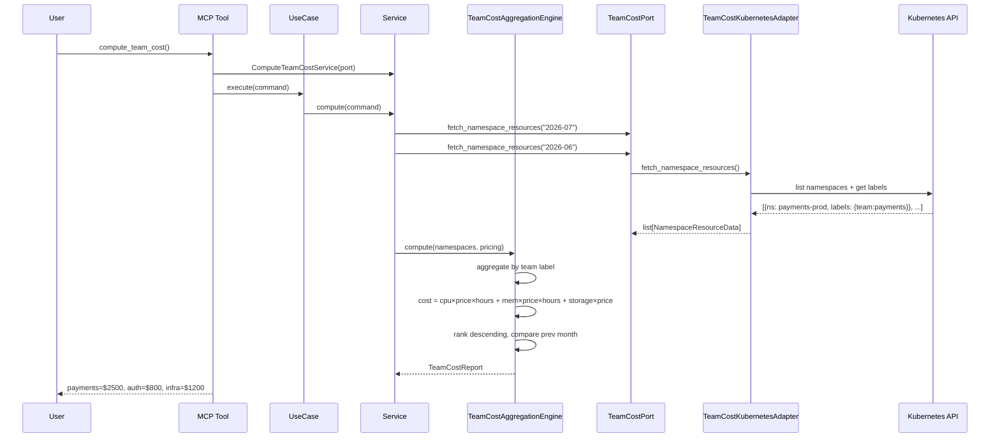

# 92 — Compute Team Cost

Aggregate cluster resource cost per team by mapping namespaces to teams
via Kubernetes labels, computing CPU/memory/storage cost, and ranking teams
from highest to lowest cost with month-over-month comparison.

## Sample Questions

- "Which team is consuming the most cluster resources and at what cost?"
- "Show me the infrastructure cost breakdown per team for this month."
- "How has each team's resource consumption changed compared to last month?"
- "Are there any unattributed costs from namespaces without a team label?"

---

## 1. Happy Path

---

## Key Points

- Team identification via namespace label `team=X` — unlabeled → "unattributed"
- Cost formula: `cpu_cores × cpu_price × days × 24 + memory_gb × mem_price × days × 24 + storage_gb × storage_price`
- Month-over-month: queries both current and previous month, side-by-side comparison
- Prorated: mid-month onboarding → cost proportional to days_active
- Multiple namespaces for same team → aggregated into one team total

---

## Related Files

- `src/hexawyn/domain/models/team_cost.py`
- `src/hexawyn/domain/services/team_cost/team_cost_aggregation_engine.py`
- `src/hexawyn/application/ports/driven/team_cost_port.py`
- `src/hexawyn/application/ports/driving/compute_team_cost/`
- `src/hexawyn/application/service/compute_team_cost_service.py`
- `src/hexawyn/mcp/tools/compute_team_cost.py`
