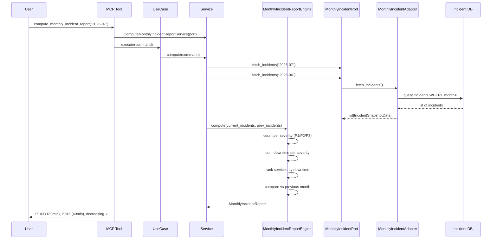

# 93 — Monthly Incident Report

Compute a monthly operational incident summary: total incident count,
downtime minutes per severity (P1/P2/P3), most impacted services ranked
by downtime, and month-over-month trend.

## Sample Questions

- "How many incidents occurred this month and what was the total downtime in minutes?"
- "Show me the P1, P2, and P3 breakdown for this month vs last month."
- "Which services were most impacted by incidents this month?"
- "Are incidents increasing or decreasing compared to the previous month?"

---

## 1. Happy Path

---

## Key Points

- Severity levels: P1, P2, P3 — counts and downtime aggregated per level
- Planned maintenance incidents excluded from count and downtime
- Services ranked by total downtime (descending) — identifies most impacted
- Month-over-month: compares total count, computes incidents_decreasing flag
- Empty month returns clean "0 incidents" report with all zeros

---

## Related Files

- `src/hexawyn/domain/models/monthly_incident_report.py`
- `src/hexawyn/domain/services/monthly_incident/monthly_incident_report_engine.py`
- `src/hexawyn/application/ports/driven/monthly_incident_port.py`
- `src/hexawyn/application/ports/driving/compute_monthly_incident_report/`
- `src/hexawyn/mcp/tools/compute_monthly_incident_report.py`
