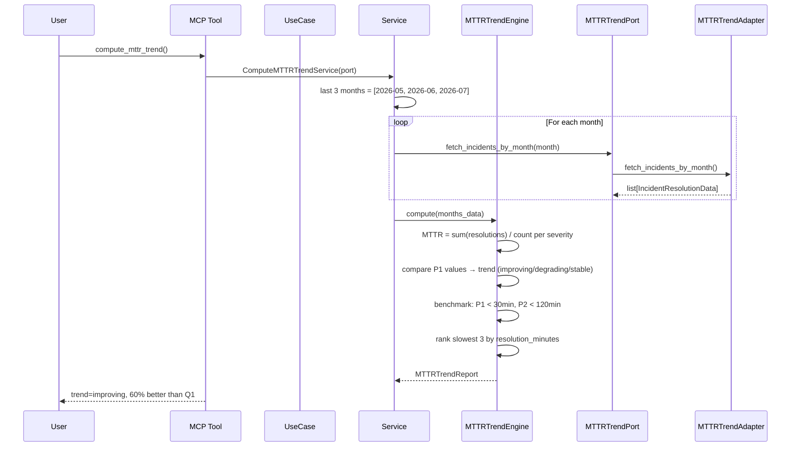

# 94 — Compute MTTR Trend

Track Mean Time To Recovery (MTTR) per severity over the last 3 months,
compute trend (improving/degrading/stable), rank slowest incidents,
and benchmark against industry standards.

## Sample Questions

- "What is our MTTR trend over the last 3 months?"
- "Is our MTTR improving or degrading compared to last quarter?"
- "Which were the 3 slowest incidents to resolve and what were their causes?"
- "Are we meeting P1 < 30min and P2 < 2h benchmarks?"

---

## 1. Happy Path

---

## Key Points

- MTTR = sum of resolution times / incident count per severity per month
- Trend: delta between first and last month P1 MTTR > 10% → improving/degrading
- Benchmarks: P1 < 30min, P2 < 120min (meets_benchmark flag)
- Slowest 3 incidents ranked by resolution_minutes (descending)
- Unresolved incidents excluded from MTTR calculation
- No incidents in a month → MTTR = None (shown as N/A)
- Default: auto-detects last 3 months from current date

---

## Related Files

- `src/hexawyn/domain/models/mttr_trend.py`
- `src/hexawyn/domain/services/mttr_trend/mttr_trend_engine.py`
- `src/hexawyn/application/ports/driven/mttr_trend_port.py`
- `src/hexawyn/application/ports/driving/compute_mttr_trend/`
- `src/hexawyn/mcp/tools/compute_mttr_trend.py`
