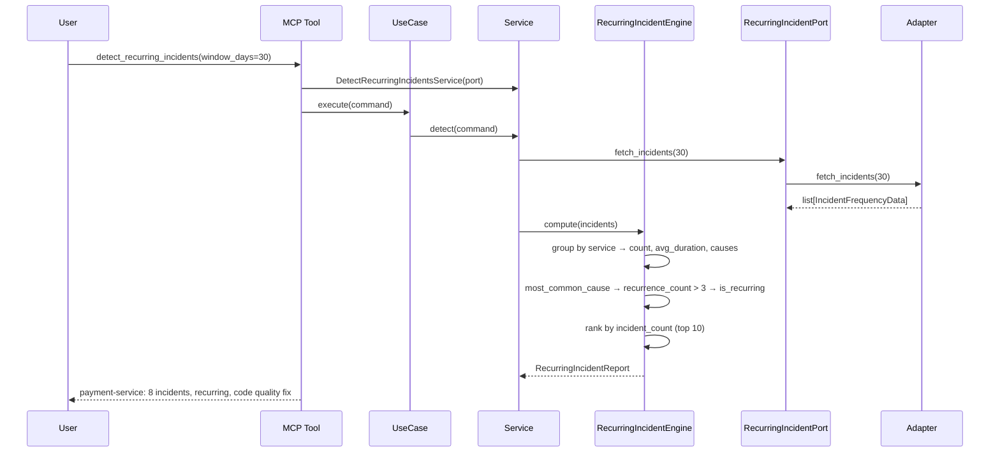

# 95 — Detect Recurring Incidents

Detect services with the most recurring incidents over a 30-day window,
identify recurring patterns (same root cause >3 times), and provide
investment recommendations for sprint planning.

## Sample Questions

- "Which services have the most recurring incidents — where should we invest next sprint?"
- "Show me the top 10 services by incident frequency over the last 30 days."
- "Which services have the same root cause happening repeatedly?"

---

## 1. Happy Path

---

## Key Points

- Top 10 services ranked by incident frequency (descending)
- Recurring pattern: same root cause > 3 times → `is_recurring=True`
- Investment recommendation: code quality (recurring), reliability (high freq), capacity (moderate)
- Same incident affecting multiple services → each service counted independently
- Decommissioned services still counted if they had incidents
- Empty root cause → "uncategorized" tag

---

## Related Files

- `src/hexawyn/domain/models/recurring_incident.py`
- `src/hexawyn/domain/services/recurring_incident/recurring_incident_engine.py`
- `src/hexawyn/application/ports/driven/recurring_incident_port.py`
- `src/hexawyn/application/ports/driving/detect_recurring_incidents/`
- `src/hexawyn/mcp/tools/detect_recurring_incidents.py`
