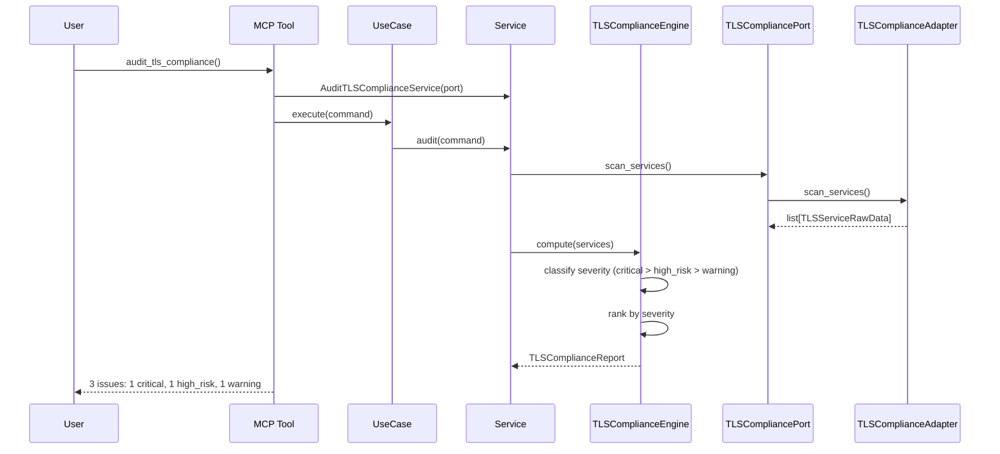

# 96 — Audit TLS Compliance

Audit all services for TLS compliance: detect services with no TLS,
expired certificates, certs expiring within 30 days, and self-signed certs,
ranked by severity.

## Sample Questions

- "Which services are running without TLS or with expired certificates right now?"
- "Are there any services with certificates expiring in the next 30 days?"
- "Show me all production services with no TLS configured."

---

## 1. Happy Path

---

## Key Points

- No TLS → `high_risk`, expired cert → `critical`, expiring ≤30 days → `warning`
- Self-signed certificates flagged separately
- Proxy TLS termination detected (service appears unencrypted but proxy handles it)
- Wildcard certs: each service still checked individually
- Empty services → `all_compliant=True`

---

## Related Files

- `src/hexawyn/domain/models/tls_compliance.py`
- `src/hexawyn/domain/services/tls_compliance/tls_compliance_engine.py`
- `src/hexawyn/application/ports/driven/tls_compliance_port.py`
- `src/hexawyn/mcp/tools/audit_tls_compliance.py`
