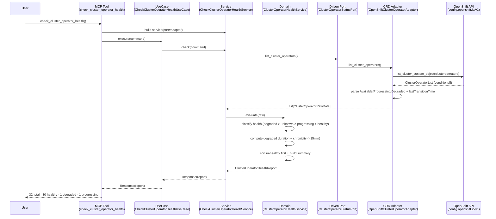
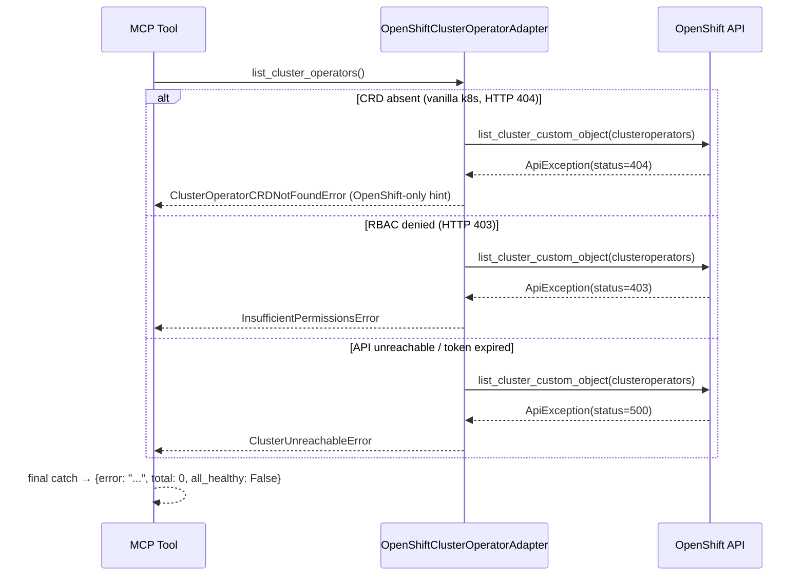
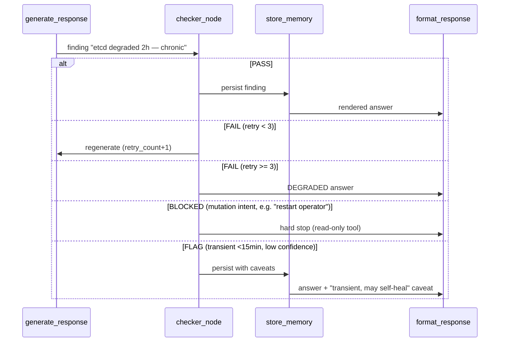

# Use Case 38 — Check OpenShift ClusterOperator Health

Answers: *"Are all OpenShift cluster operators healthy? Which ones are Degraded
or Progressing, and what is the root cause?"*

Lists every ClusterOperator (`config.openshift.io/v1`) with its
Available / Progressing / Degraded conditions, surfaces the root-cause message
for unhealthy operators, flags operators degraded for more than 15 minutes as
chronic, and returns a summary (total, healthy, degraded, progressing).

## Sample Questions

- "Are all OpenShift cluster operators healthy right now?"
- "Which cluster operators are Degraded or Progressing, and what is the root cause?"
- "Has the etcd operator been degraded long enough to worry about?"
- "Give me a summary of ClusterOperator health — how many are healthy vs degraded?"
- "Why is my OpenShift upgrade stuck — which operators are still progressing?"

---

## 1. Happy Path — Full Hexagonal Chain



---

## 2. Error Flows

Infrastructure exceptions never escape the secondary adapter — they are
translated to `HexawynError` subclasses. The MCP tool performs the final catch.



---

## 3. Checker Node



---

## Key Points

- ClusterOperator is OpenShift-only (`config.openshift.io/v1`); on vanilla k8s
  the tool returns a graceful `ClusterOperatorCRDNotFoundError` with a hint.
- Health precedence: `Degraded > Unknown > Progressing > Healthy`. An
  `Available=Unknown` operator is never counted as healthy.
- Chronicity: degraded for **> 15 minutes** → chronic; ≤ 15 minutes → transient.
- Root-cause message is taken from the Degraded condition first, then
  Progressing, then Available.
- Unhealthy operators are sorted first so the summary surfaces problems fast.

---

## Tests

Unit test stubs for the domain logic (condition parsing, degraded detection,
chronicity check). Implemented in
`tests/unit/test_cluster_operator_health_service.py`.

```python
# ── Condition parsing ────────────────────────────────────────
def test_degraded_message_surfaced():
    # Degraded=True with message → health == "degraded", message preserved
    ...

def test_available_unknown_is_not_healthy():
    # Available=Unknown → health == "unknown", not counted healthy
    ...

def test_degraded_takes_priority_over_progressing():
    # Degraded=True AND Progressing=True → health == "degraded"
    ...

# ── Degraded / summary detection ─────────────────────────────
def test_counts_healthy_degraded_progressing():
    # 30 healthy + 1 degraded + 1 progressing → summary total=32
    ...

def test_all_available_is_all_healthy():
    # every operator Available=True → all_healthy is True
    ...

# ── Chronicity check (15-minute threshold) ───────────────────
def test_progressing_three_minutes_is_transient():
    # degraded_since 3 min ago → is_chronic False, duration == 3
    ...

def test_degraded_two_hours_is_chronic():
    # degraded_since 2h ago → is_chronic True, duration == 120
    ...

def test_exactly_fifteen_minutes_is_not_chronic():
    # boundary: 15 min → is_chronic False
    ...

def test_sixteen_minutes_is_chronic():
    # boundary: 16 min → is_chronic True
    ...

def test_missing_or_malformed_degraded_since_is_not_chronic():
    # None / "not-a-date" → duration 0, is_chronic False
    ...
```

| Test | Scenario | File | Status |
|---|---|---|---|
| `test_counts_healthy_degraded_progressing` | 32 ops: 30 healthy/1 degraded/1 progressing | `test_cluster_operator_health_service.py` | ✅ |
| `test_all_available_is_all_healthy` | all Available=True | `test_cluster_operator_health_service.py` | ✅ |
| `test_degraded_message_surfaced` | root-cause message returned | `test_cluster_operator_health_service.py` | ✅ |
| `test_progressing_three_minutes_is_transient` | transient (<15min) | `test_cluster_operator_health_service.py` | ✅ |
| `test_degraded_two_hours_is_chronic` | chronic with duration | `test_cluster_operator_health_service.py` | ✅ |
| `test_available_unknown_is_not_healthy` | Available=Unknown edge case | `test_cluster_operator_health_service.py` | ✅ |
| `test_not_found_raises_crd_not_found` | vanilla k8s (CRD absent) | `test_openshift_cluster_operator_adapter.py` | ✅ |
| `test_forbidden_raises_insufficient_permissions` | RBAC blocked | `test_openshift_cluster_operator_adapter.py` | ✅ |
| `test_handles_crd_absent_gracefully` | MCP graceful error | `test_check_cluster_operator_health_mcp.py` | ✅ |

---

## Related Files

- `src/hexawyn/domain/models/cluster_operator_health.py`
- `src/hexawyn/domain/services/cluster_operator_health/cluster_operator_health_service.py`
- `src/hexawyn/application/ports/driven/cluster_operator_status_port.py`
- `src/hexawyn/application/ports/driving/check_cluster_operator_health/`
- `src/hexawyn/application/service/check_cluster_operator_health_service.py`
- `src/hexawyn/application/use_case/check_cluster_operator_health/check_cluster_operator_health_use_case.py`
- `src/hexawyn/adapters/secondary/openshift/openshift_cluster_operator_adapter.py`
- `src/hexawyn/mcp/tools/check_cluster_operator_health.py`
- `src/hexawyn/mcp/server.py` (`build_cluster_operator_status_adapter`)
